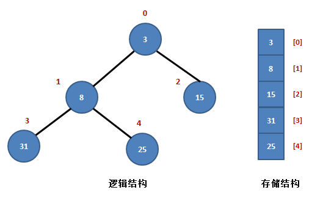
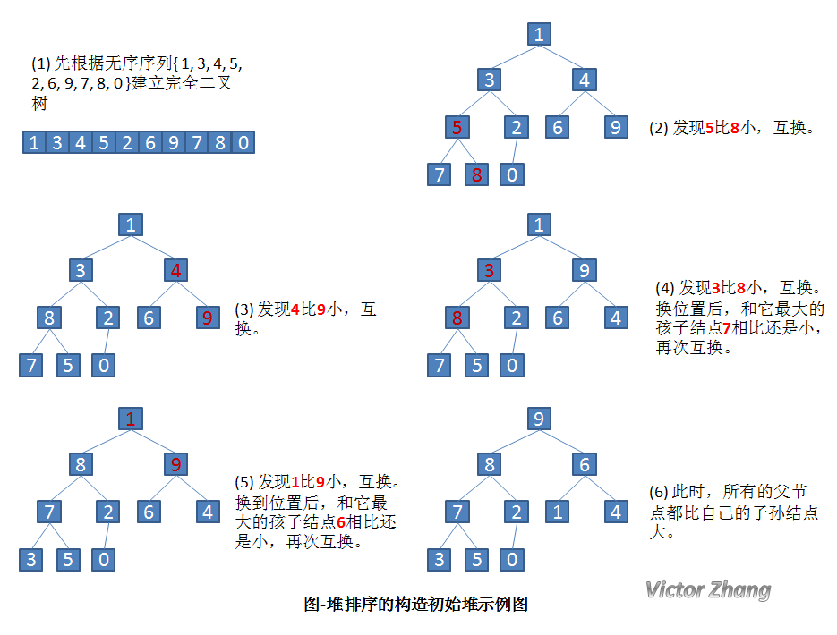
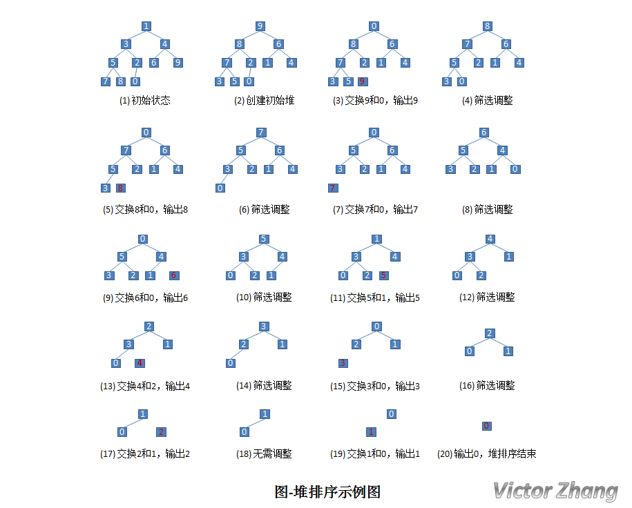

# 排序

## 选择排序

#### 工作原理

每次找出Ai...An中最小的元素，然后将这个最小的元素与Ai进行交换。

#### 稳定性

由于swap (交换两个元素）操作的存在，选择排序是一种不稳定的排序算法。

#### 时间复杂度

选择排序的最优时间复杂度、平均时间复杂度和最坏时间复杂度均为O(n^2)

#### 空间复杂度

O(n).

#### 代码

```c
void selection_sort(int *a, int n){
    for(int i=0; i<n-1; ++i){
        int min_pos = i;
        for(int j=i+1; j<n; ++j){
            if(a[j] < a[min_pos])
                min_pos = j;
        }
        swap(a[min_pos], a[i]);
    }
}
```


## 插入排序

#### 工作原理

将待排列元素划分为"已排序"和"未排序"两部分，每次从"未排序的"元素中诋瑾于个插入到已排序的"元素中的正确位置。一个与插入排序相同的操作是打扑克牌时，从牌桌上抓一张牌，按牌面大小插到手牌后，再抓下一张牌。

#### 稳定性

插入排序是一种稳定的排序算法。

#### 时间复杂度

插入排序的最优时间复杂度为O(N)，在数列几乎有序时效率很高.插入排序的最坏时间复杂度和平均时间复杂度都为O(N2)。

#### 空间复杂度

o(n).

#### 代码

```c
void insertion_sort(int *a, int n){
    for(int i=1; i<n; ++i){
        int key = a[i];
        int j = i-1;
        while(j>0 && a[j]>key){
            a[j+1]=a[j];
            --j;
        }
        a[j+1]=key;
    }
}
```


## 冒泡排序

#### 工作原理

它的工作原理是每次检查相邻两个元素，如果前面的元素与后面的元素满足给定的排序条件，就将相邻两个元素交换。当没有相邻的元素需要交换时，排序就完成了。

经过i 次扫描后，数列的末尾i 项必然是最大的i 项，因此冒泡排序最多需要扫描n-1遍数组就能完成排序。

#### 稳定性

冒泡排序是一种稳定的排序算法。

#### 时间复杂度

在序列完全有序时，冒泡排序只需遍历一遍数组，不用执行任何交换操作，时间复杂度为O(n)。在最坏情况下，冒泡排序要执行n(n-1)/2 次交换操作，时间复杂度为O(n^2).

冒泡排序的平均时间复杂度为O(n^2).

#### 空间复杂度

O(n).

#### 代码

```c
void bubble_sort(int *a, int n){
    bool flag = true;
    while(flag){
        flag = false;
        for(int i=0; i<n-1; ++i){
            if(a[i]>a[i+1]){
                flag = true;
                swap[a[i], a[i+1]];
            }
        }
    }
}
```

## 计数排序

计数排序(英语:Counting sort)是一种线性时间的排序算法。

#### 工作原理

计数排序的工作原理是使用一个额外的数组C，其中第i 个元素是待排序数组A中值等于i 的元素的个数，然后根据数组C来将A中的元素排到正确的位置。

它的工作过程分为三个步骤:

1). 计算每个数出现了几次;

2). 求出每个数出现的次数；

3). 利用出现次数进行排序。

因为存在下标的限制，因此计数排序存在一定的限制。

#### 稳定性

计数排序是一种稳定的排序算法。

#### 时间复杂度

计数排序的时间复杂度为O(n + w) 其中w代表待排序数据的值域大小。

#### 空间复杂度

max(w，n)，a[i]≤w

#### 代码

```c++
vector<int> counting_sort(vector<int> a){
    // max
    int max = INT_MIN;
    for(int num: a){
        max = max(max, num);
    }
    // count
    vector<int> count(max, 0);
    for(int num: a){
        ++count[num];
    }
    // return
    vector<int> res;
    for(int i=0; i<count.size(); ++i){
        while(count[i] > 0){
            res.push_back(i);
            --count[i];
        }
    }
    return res;
}
```

#### 辅助数组长度的优化

将数组长度定为`max-min+1`，即不仅要找出最大值，还要找出最小值，**根据两者的差来确定计数数组的长度**。

#### 稳定性的优化

1). 计算每个数出现了几次；

2). 求出每个数出现次数的前缀和；

3). 利用出现次数的前缀和，从右至左计算每个数的排名。

```C++
vector<int> counting_sort(vector<int> a){
    // max & min
    int max = INT_MIN;
    int min = INT_MAX;
    for(int num: a){
        max = max(max, num);
        min = min(min, num);
    }
    // count
    vector<int> count(max-min+1, 0);
    for(int num: a){
        // A中的元素要减去最小值，再作为新索引
        ++count[num-min];
    }
    // 计算前缀和
    for(int i=1; i<count.size(); ++i){
        count[i] += count[i-1];
    }
    // return
    vector<int> res(a.size(), 0);
    for(int i=a.size()-1; i>=0; --i){
        res[count[a[i]-min-1]] = a[i];
        --count[a[i]-min];
    }
    return res;
}
```

## 归并排序

归并排序(英语: merge sort)是一种采用了分治思想的排序算法。

#### 工作原理

归并排序分为三个步骤:

1). 将数列划分为两部分;

2). 递归地分别对两个子序列进行归并排序;

3). 合并两个子序列。

不难发现，归并排序的前两步都很好实现，关键是如何合并两个子序列。注意到两个子序列在第二步中已经保证了都是有序的了，第三步中实际上是想要把两个有序的序列合并起来。

#### 稳定性

归并排序是一种稳定的排序算法。

#### 时间复杂度

归并排序的最优时间复杂度、平均时间复杂度和最坏时间复杂度均为O(nlogn)。

#### 空间复杂度

归并排序的空间复杂度为O(n)。

#### 代码

```C++
void merge_sort(vector<int> &a){
    //在排序前，先建好一个长度等于原数组长度的临时数组，避免递归中频繁开辟空间
    vector<int> temp(a.size(), 0);
    merge_sort(a, 0, a.size()-1, temp);
}

void merge_sort(vector<int> &a, int left, int right, vector<int> &temp){
    if(left < right){
        int mid = (right-left)>>1 + left;
        merge_sort(a, left, mid, temp);
        merge_sort(a, mid+1, right, temp);
        merge(a, left, mid, right, temp);
    }
}

void merge(vector<int> &a, int left, int mid, int right, vector<int> &temp){
    int i = left;  //左序列指针
    int j = mid+1; //右序列指针
    int t = 0;     //临时数组指针
    while (i<=mid && j<=right){
        if(a[i]<=a[j]){ // 稳定
            temp[t++] = a[i++];
        }else {
            temp[t++] = a[j++];
        }
    } 
    while(i<=mid){
        temp[t++] = a[i++];
    }
    while(j<=right){
        temp[t++] = a[j++];
    }
    t = 0;
    //将temp中的元素全部拷贝到原数组中
    while(left <= right){
        a[left++] = temp[t++];
    }
}
```

## 快速排序

快速排序（英语:Quicksort)，又称分区交换排序（英语: partition-exchange sort) ，简称快排，是一种被广泛运用的排序算法。

#### 工作原理

快速排序的工作原理是通过分治的方式来将一个数组排序。快速排序分为三个过程:

1)．将数列划分为两部分(利用基准数，保证相对大小关系);

2)．递归到两个子序列中分别进行快速排序;

3)．不用合并，因为此时数列已经完全有序。

和归并排序不同，第一步并不是直接分成前后两个序列，而是在分的过程中要保证相对大小关系。具体来说，第一步要是要把数列分成两个部分，然后保证前一个子数列中的数都小于后一个子数列中的数。为了保证平均时间复杂度，一般是随机选择一个数来当做两个子数列的分界。

之后，维护一前一后两个指针和，依次考虑当前的数是否放在了应该放的位置(前还是后)。如果当前的数没放对，比如说如果后面的指针遇到了一个比小的数，那么可以交换和位置上的数，再把向后移一位。当前的数的位置全放对后，再移动指针继续处理,直到两个指针相遇。

其实，快速排序没有指定应如何具体实现第一步，不论是选择的过程还是划分的过程，都有不止一种实现方法。

第三步中的序列已经分别有序且第一个序列中的数都小于第二个数，所以直接拼接起来就好了

#### 稳定性

快速排序不稳定。

#### 时间复杂度

最优时间复杂度和平均时间复杂度：O(nlogn);

最坏时间复杂度为：O(n^2)。

#### 空间复杂度

O(n)。

#### 代码

```C++
void quick_sort(vector<int> a, int left, int right){
    if(left<right){
        int i=left, j=right, base_num = a[left];
        while(i<j){
            // 从右向左找第一个小于x的数
            while(i<j && a[j]>=x) --j;
            if(i<j) s[i++] = s[j];
            // 从左向右找第一个大于等于x的数
            while(i<j && s[i]<x) ++i;
            if(i<j) s[j--] = s[i];
        }
        s[i]=base_num;
        // 递归调用
        quick_sort(s, left, i-1);
        quick_sort(s, i+1, right);
    }
}
```

#### 优化

如随机选择基准数，区间内数据较少时直接用另的方法排序以减小递归深度。

## 桶排序

桶排序(英文︰Bucket sort)是排序算法的一种，适用于待排序数据值域较大但分布比较均匀的情况。

#### 工作原理

划分多个范围相同的区间，每个子区间自排序，最后合并。

桶排序是计数排序的扩展版本，计数排序可以看成每个桶只存储相同元素，而桶排序每个桶存储一定范围的元素，通过映射函数，将待排序数组中的元素映射到各个对应的桶中，对每个桶中的元素进行排序，最后将非空桶中的元素逐个放入原序列中。

桶排序需要尽量保证元素分散均匀，否则当所有数据集中在同一个桶中时，桶排序失效

桶排序按下列步骤进行:

1). 设置一个定量的数组当作空桶;

2). 遍历序列，并将元素一个个放到对应的桶中;

3). 对每个不是空的桶进行排序;

4). 从不是空的桶里把元素再放回原来的序列中。

#### 稳定性

桶排序的稳定性取决于桶内排序使用的算法。

如果使用稳定的内层排序，并且将元素插入桶中时不改变元素间的相对顺序，那么桶排序就是一种稳定的排序算法。由于每块元素不多，一般使用插入排序。此时桶排序是一种稳定的排序算法。但比如用快排，就不稳定了。

#### 时间复杂度

对于待排序序列大小为 N，共分为 M 个桶，主要步骤有：

N 次循环，将每个元素装入对应的桶中
M 次循环，对每个桶中的数据进行排序（平均每个桶有 N/M 个元素）
一般使用较为快速的排序算法，时间复杂度为 O(NlogN)，实际的桶排序过程是以链表形式插入的。

整个桶排序的时间复杂度为：

O(N)+O(M∗(N/M∗log(N/M)))=O(N ∗ (log(N/M)+1))

当 N = M 时，复杂度为O(N)

#### 空间复杂度

O(n+m)。

#### 代码

```C++
void counting_sort(vector<int> a){
    // max & min
    int max_num = INT_MIN;
    int min_num = INT_MAX;
    for(int num: a){
        max_num = max(max_num, num);
        min_num = min(min_num, num);
    }

    // 确定桶的数量
    int bucket_num = (max_num-min_num)/(int)a.size() + 1;
    vector<vector<int>> buckets(bucket_num, vector<int>());

    // 元素入桶
    for(int i=0; i<a.size(); ++i){
        int num = (a[i]-min_num)/(int)a.size();
        buckets[num].push_back(a[i]);
    }

    // 对桶分别排序
    for(auto bucket: buckets){
        sort(bucket.begin(), bucket.end());
    }

    int index = 0;
    for(const auto& bucket: buckets){
        for(int num: bucket){
            a[index++]=num;
        }
    }
}
```

## 希尔排序

希尔排序（英语: Shell sort) ，也称为缩小增量排序法，是插入排序的一种改进版本。希尔排序以它的发明者希尔（英语: Donald Shell )命名。

#### 改进策略

希尔排序是把记录按下标的一定增量分组，对每组使用直接插入排序算法排序；随着增量逐渐减少，每组包含的关键词越来越多，当增量减至1时，整个文件恰被分成一组，算法便终止。

简单插入排序很循规蹈矩，不管数组分布是怎么样的，依然一步一步的对元素进行比较，移动，插入，比如[5,4,3,2,1,0]这种倒序序列，数组末端的0要回到首位置很是费劲，比较和移动元素均需n-1次。而希尔排序在数组中采用跳跃式分组的策略，通过某个增量将数组元素划分为若干组，然后分组进行插入排序，随后逐步缩小增量，继续按组进行插入排序操作，直至增量为1。希尔排序通过这种策略使得整个数组在初始阶段达到从宏观上看基本有序，小的基本在前，大的基本在后。然后缩小增量，到增量为1时，其实多数情况下只需微调即可，不会涉及过多的数据移动。

#### 工作原理

排序对不相邻的记录进行比较和移动:

1). 将待排序序列分为若干子序列(每个子序列的元素在原始数组中间距相同);

2). 对这些子序列进行插入排序;

3). 减小每个子序列中元素之间的间距，重复上述过程直至间距减少为1。

#### 稳定性

希尔排序是一种不稳定的排序算法。

#### 时间复杂度

希尔排序的最优时间复杂度为O(n)。

希尔排序的平均时间复杂度和最坏时间复杂度与间距序列的选取(就是间距如何减小到1）有关，比如「间距每次除以3」的希尔排序的时间复杂度是O(n^(3/2))。已知最好的最坏时间复杂度为O(n(logn)^2)。

#### 空间复杂度

O(n)。

#### 代码

```C++
// 交换法
void shell_sort(vector<int> &a){
    for(int gap=a.size()/2; gap>0; gap/=2){
        for(int i=gap; i<a.size(); ++i){
            int j=i;
            while(j-gap >=0 && a[j]<a[j-gap]){
                swap(a[j], a[j-gap]);
                j-=gap;
            }
        }
    }
}
// 移动法
void shell_sort(vector<int> &a){
    int j;
    for(int gap=a.size()/2; gap>0; gap/=2){
        for(int i=gap; i<a.size(); ++i){
            int tmp = a[i];
            for(j=i; j>=gap && a[j]<a[j-gap]; j-=gap){
                a[j]=a[j-gap];
            }
            a[j] = tmp;
        }
    }
}
```

## 基数排序


## 堆排序

#### 堆

**堆**是一棵**顺序存储**的**完全二叉树**。

其中每个结点的关键字都**不大于**其孩子结点的关键字，这样的堆称为**小根堆**。

其中每个结点的关键字都**不小于**其孩子结点的关键字，这样的堆称为**大根堆**。

举例来说，对于n个元素的序列{R0, R1, ... , Rn}当且仅当满足下列关系之一时，称之为堆：

(1) Ri <= R2i+1 且 Ri <= R2i+2 (小根堆)

(2) Ri >= R2i+1 且 Ri >= R2i+2 (大根堆)

其中i=1,2,…,n/2向下取整; 



如上图所示，序列R{3, 8, 15, 31, 25}是一个典型的小根堆。

堆中有两个父结点，元素3和元素8。

元素3在数组中以R[0]表示，它的左孩子结点是R[1]，右孩子结点是R[2]。

元素8在数组中以R[1]表示，它的左孩子结点是R[3]，右孩子结点是R[4]，它的父结点是R[0]。可以看出，它们满足以下规律：

设当前元素在数组中以R[i]表示，那么，

(1) 它的左孩子结点是：R[2\*i+1];

(2) 它的右孩子结点是：R[2\*i+2];

(3) 它的父结点是：R[(i-1)/2];

(4) R[i] <= R[2*i+1] 且 R[i] <= R[2i+2]。

#### 过程

首先，按堆的定义将数组R[0..n]调整为堆（这个过程称为创建初始堆），交换R[0]和R[n]；

然后，将R[0..n-1]调整为堆，交换R[0]和R[n-1]；

如此反复，直到交换了R[0]和R[1]为止。

 

以上思想可归纳为两个操作：

（1）根据初始数组去**构造初始堆**（构建一个完全二叉树，保证所有的父结点都比它的孩子结点数值大）。

（2）每次**交换第一个和最后一个元素，输出最后一个元素**（最大值），然后把剩下元素**重新调整**为大根堆。 

当输出完最后一个元素后，这个数组已经是按照从小到大的顺序排列了。

先通过详细的实例图来看一下，如何构建初始堆。

设有一个无序序列 { 1, 3, 4, 5, 2, 6, 9, 7, 8, 0 }。



构造了初始堆后，我们来看一下完整的堆排序处理：

还是针对前面提到的无序序列 { 1, 3, 4, 5, 2, 6, 9, 7, 8, 0 } 来加以说明。



#### 时间复杂度

堆的存储表示是**顺序的**。因为堆所对应的二叉树为完全二叉树，而完全二叉树通常采用顺序存储方式。

当想得到一个序列中第**k**个最小的元素之前的部分排序序列，最好采用堆排序。

因为堆排序的时间复杂度是**O(n+klog2n)**，若k≤n/log2n，则可得到的时间复杂度为**O(n)**。

#### 算法稳定性

堆排序是一种**不稳定**的排序方法。

因为在堆的调整过程中，关键字进行比较和交换所走的是该结点到叶子结点的一条路径，

因此对于相同的关键字就可能出现排在后面的关键字被交换到前面来的情况。 