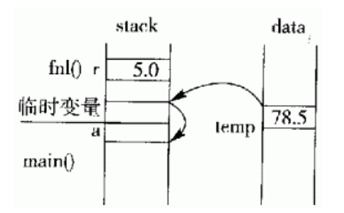
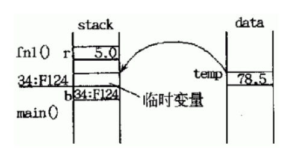
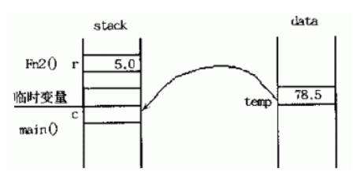
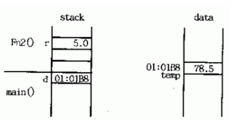
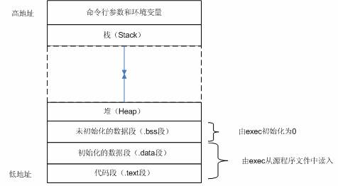
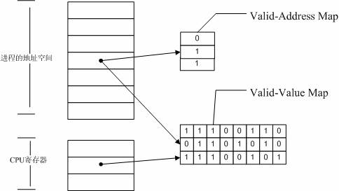
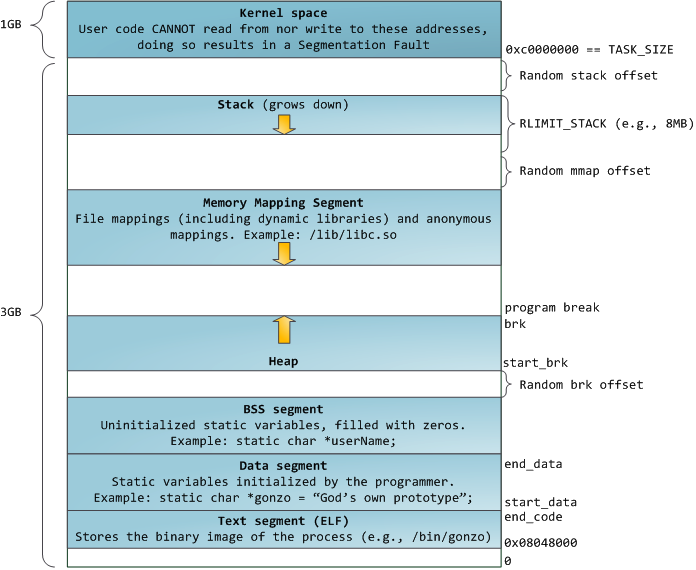
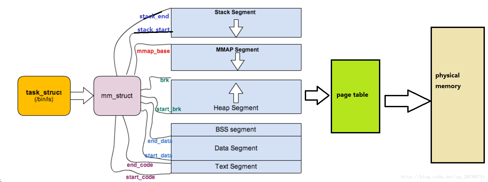
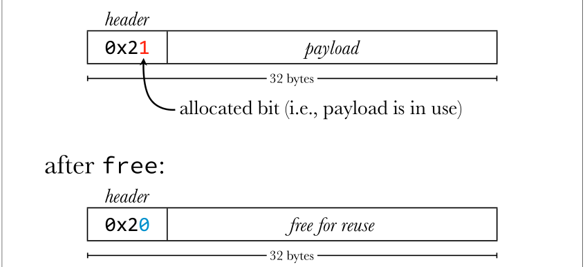
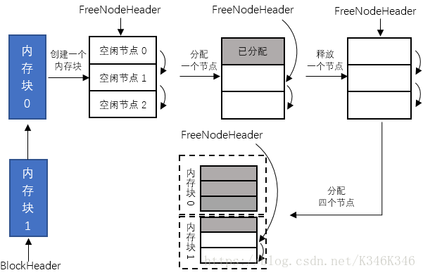

#### ++a 与 a++ 左值

```markdown
* 必须有特定地址，才能作为左值，否则赋值就没有具体的对象。

* a++ 先复制一份临时数据出来参与周边环境的运算，再自加变量 a；
* ++a 先自加变量a，再将变量放到周边环境参与运算，参与运算时是具有具体地址的变量。
```


#### const

```markdown
* 作用：
	* 欲阻止一个变量被改变，可使用const，在定义该const变量时，需先初始化，以后就没有机会改变他了；
	* 对指针而言，可以指定指针本身为const，也可以指定指针所指的数据为const，或二者同时指定为const；
	* 在一个函数声明中，const可以修饰形参表明他是一个输入参数，在函数内部不可以改变其值；
	* 对于类的成员函数，有时候必须指定其为const类型，表明其是一个常函数，不能修改类的成员变量；
	* 对于类的成员函数，有时候必须指定其返回值为const类型，以使得其返回值不为“左值”。

* 例子：
	* const修饰变量
		* 变量的值不能变
	* const修饰指针
		* const位于'\*'左侧,const修饰指针所指向的变量的值，指针指向为常量 
		* const位于'\*'右侧,const修饰指针本身，即指针本身为常量
		* 指针常量：不能通过指针来修改变量的值
		* 常量指针：一直指向该变量，不能给该指针赋予其他地址
	* 函数中使用const
		* 常函数 void fun() const {} 析构函数和构造函数不能为常函数
```


#### 指向整型数组的指针 

```
* 指针数组： int *p1[N]; 
  * 本质是一个数组，这个数组每个元素是int型的指针类型
  * 优先级使p先和[n]结合说明这是一个数组，再和*结合
* 数组指针：int  (*p2）[n]; 
  * 本质是一个指针，这个指针指向这个数组
  * p首先和*结合，说明这是一个指针，再和[n]结合
  
推断方法：先和变量名结合，弄清楚是一个指针还是一个数组，一步步推论

* 指向数组指针的指针
  * int (**p)[n]
* 指向指针数组的指针
  * int *(*p)[n]
```


####  指针++ 引用++

```
# 指针++
  ## p++: 指针向下移动一个单位(对于T*，移动sizeof(T)字节)
  ## *p++: 指针向下移动一个单位,然后进行取值操作，但没用到这个值
  ## *p = *p + 1: 指针不移动，但指针所指的数据有+1效果
  ## (*p) ++: 与"*p=*p+1"效果相同
  
  -> 若要对指针进行移位操作，只需对指针变量本身进行加减。
  -> 若要对指针所指的内容进行操作，需要将“取内容的*”和指针变量放在一个括号里（比如"(*p)"），这样才能对指针所指的内容进行操作。

# 引用++
int a = 0; 
int b = &a;
b++;
  ## b++ 相当于 a++；b只是a的一个别用，和a一样使用
```


#### 指针 & 引用

```
1.指针：指针是一个变量，只不过这个变量存储的是一个地址，指向内存的一个存储单元，并且有自己的一块空间；
  引用：跟原来的变量实质上是同一个东西，只不过是原变量的一个别名而已。

2."sizeof指针"得到的是指针本身的大小，是4；
  "sizeof引用"得到的是所指向的变量(对象)的大小。

3.指针可以是空值NULL，可以在任何时候被初始化;
  而引用必须被初始化且必须是一个已有对象的引用；

4.指针的值在初始化后可以改变，即指向其它的存储单元;
  引用在进行初始化后就不会再改变了。

5.可以有const指针，但是没有const引用；

6.指针在使用中可以指向其它对象;
  引用只能是一个对象的引用，不能被改变；

7.指针可以有多级指针（**p），而引用至多一级；

8.指针和引用使用++运算符的意义不一样；

9.func(int*)时，指针作为参数传递进去的仅仅只是指针的值，而不是指针的地址，或者说只是指针的一份拷贝，他们两个指向同一个存储地址，也算是传值。且指针需要被解引用才可以对对象进行操作；
  func(int&)时，引用作为参数传递进去不是拷贝（地址相同），又叫传引用，直接对引用的修改都会改变引用所指向的对象。
  用引用进行参数传递时，不仅节约时间，而且可以节约空间。
另：修改指针的指向的话，需要引用：func(*&)
如：
void test(int *&p) {
    int a = 1;
    p = &a;
    cout << &p << " " << p << " " << *p << endl;
}

int main(void) {
    int *p = NULL;
    test(p);
    if (p != NULL)
        cout << "p not NULL" << endl;
    cout << &p << " " << p << " " << *p << endl;
}

10.如果返回动态内存分配的对象或者内存，必须使用指针，引用可能引起内存泄露。
对象通过指针获取申请的堆上内存，指针是指向动态内存区域的唯一方式，而引用实质是对象的一个别名，对象被析构之后，引用将会失效，所以可能会使得堆上的内存空间没有及时释放，造成内存泄露。
```


#### C/C++ 引用作为函数的返回值

```
语法：类型 &函数名（形参列表）{ 函数体 }
```

1. **引用作为函数的返回值时，必须在定义函数时在函数名前加 &**

2. **用引用作函数的返回值的最大的好处是在内存中不产生返回值的副本**,示例:

   ```C++
   //代码来源：RUNOOB
   #include<iostream>
   using namespace std;
   float temp;
   float fn1(float r){
       temp=r*r*3.14;
       return temp;
   } 
   float &fn2(float r){ //&说明返回的是temp的引用，换句话说就是返回temp本身
       temp=r*r*3.14;
       return temp;
   }
   int main(){
       float a=fn1(5.0); //case 1：返回值
       //float &b=fn1(5.0); //case 2:用函数的返回值作为引用的初始化值 [Error] invalid initialization of non-const reference of type 'float&' from an rvalue of type 'float'
                              //（有些编译器可以成功编译该语句，但会给出一个warning） 
       float c=fn2(5.0);//case 3：返回引用
       float &d=fn2(5.0);//case 4：用函数返回的引用作为新引用的初始化值
       cout<<a<<endl;//78.5
       //cout<<b<<endl;//78.5
       cout<<c<<endl;//78.5
       cout<<d<<endl;//78.5
       return 0;
   }
   ```

   case_1: **用返回值方式调用函数**



​	返回全局变量temp的值时，C++会在内存中创建临时变量并将temp的值拷贝给该临时变量。当返回到主函数main后，赋值语句 a = fn1 (5.0)会把临时变量的值再拷贝给变量a。

​	case_2: **用函数的返回值初始化引用的方式调用函数**



​	这种情况下，函数fn1()是以值方式返回到，返回时，首先拷贝temp的值给临时变量。返回到主函数后，用临时变量来初始化引用变量b，使得b成为该临时变量到的别名。由于临时变量的作用域短暂（在C++标准中，临时变量或对象的生命周期在一个完整的语句表达式结束后便宣告结束，也就是在语句float &b=fn1(5.0);之后） ，所以b面临无效的危险，很有可能以后的值是个无法确定的值。

​	如果真的希望用函数的返回值来初始化一个引用，应当先创建一个变量，将函数的返回值赋给这个变量，然后再用该变量来初始化引用：

```C++
int x=fn1(5.0);
int &b=x;
```

​	case_3: **用返回引用的方式调用函数**



​	这种情况下，函数fn2()的返回值不产生副本，而是直接将变量temp返回给主函数，即主函数的赋值语句中的左值是直接从变量temp中拷贝而来（也就是说c只是变量temp的一个拷贝而非别名） ，这样就避免了临时变量的产生。尤其当变量temp是一个用户自定义的类的对象时，这样还避免了调用类中的拷贝构造函数在内存中创建临时对象的过程，提高了程序的时间和空间的使用效率。

​	case_4: **用函数返回的引用作为新引用的初始化值的方式来调用函数**



​	这种情况下，函数fn2()的返回值不产生副本，而是直接将变量temp返回给主函数。在主函数中，一个引用声明d用该返回值初始化，也就是说此时d成为变量temp的别名。由于temp是全局变量，所以在d的有效期内temp始终保持有效，故这种做法是安全的。

3. **不能返回局部变量的引用**: 如果是局部变量，那么它会在函数返回后被销毁，此时对该局部变量的引用就会成为“无所指”的引用，程序会进入未知状态。

4. ？？？**不能返回函数内部通过new分配的内存的引用**。虽然不存在局部变量的被动销毁问题，但如果被返回的函数的引用只是作为一个临时变量出现，而没有将其赋值给一个实际的变量，那么就可能造成这个引用所指向的空间（有new分配）无法释放的情况（由于没有具体的变量名，故无法用delete手动释放该内存），从而造成内存泄漏。因此应当避免这种情况的发生。

5. **当返回类成员的引用时，最好是const引用**。这样可以避免在无意的情况下破坏该类的成员。

6. **可以用函数返回的引用作为赋值表达式中的左值**：

   ```C++
   #include <iostream>
   using namespace std;
   int value[10];
   int error=-1;
   
   int &func(int n){
       if(n >= 0 && n <= 9)
           // 返回的引用所绑定的变量一定是全局变量
           // 不能是函数中定义的局部变量
           return value[n]; 
       else
           return error;
   }
    
   int main(){
       func(0)=10;
       cout<<value[0]<<endl;
       return 0; 
   }
   ```

   

#### 用引用实现多态：

​    在C++中，**引用是除了指针外另一个可以产生多态效果的手段**。也就是说一个基类的引用可以用来绑定其派生类的实例

```C++
class Father;                    //基类（父类）
class Son : public Father{.....}  //Son是Father的派生类
Son son;          //son是类Son的一个实例
Father &ptr=son;  //用派生类的对象初始化基类对象的使用
```

​    **ptr 只能用来访问派生类对象中从基类继承下来的成员。**

​    如果基类（类Father）中定义的有虚函数，那么就可以通过在派生类（类Son）中重写这个虚函数来实现类的多态。


#### 内存泄漏（Memory leak）

1. [定义](https://zh.wikipedia.org/wiki/%E5%86%85%E5%AD%98%E6%B3%84%E6%BC%8F)：在计算机科学中，**内存泄漏指由于疏忽或错误造成程序未能释放已经不再使用的内存的情况**。内存泄漏并非指内存在物理上的消失，而是应用程序分配某段内存后，由于设计错误，导致在释放该段内存之前就失去了对该段内存的控制，从而造成了内存的浪费。

2. 后果：普通后果，因为减少可用内存的数量从而降低计算机的性能；糟糕后果，过多的可用内存被分配掉导致全部或部分设备停止正常工作，或者应用程序崩溃。内存泄漏带来的后果可能是不严重的，有时甚至能够被常规的手段检测出来。在现代操作系统中，一个应用程序使用的常规内存在程序终止时被释放。这表示**一个短暂运行的应用程序中的内存泄漏不会导致严重后果**。

    在以下情况，内存泄漏导致较严重的后果：

   * 程序运行后置之不理，并且随着时间的流逝消耗越来越多的内存（比如服务器上的后台任务，尤其是[嵌入式系统](https://zh.wikipedia.org/wiki/嵌入式系统)中的后台任务，这些任务可能被运行后很多年内都置之不理）；
   * 新的内存被频繁地分配，比如当显示电脑游戏或动画视频画面时；
   * 程序能够请求即使在程序终止之后也不会被释放的内存（比如[共享内存](https://zh.wikipedia.org/wiki/共享内存)）；
   * 泄漏在操作系统内部发生；
   * 泄漏在系统关键驱动中发生；
   * 内存非常有限，比如在[嵌入式系统](https://zh.wikipedia.org/wiki/嵌入式系统)或便携设备中；
   * 当运行于一个程序终止时内存并不自动释放内存的操作系统（比如[AmigaOS](https://zh.wikipedia.org/wiki/AmigaOS)）之上时。

3. 内存检测工具、存储器管理器

   ​    存储器泄漏是[程序设计](https://zh.wikipedia.org/wiki/程式設計)中一项常见错误，特别是使用没有内置自动[垃圾回收](https://zh.wikipedia.org/wiki/垃圾回收_(計算機科學))的[编程语言](https://zh.wikipedia.org/wiki/程式語言)，如[C](https://zh.wikipedia.org/wiki/C語言)及[C++](https://zh.wikipedia.org/wiki/C%2B%2B)。一般情况下，存储器泄漏发生是因为不能访问[动态分配](https://zh.wikipedia.org/wiki/動態記憶體分配)的存储器。目前有相当数量的[调试工具](https://zh.wikipedia.org/wiki/调试工具)用于检测不能访问的内存，从而可以防止存储器泄漏[问题](https://zh.wikipedia.org/wiki/程式錯誤)，如[IBM Rational Purify](https://zh.wikipedia.org/w/index.php?title=IBM_Rational_Purify&action=edit&redlink=1)、[BoundsChecker](https://zh.wikipedia.org/w/index.php?title=BoundsChecker&action=edit&redlink=1)、[Valgrind](https://zh.wikipedia.org/wiki/Valgrind)、[Insure++](https://zh.wikipedia.org/w/index.php?title=Insure%2B%2B&action=edit&redlink=1)及[memwatch](https://zh.wikipedia.org/w/index.php?title=Memwatch&action=edit&redlink=1)都是为C／C++程序设计亦较受欢迎的存储器调试工具。垃圾回收则可以应用到任何编程语言，而C／C++也有此类库。

   ​    提供自动存储器管理的编程语言如[Java](https://zh.wikipedia.org/wiki/Java)、[C](https://zh.wikipedia.org/wiki/C)、[C#](https://zh.wikipedia.org/wiki/C♯)、[VB.NET](https://zh.wikipedia.org/wiki/VB.NET)以及[LISP](https://zh.wikipedia.org/wiki/LISP)，都不能避免存储器泄漏。例如，程序会把项目加入至列表，但在完成时没有移除，如同人把对象丢到一堆物品中或放到抽屉内，但后来忘记取走这件物品一样。存储器管理器不能判断项目是否将再被访问，除非程序作出一些指示表明不会再被访问。

   ​    譬如以C语言为例，在stdlib.h中提供了 malloc()、calloc()、free()等函数，在使用malloc()获取存储器空间，则需在不需使用后free()释放，如未释放，则会产生所谓memory leakage。

   ​    虽然存储器管理器可以恢复不能访问的存储器，但它不可以释放可访问的存储器因为仍有可能需要使用。现代的存储器管理器因此为程序设计员提供技术来标示存储器的可用性，以不同级别的“访问性”表示。存储器管理器不会把需要访问可能较高的对象释放。当对象直接和一个强引用相关或者间接和一组强引用相关表示该对象访问性较强。（强引用相对于[弱引用](https://zh.wikipedia.org/wiki/弱引用)，是防止对象被回收的一个引用。）要防止此类存储器泄漏，开发者必须使用对象后清理引用，一般都是在不再需要时将引用设成null，如果有可能，把维持强引用的事件侦听器全部注销。

   ​    使用 MFC 开发时，可用 CMenoryState 动态检测内存泄露, [如下](https://web.archive.org/web/20070209064152/http://msdn.microsoft.com/library/en-us/vccore98/html/_core_detecting_a_memory_leak.asp)：

   ​    CMemoryState类的主要成员函数如下:

   * .Checkpoint 取得当前内存状态的一个快照或“检查点” 
   * .Difference 计算两个CMemoryState类型的对象之间的差异
   * .DumpAllObjectsSince 从前一个检查点开始转储所有分配对象的摘要
   * .DumpStatistics 打印一个CMemoryState 对象的内存分配统计信息

   ```C++
   // Declare the variables needed
   #ifdef _DEBUG
       CMemoryState oldMemState, newMemState, diffMemState;
       oldMemState.Checkpoint();
   #endif
   
       // do your memory allocations and deallocations...
       CString s = "This is a frame variable";
       // the next object is a heap object
       CPerson* p = new CPerson( "Smith", "Alan", "581-0215" );
   
   #ifdef _DEBUG
       newMemState.Checkpoint();
       if( diffMemState.Difference( oldMemState, newMemState ) )
       {
           TRACE( "Memory leaked!\n" );
       }
   #endif
   ```


#### 常见内存泄漏

常见内存泄漏情景：

1. new / delete， malloc / free 不成对出现
2. 从函数返回一段内存
3. init后忘记release，这是一般在使用第三方库时候，申请了资源，在使用完忘记释放。
4. 往容器中比如vector、list、map中插入了一段内存，在使用完未进行释放。
5. catch，在程序执行过程中产生了异常，直接进入catch，如果处理不当，可能会产生内存泄露。
6. 虚析构函数，在多态中，一定要将基类的析构函数设置为virtual。如果在析构函数中有内存释放的操作，且基类的析构函数没有设置为vitual的情况下，可能会发生内存泄露。
7. 线程退出，在多线程中，线程退出时忘记释放内存也是造成内存泄露高频发生地段。
8. 拷贝构造函数。拷贝构造构造函数的返回值和传入值一定要是引用类型，否则会栈溢出。原因是当一个对象以传递值的方式传一个函数的时候，拷贝构造函数自动的调用来生成函数中的对象．这样会导致无限循环地调用拷贝构造函数，直至栈溢出。

预防内存泄漏：

1. 编码习惯，new / delete， malloc / free，第三方库申请和释放资源的接口成对出现。
2. 使用内存池。
3. 使用智能指针。
4. 使用自定义内存管理类。

#### 检测内存泄漏

参考：[C/C++内存泄漏及检测](https://www.cnblogs.com/skynet/archive/2011/02/20/1959162.html)

1. 手动检测: 看源码，搜 malloc, free, new, delete 关键词

2. Windows平台下面Visual Studio 调试器和 C 运行时 (CRT) 库

   原理：内存分配要通过CRT在运行时实现，只要在分配内存和释放内存时分别做好记录，程序结束时对比分配内存和释放内存的记录就可以确定是不是有内存泄漏。

   步骤：

   1. 程序中通过包括 crtdbg.h，将 [malloc](http://msdn.microsoft.com/zh-cn/library/6ewkz86d.aspx) 和 [free](http://msdn.microsoft.com/zh-cn/library/we1whae7.aspx) 函数映射到它们的调试版本，即 [_malloc_dbg](http://msdn.microsoft.com/zh-cn/library/faz3a37z.aspx) 和 [_free_dbg](http://msdn.microsoft.com/zh-cn/library/16swbsbc.aspx)，这两个函数将跟踪内存分配和释放。 此映射只在调试版本（在其中定义了**_DEBUG**）中发生。 发布版本使用普通的 **malloc** 和 **free** 函数。

      ```C++
      // #define 语句将 CRT 堆函数的基版本映射到对应的"Debug" 版本。
      //并非绝对需要该语句；如果没有该语句，内存泄漏转储包含的有用信息将较少。
      #define _CRTDBG_MAP_ALLOC
      #include <stdlib.h>
      #include <crtdbg.h>
      ```

   2. 在添加了上述语句之后，可以通过在程序中包括以下语句（通常应恰好放在程序退出位置之前，但如果程序退出位置过多，可以在程序开始位置包含下列调用替换`_CrtSetDbgFlag ( _CRTDBG_ALLOC_MEM_DF | _CRTDBG_LEAK_CHECK_DF );`）来转储内存泄漏信息：

      ```C++
      _CrtDumpMemoryLeaks();
      ```

   完整示例 代码如下：

   ```C++
   #define _CRTDBG_MAP_ALLOC
   #include <stdlib.h>
   #include <crtdbg.h>
   
   #include <iostream>
   using namespace std;
   
   void GetMemory(char* p, int num)
   {
   	p = (char*)malloc(sizeof(char) * num);
   }
   
   int main(int argc, char** argv)
   {
   	char* str = NULL;
   	char* str1 = NULL;
   	GetMemory(str, 100);
   	GetMemory(str1, 50);
   	cout << "Memory leak test!" << endl;
   	_CrtDumpMemoryLeaks();
   	return 0;
   }
   ```

   格式：

   ```
   内存分配函数malloc和new位置 : {内存分配编号} 普通快/客户端块/CRT块 at 十六进制内存地址，单位为字节的块大小.
   Data: 前十六字节的十六进制形式的内容
   ```

   输出：

   ```
   Detected memory leaks!
   Dumping objects ->
   D:\workspace\vs\ConsoleApplication1\ConsoleApplication1\ConsoleApplication1\ConsoleApplication1.cpp(10) : {165} normal block at 0x00F31AA0, 50 bytes long.
    Data: <                > CD CD CD CD CD CD CD CD CD CD CD CD CD CD CD CD 
   D:\workspace\vs\ConsoleApplication1\ConsoleApplication1\ConsoleApplication1\ConsoleApplication1.cpp(10) : {164} normal block at 0x00F27820, 100 bytes long.
    Data: <                > CD CD CD CD CD CD CD CD CD CD CD CD CD CD CD CD 
   Object dump complete.
   ```

3. 在关键点对应用程序的内存状态拍快照

   **_CrtMemState** 可用于存储内存状态的快照。示例如下：

   ```C++
   #define _CRTDBG_MAP_ALLOC
   #include <stdlib.h>
   #include <crtdbg.h>
    
   #include <iostream>
   using namespace std;
    
   _CrtMemState s1, s2, s3;
    
   void GetMemory(char *p, int num)
   {
       p = (char*)malloc(sizeof(char) * num);
   }
    
   int main(int argc,char** argv)
   {
       // 向 _CrtMemCheckpoint 函数传递 _CrtMemState 结构。该函数用当前内存状态的快照填充此结构
       _CrtMemCheckpoint( &s1 );
       char *str = NULL;
       GetMemory(str, 100);
       _CrtMemCheckpoint( &s2 );
       // _CrtMemDifference 比较两个内存状态（s1 和 s2），生成这两个状态之间差异的结果（s3）
       if ( _CrtMemDifference( &s3, &s1, &s2) )
           //  函数以用户可读的形式转储指定堆状态的调试标头信息。 应用程序可以使用转储统计信息来跟踪分配并检测内存问题。
           // 内存状态可以包含特定的堆状态或两个状态之间的差异。
           _CrtMemDumpStatistics( &s3 );
       cout<<"Memory leak test!"<<endl;
       // 如果检测到泄漏，则可以使用 _CrtMemCheckpoint 调用通过二进制搜索技术来划分程序和定位泄漏
       _CrtDumpMemoryLeaks();
       return 0;
   }
   ```

4. Linux 下 mtrace

   [`mtrace`](https://en.wikipedia.org/wiki/Mtrace)is the [memory debugger](https://en.wikipedia.org/wiki/Memory_debugger) included in the [GNU C Library](https://en.wikipedia.org/wiki/GNU_C_Library).

   步骤：

   1. 设置输出文件的环境变量

      ```shell
      $ MALLOC_TRACE=/home/YourUserName/path/to/program/MallocTraceOutputFile.txt
      $ export MALLOC_TRACE
      ```

   2. Include `mcheck.h`

   3. 通常在开始处调用 mtrace() 函数，在终止处调用 muntrace() 函数。

   4. 以 -g 参数用 gcc 编译。

   5. 默认情况下，所生成的内存泄露信息是 `computer-readable format`，使用`mtrace` 命令转为文本文档

      ```shell
      # mtrace <exec_file_name> <malloc_trace_filename>
      $ mtrace a.out MallocTraceOutputFile.txt
      ```

   6. `mtrace` 可以与并行计算一起使用，但一次只能使用一个进程，使用以下条件：

      ```C
      if (my_rank == 0)
          mtrace();
      ```

   完整代码示例：

   ```C++
   #include <stdlib.h>
   #include <mcheck.h>
   
   int main(void) {
       
   	mtrace(); /* Starts the recording of memory allocations and releases */
   
   	int* a = NULL;
   	a = malloc(sizeof(int)); /* allocate memory and assign it to the pointer */
   	if (a == NULL) {
   		return 1; /* error */
   	}
   
   	free(a); /* we free the memory we allocated so we don't have leaks */
   	muntrace();
   
   	return 0; /* exit */
   }
   ```

```
注：方法3，4原理，发布版本使用普通的 **malloc** 和 **free** 函数。”即为malloc和free做了钩子，用于记录内存分配信息
```

5. Valgrind

   **Valgrind**是一款用于内存调试、[内存泄漏](https://zh.wikipedia.org/wiki/内存泄漏)检测以及[性能分析](https://zh.wikipedia.org/wiki/性能分析)的[软件开发工具](https://zh.wikipedia.org/wiki/软件开发工具)。

   记得gcc编译时参数 -g：使用这个选项产生符号信息。这样Valgrind产生的报告中会显示的代码位置是源代码的位置，否则Valgrind只能猜函数名。

   linux 下安装 valgrind 工具，命令行使用：

   ```shell
   $ sudo apt install valgrind
   # 简单使用
   $ valgrind <exec_file_name>
   # --leak-check=full 完全检查内存泄漏，并会显示调用堆栈
   # --show-reachable=yes 显示内存泄漏的地点
   # --trace-children=yes 跟入子进程 
   $ valgrind --leak-check=full <exec_file_name>
   ```

   

#### Valgrind 原理

1. valgrind 是一套Linux下，开放源代码（GPL V2）的仿真调试工具的集合。Valgrind 由内核（core）以及基于内核的其他调试工具组成。内核类似于一个框架（framework），它模拟了一个CPU环境，并提供服务给其他工具；而其他工具则类似于插件 (plug-in)，利用内核提供的服务完成各种特定的内存调试任务。Valgrind 的体系结构如下图所示：

   

   * **Memcheck。**这是valgrind应用最广泛的工具，一个重量级的内存检查器，能够发现开发中绝大多数内存错误使用情况，比如：使用未初始化的内存，使用已经释放了的内存，内存访问越界等。这也是本文将重点介绍的部分。

   * **Callgrind**。它主要用来检查程序中函数调用过程中出现的问题
   * **Cachegrind**。它主要用来检查程序中缓存使用出现的问题。
   * **Helgrind**。它主要用来检查多线程程序中出现的竞争问题。
   * **Massif**。它主要用来检查程序中堆栈使用中出现的问题。
   * **Extension。**可以利用core提供的功能，自己编写特定的内存调试工具。

2. Linux程序内存空间布局：

   

   - **代码段（.text）。**这里存放的是CPU要执行的指令。代码段是可共享的，相同的代码在内存中只会有一个拷贝，同时这个段是只读的，防止程序由于错误而修改自身的指令。
   - **初始化数据段（.data）。**这里存放的是程序中需要明确赋初始值的变量，例如位于所有函数之外的全局变量：int val=100。需要强调的是，以上两段都是位于程序的可执行文件中，内核在调用exec函数启动该程序时从源程序文件中读入。
   - **未初始化数据段（.bss）**。位于这一段中的数据，内核在执行该程序前，将其初始化为0或者null。例如出现在任何函数之外的全局变量：int sum;
   - **堆（Heap）。**这个段用于在程序中进行动态内存申请，例如经常用到的malloc，new系列函数就是从这个段中申请内存。
   - **栈（Stack）。**函数中的局部变量以及在函数调用过程中产生的临时变量都保存在此段中。

3. 内存检查原理：

   

   两个全局表：

   * Valid-Value Map

     对于进程的整个地址空间中的每一个字节(byte)，都有与之对应的 8 个 bits；对于 CPU 的每个寄存器，也有一个与之对应的 bit 向量。这些 bits 负责记录该字节或者寄存器值是否具有有效的、已初始化的值。

   * Valid-Address Map

     对于进程整个地址空间中的每一个字节(byte)，还有与之对应的 1 个 bit，负责记录该地址是否能够被读写。

   检测原理：

   * 当要读写内存中某个字节时，首先检查这个字节对应的 A bit。如果该A bit显示该位置是无效位置，memcheck 则报告读写错误。
   * 内核（core）类似于一个虚拟的 CPU 环境，这样当内存中的某个字节被加载到真实的 CPU 中时，该字节对应的 V bit 也被加载到虚拟的 CPU 环境中。一旦寄存器中的值，被用来产生内存地址，或者该值能够影响程序输出，则 memcheck 会检查对应的 V bits，如果该值尚未初始化，则会报告使用未初始化内存错误。


#### Valgrind Memcheck 发现常见问题

参考：[应用 Valgrind 发现 Linux 程序的内存问题](https://www.ibm.com/developerworks/cn/linux/l-cn-valgrind/)

* 1 使用未初始化的内存

  -> 全局变量和静态变量初始值为0，而局部变量和动态申请的变量，其初始值为随机值。如果程序使用了为随机值的变量，那么程序的行为就变得不可预期。

  ```c
  /// memInit.c
  #include <stdio.h>
  
  int main(){
      int a[5];
      int s;
      a[0] = a[1] = a[3] = a[4] = 0;
      s = 0;
      for(int i = 0; i < 5; ++i)
          s += a[i];
      if(s == 1)
          printf("sum: %d\n", s);
      return 0;
  }
  ```

  ```shell
  sysy@sysy-virtual-machine:~/s$ gcc -g memInit.c -o memInit
  sysy@sysy-virtual-machine:~/s$ valgrind ./memInit
  ==26831== Memcheck, a memory error detector
  ==26831== Copyright (C) 2002-2017, and GNU GPL'd, by Julian Seward et al.
  ==26831== Using Valgrind-3.13.0 and LibVEX; rerun with -h for copyright info
  ==26831== Command: ./memInit
  ==26831== 
  ==26831== Conditional jump or move depends on uninitialised value(s)
  ==26831==    at 0x108704: main (memInit.c:11)
  ==26831== 
  ==26831== 
  ==26831== HEAP SUMMARY:
  ==26831==     in use at exit: 0 bytes in 0 blocks
  ==26831==   total heap usage: 0 allocs, 0 frees, 0 bytes allocated
  ==26831== 
  ==26831== All heap blocks were freed -- no leaks are possible
  ==26831== 
  ==26831== For counts of detected and suppressed errors, rerun with: -v
  ==26831== Use --track-origins=yes to see where uninitialised values come from
  ==26831== ERROR SUMMARY: 1 errors from 1 contexts (suppressed: 0 from 0)
  sysy@sysy-virtual-machine:~/s$ 
  ```

  结果显示程序 Line 11 的跳转依赖于一个未初始化的变量。

  

* 2 内存读写越界

  -> 访问了不应该/没有权限访问的内存地址空间，比如访问数组时越界；对动态内存访问时超出了申请的内存大小范围。

  ```c
  /// memRW.c
  #include <stdio.h>
  #include <stdlib.h>
  
  int main(){
      int len = 4;
      int* ptr = (int*)malloc(len*sizeof(int));
      int* p = ptr;
      
      for(int i=0; i<len; ++i){
          p++;
      }
      *p = 5;
      printf("P: %d", *p);
      return 0;
  }
  ```

  ```shell
  ==26855== Invalid write of size 4
  ==26855==    at 0x1086D4: main (memRW.c:13)
  ==26855==  Address 0x522d050 is 0 bytes after a block of size 16 alloc'd
  ==26855==    at 0x4C2FB0F: malloc (in /usr/lib/valgrind/vgpreload_memcheck-amd64-linux.so)
  ==26855==    by 0x1086A9: main (memRW.c:7)
  ==26855== 
  ==26855== Invalid read of size 4
  ==26855==    at 0x1086DE: main (memRW.c:14)
  ==26855==  Address 0x522d050 is 0 bytes after a block of size 16 alloc'd
  ==26855==    at 0x4C2FB0F: malloc (in /usr/lib/valgrind/vgpreload_memcheck-amd64-linux.so)
  ==26855==    by 0x1086A9: main (memRW.c:7)
  ```

  结果显示 Line 13 Invalid write，Line 14 Invalid read

  

* 3 内存覆盖

  -> C 语言的强大和可怕之处在于其可以直接操作内存，C 标准库中提供了大量这样的函数，比如 strcpy, strncpy, memcpy, strcat 等，这些函数有一个共同的特点就是需要设置源地址 (src)，和目标地址(dst)，src 和 dst 指向的地址不能发生重叠，否则结果将不可预期。

  ```c
  /// memOverlap.c
  #include <stdio.h>
  #include <stdlib.h>
  #include <string.h>
  
  int main(){
      char x[50];
      for(int i = 0; i<50; ++i){
          x[i] = i;
      }
      
      strncpy(x+20, x, 20);  // ok
      strncpy(x+20, x, 21);  // overlap
      strncpy(x, x+20, 20);  // ok
      strncpy(x, x+20, 21);  // overlap
      
      x[39] = '\0';
      strcpy(x, x+20);       // ok
      
      x[39] = 39;
      x[40] = '\0';
      strcpy(x, x+20);       // overlap
      
      return 0;
  }
  ```

  ```shell
  ==26896== Source and destination overlap in strncpy(0x1ffefffe10, 0x1ffefffe24, 21)
  ==26896==    at 0x4C330A8: strncpy (in /usr/lib/valgrind/vgpreload_memcheck-amd64-linux.so)
  ==26896==    by 0x1087A1: main (memOverWrite.c:15)
  ```

  不知道为什么，三处内存 overlap, 只提示检测出了一处？

  

* 4 动态内存管理错误

  -> 常见的内存分配方式分三种：静态存储，栈上分配，堆上分配。全局变量属于静态存储，它们是在编译时就被分配了存储空间，函数内的局部变量属于栈上分配，而最灵活的内存使用方式当属堆上分配，也叫做内存动态分配了。常用的内存动态分配函数包括：malloc, alloc, realloc, new等，动态释放函数包括free, delete。

  ```c
  /// memDymMag.cpp
  #include <stdlib.h>
  #include <stdio.h>
  
  int main(){
      char* p = (char*)malloc(10);
      char* ptr = p;
      
      for(int i = 0; i<10; ++i){
          p[i] = 'a';
      }
      delete p;
      
      ptr[1] = 'b';
      free(ptr);
      
      return 0;
  }
  ```

  -> 常见的内存动态管理错误：

  * 申请和释放不一致

    ​    由于 C++ 兼容 C，而 C 与 C++ 的内存申请和释放函数是不同的，因此在 C++ 程序中，就有两套动态内存管理函数。一条不变的规则就是采用 C 方式申请的内存就用 C 方式释放；用 C++ 方式申请的内存，用 C++ 方式释放。也就是用 malloc/alloc/realloc 方式申请的内存，用 free 释放；用 new 方式申请的内存用 delete 释放。在上述程序中，用 malloc 方式申请了内存却用 delete 来释放，虽然这在很多情况下不会有问题，但这绝对是潜在的问题。

  * 申请和释放不匹配

    ​    申请了多少内存，在使用完成后就要释放多少。如果没有释放，或者少释放了就是内存泄露；多释放了也会产生问题。上述程序中，指针p和pt指向的是同一块内存，却被先后释放两次。

  * 释放后仍然读写

    ​    本质上说，系统会在堆上维护一个动态内存链表，如果被释放，就意味着该块内存可以继续被分配给其他部分，如果内存被释放后再访问，就可能覆盖其他部分的信息，这是一种严重的错误，上述程序中就在释放后仍然写这块内存。

  Valgrind 检测如下：

  ```shell
  ==27448== Mismatched free() / delete / delete []
  ==27448==    at 0x4C3123B: operator delete(void*) (in /usr/lib/valgrind/vgpreload_memcheck-amd64-linux.so)
  ==27448==    by 0x10875B: main (memDymMag.cpp:12)
  ==27448==  Address 0x5b7dc80 is 0 bytes inside a block of size 10 alloc'd
  ==27448==    at 0x4C2FB0F: malloc (in /usr/lib/valgrind/vgpreload_memcheck-amd64-linux.so)
  ==27448==    by 0x10871B: main (memDymMag.cpp:6)
  ==27448== 
  ==27448== Invalid write of size 1
  ==27448==    at 0x108764: main (memDymMag.cpp:14)
  ==27448==  Address 0x5b7dc81 is 1 bytes inside a block of size 10 free'd
  ==27448==    at 0x4C3123B: operator delete(void*) (in /usr/lib/valgrind/vgpreload_memcheck-amd64-linux.so)
  ==27448==    by 0x10875B: main (memDymMag.cpp:12)
  ==27448==  Block was alloc'd at
  ==27448==    at 0x4C2FB0F: malloc (in /usr/lib/valgrind/vgpreload_memcheck-amd64-linux.so)
  ==27448==    by 0x10871B: main (memDymMag.cpp:6)
  ==27448== 
  ==27448== Invalid free() / delete / delete[] / realloc()
  ==27448==    at 0x4C30D3B: free (in /usr/lib/valgrind/vgpreload_memcheck-amd64-linux.so)
  ==27448==    by 0x108772: main (memDymMag.cpp:15)
  ==27448==  Address 0x5b7dc80 is 0 bytes inside a block of size 10 free'd
  ==27448==    at 0x4C3123B: operator delete(void*) (in /usr/lib/valgrind/vgpreload_memcheck-amd64-linux.so)
  ==27448==    by 0x10875B: main (memDymMag.cpp:12)
  ==27448==  Block was alloc'd at
  ==27448==    at 0x4C2FB0F: malloc (in /usr/lib/valgrind/vgpreload_memcheck-amd64-linux.so)
  ==27448==    by 0x10871B: main (memDymMag.cpp:6)
  
  ```

* 5 内存泄漏

  -> 内存泄露（Memory leak）指的是，在程序中动态申请的内存，在使用完后既没有释放，又无法被程序的其他部分访问。

  ```c
  /// memLeak.c
  #include <stdlib.h>
  
  
  typedef struct _node{
      struct _node* l;
      struct _node* r;
      char v;
  } node;
  
  node* nodeMake(node* l, node* r, char val);
  void nodeFree(node* n);
  
  node* nodeMake(node* l, node* r, char val){
      node *n = (node*)malloc(sizeof(*n));
      n->l = l;
      n->r = r;
      n->v = val;
      return n;
  }
  
  void nodeFree(node* n){
      if(n){
          nodeFree(n->l);
          nodeFree(n->r);
          free(n);
      }
  }
  
  int main(){
      node* tree0, *tree1, *tree2;
      tree1 = nodeMake(nodeMake(nodeMake(0,0,'3'), 0, '2'), 0, '1');
      tree2 = nodeMake(0, nodeMake(0, nodeMake(0, 0, '6'), '5'), '4');
      tree0 = nodeMake(nodeMake(tree1, tree2, '8'), 0, '7');
      return 0;
  }
  ```

  ```shell
  ==27497== 192 (24 direct, 168 indirect) bytes in 1 blocks are definitely lost in loss record 8 of 8
  ==27497==    at 0x4C2FB0F: malloc (in /usr/lib/valgrind/vgpreload_memcheck-amd64-linux.so)
  ==27497==    by 0x1086A8: nodeMake (memLeak.c:15)
  ==27497==    by 0x1087BF: main (memLeak.c:34)
  ==27497== 
  ==27497== LEAK SUMMARY:
  ==27497==    definitely lost: 24 bytes in 1 blocks
  ==27497==    indirectly lost: 168 bytes in 7 blocks
  ==27497==      possibly lost: 0 bytes in 0 blocks
  ==27497==    still reachable: 0 bytes in 0 blocks
  ==27497==         suppressed: 0 bytes in 0 blocks
  ```

  MemCheck 内存泄漏分类：

  * Possibly lost: 仍然存在某个指针能够访问某块内存，但该指针指向的已经不是该内存首地址。
  * Definitely lost: 已经不能够访问这块内存。
    * 直接的（direct）: 没有任何指针指向该内存
    * 间接的（indirect）: 指向该内存的指针都位于内存泄露处


#### IOS C 存储空间动态分

IOS C 三种用于存储空间动态分配的函数，通常均用 sbrk 实现。

三个函数在 Heap 上分配，返回值：若成功，返回非空指针；若出错，返回 NULL 。

```c
#include <stdlib.h>

// malloc 分配指定字节数的存储区。此存储区中的初始值不确定。
void *malloc(size_t size);

// calloc 为指定数量指定长度的对象分配存储空间。
// 该空间中每一位（bit）都初始化为0。
void *calloc(size_t nobj, size_t size);
// void* calloc（unsigned int num，unsigned int size）；

// realloc 增加或减少以前分配区的长度。
// 当增减长度时，可能需要将以前分配区的内容移到另一个足够大的区域，
// 以便在尾端提供增加的存储区，而新增区域的初始值则不确定。
// 若 ptr 为空，则功能等同 malloc。
// 如果newsize大小为0，那么释放 ptr 指向的内存，并返回 NULL。
void *realloc(void *ptr, size_t newsize);

// 释放 ptr 指向的存储区域。
// 被释放的空间通常被送入可用存储区池，等待再分配。
void *free(void *ptr);
```

另：Stack dynamic allocation

```C++
void* alloca(size_t size);
```


#### brk & sbrk & mm_struct

brk和sbrk主要的工作是实现虚拟内存到内存的映射。

每个进程可访问的虚拟内存空间为3G，但在程序编译时，不可能也没必要为程序分配这么大的空间，毕竟内存是很宝贵的资源，实际只分配并不大的数据段空间。

在Linux系统上，程序被载入内存时，内核为用户进程地址空间建立了代码段、数据段和堆栈段，在数据段与堆栈段之间的空闲区域用于动态内存分配。



每一个进程都会有自己独立的 **进程—内存描述符 (mm_struct)**，使得每个进程都有一个抽象的平坦的独立的32或64位地址空间，各个进程都在各自的地址空间中相同的地址内存存放不同的数据而且互不干扰。

mm_struct 中的成员变量start_code和end_code是进程代码段的起始和终止地址，start_data和end_data是进程数据段的起始和终止地址，start_stack是进程堆栈段起始地址，start_brk是进程动态内存分配起始地址（堆的起始地址），还有一个brk（堆的当前最后地址），就是动态内存分配当前的终止地址。



C语言的动态内存分配基本函数是malloc()，在Linux上的基本实现是通过内核的brk系统调用。brk()是一个非常简单的系统调用，只是简单地改变mm_struct结构的成员变量brk的值。

如果空间不够，malloc函数族（realloc，calloc等）就调用sbrk函数将数据段的下界移动，sbrk函数在内核的管理下将虚拟地址空间映射到内存，供malloc函数使用。

According to Linux Programmer's Manual:

1. NAME: 

   ```
   brk, sbrk - change data segment size
   ```

2. SYNOPSIS:

   ```c
   #include <unistd.h>
   int brk(void *addr);
   void *sbrk(intptr_t increment);
   ```

3. DESCRIPTION

   ```
   brk()  and  sbrk()  change  the  location  of  the program break, which defines the end of the process's data segment (i.e., the program  break is the first location after the end of the uninitialized data segment). Increasing the program break has the effect of allocating memory to the process; decreasing the break deallocates memory.
   
   brk()  sets the end of the data segment to the value specified by addr, when that value is reasonable, the system has enough  memory,  and  the process does not exceed its maximum data size (see setrlimit(2)).
   
   sbrk() increments the program's data space by increment bytes.  Calling sbrk() with an increment of 0 can be used to find the current  location of the program break.
   ```

4. RETURN VALUE

   ```
   On success, brk() returns zero.  On error, -1 is returned, and errno is set to ENOMEM.
   
   On success, sbrk() returns the previous program break.  (If  the  break was  increased,  then this value is a pointer to the start of the newly allocated memory).  On error, (void *) -1 is returned, and errno is set to ENOMEM.
   ```

5. NOTES

   ```
   Avoid  using  brk() and sbrk(): the malloc(3) memory allocation package is the portable and comfortable way of allocating memory.
   
   Various systems use various types for the argument of  sbrk().   Common are int, ssize_t, ptrdiff_t, intptr_t.
   ```


#### 实现 malloc

参考：

* http://gee.cs.oswego.edu/dl/html/malloc.html

* https://moss.cs.iit.edu/cs351/slides/slides-malloc.pdf

* https://danluu.com/malloc-tutorial/

* http://tharikasblogs.blogspot.com/p/how-to-write-your-own-malloc-and-free.html

* https://blog.csdn.net/asialiyazhou/article/details/44677527

* https://stackoverflow.com/questions/5422061/malloc-implementation

基本方式

* metadata

  

  

Note:

​    系统在接收到分配一定大小内存的请求时，首先查找内部维护的内存空闲块表，并且需要根据一定的算法（例如分配最先找到的不小于申请大小的内存块给请求者，或者分配最适于申请大小的内存块，或者分配最大空闲的内存块等）找到合适大小的空闲内存块。如果该空闲内存块过大，还需要切割成已分配的部分和较小的空闲块。然后系统更新内存空闲块表，完成一次内存分配。类似地，在释放内存时，系统把释放的内存块重新加入到空闲内存块表中。如果有可能的话，可以把相邻的空闲块合并成较大的空闲块。默认的内存管理函数还考虑到多线程的应用，需要在每次分配和释放内存时加锁，同样增加了开销。

​    可见，如果应用程序频繁地在堆上分配和释放内存，会导致性能的损失。并且会使系统中出现大量的内存碎片，降低内存的利用率。默认的分配和释放内存算法自然也考虑了性能，然而这些内存管理算法的通用版本为了应付更复杂、更广泛的情况，需要做更多的额外工作。而对于某一个具体的应用程序来说，适合自身特定的内存分配释放模式的自定义[内存池](#内存池)可以获得更好的性能。


#### 内存池

参考[C++ 内存池介绍与经典内存池的实现](https://blog.csdn.net/K346K346/article/details/49538975)

1. 定义：

   内存池（Memory Pool）是一种内存分配方式。通常我们习惯直接使用new、malloc等API申请内存，这样做的缺点在于所申请内存块的大小不定，当频繁使用时会造成大量的内存碎片并进而降低性能。(原因：[实现 malloc](#实现%20malloc)）

2. 优点

   通过自定义适合自身特定的内存分配释放模式，内存分配效率得到提升。

3. 分类

   * 线程安全角度
     * 单线程内存池：整个生命周期只被一个线程使用，因而不需要考虑互斥访问的问题。性能更高。
     * 多线程内存池：有可能被多个线程共享，因此需要在每次分配和释放内存时加锁。适用范围更加广泛。
   * 内存分配单元角度
     * 固定内存池：每次从内存池中分配出来的内存单元大小事先已经确定，固定不变。
     * 可变内存池：每次分配的内存单元大小可以按需变化，应用范围更广，而性能比固定内存池要低。

4. 实现原理

   （1）先申请一块连续的内存空间，该段内存空间能够容纳一定数量的对象；
   （2）每个对象连同一个指向下一个对象的指针一起构成一个内存节点（Memory Node）。各个空闲的内存节点通过指针形成一个链表，链表的每一个内存节点都是一块可供分配的内存空间；
   （3）某个内存节点一旦分配出去，从空闲内存节点链表中去除；
   （4）一旦释放了某个内存节点的空间，又将该节点重新加入空闲内存节点链表；
   （5）如果一个内存块的所有内存节点分配完毕，若程序继续申请新的对象空间，则会再次申请一个内存块来容纳新的对象。新申请的内存块会加入内存块链表中。

   

5. 实例

   ```C++
   /// memPool.cpp
   #include <iostream>
   
   using namespace std;
   
   template<int ObjectSize, int NumOfObjects = 20>
   class MemPool {
   private:
       //空闲节点结构体
       struct FreeNode {
           FreeNode *pNext;
           char data[ObjectSize];
       };
   
       //内存块结构体
       struct MemBlock {
           MemBlock *pNext;
           FreeNode data[NumOfObjects];
       };
   
       FreeNode *freeNodeHeader;
       MemBlock *memBlockHeader;
   public:
       MemPool() {
           freeNodeHeader = NULL;
           memBlockHeader = NULL;
       }
   
       ~MemPool() {
           MemBlock *ptr;
           while (memBlockHeader) {
               ptr = memBlockHeader->pNext;
               delete memBlockHeader;
               memBlockHeader = ptr;
           }
       }
   
       void *malloc();
   
       void free(void *);
   };
   
   //分配空闲的节点
   template<int ObjectSize, int NumOfObjects>
   void *MemPool<ObjectSize, NumOfObjects>::malloc() {
       //无空闲节点，申请新内存块
       if (freeNodeHeader == NULL) {
           MemBlock *newBlock = new MemBlock;
           newBlock->pNext = NULL;
   
           freeNodeHeader = &newBlock->data[0];     //设置内存块的第一个节点为空闲节点链表的首节点
           //将内存块的其它节点串起来
           for (int i = 1; i < NumOfObjects; ++i) {
               newBlock->data[i - 1].pNext = &newBlock->data[i];
           }
           newBlock->data[NumOfObjects - 1].pNext = NULL;
   
           //首次申请内存块
           if (memBlockHeader == NULL) {
               memBlockHeader = newBlock;
           }
           else {
               //将新内存块加入到内存块链表
               newBlock->pNext = memBlockHeader;
               memBlockHeader = newBlock;
           }
       }
       //返回空节点闲链表的第一个节点
       void *freeNode = freeNodeHeader;
       freeNodeHeader = freeNodeHeader->pNext;
       return freeNode;
   }
   
   //释放已经分配的节点
   template<int ObjectSize, int NumOfObjects>
   void MemPool<ObjectSize, NumOfObjects>::free(void *p) {
       FreeNode *pNode = (FreeNode *) p;
       pNode->pNext = freeNodeHeader;    //将释放的节点插入空闲节点头部
       freeNodeHeader = pNode;
   }
   
   class ActualClass {
       static int count;
       int No;
   
   public:
       ActualClass() {
           No = count;
           count++;
       }
   
       void print() {
           cout << this << ": ";
           cout << "the " << No << "th object" << endl;
       }
   
       void *operator new(size_t size);
   
       void operator delete(void *p);
   };
   
   //定义内存池对象
   MemPool<sizeof(ActualClass), 2> mp;
   
   void* ActualClass::operator new(size_t size)
   {
       return mp.malloc();
   }
   
   void ActualClass::operator delete(void* p)
   {
       mp.free(p);
   }
   
   int ActualClass::count = 0;
   
   
   int main() {
       ActualClass* p1 = new ActualClass;
       p1->print();
   
       ActualClass* p2 = new ActualClass;
       p2->print();
       delete p1;
   
       p1 = new ActualClass;
       p1->print();
   
       ActualClass* p3 = new ActualClass;
       p3->print();
   
       delete p1;
       delete p2;
       delete p3;
       return 0;
   }
   
   ```

   注：以上内存池方案并不完美，比如，只能单个单个申请对象空间，不能申请对象数组，内存池中内存块的个数只能增大不能减少，未考虑多线程安全等问题。


#### 智能指针

智能指针是一个类，主要用于管理在堆上分配的内存，它将普通的指针封装为一个栈对象。这个类的构造函数中传入一个普通指针，析构函数中释放传入的指针。当栈对象的生存周期结束后（函数、程序等结束时），会在析构函数中释放掉申请的内存，从而防止内存泄漏

* auto_ptr: 

  * C++ 98 的方案，C++ 11 已经弃用。

  * 有很多问题。 不支持复制（拷贝构造函数）和赋值（operator =），但复制或赋值的时候不会提示出错。**存在潜在的内存崩溃问题**。

  * 因为不能被复制，所以不能被放入容器中。

* unique_ptr: 

  * 指针独占所指向的对象，不支持拷贝和赋值

  * 尝试直接将一个 unique_ptr 赋值给另一个时，会编译期出错，而auto_ptr能通过编译期从而在运行期埋下出错的隐患。因此，unique_ptr比auto_ptr更安全。

  * 当程序试图将一个 unique_ptr 赋值给另一个时，如果源 unique_ptr 是个临时右值，编译器允许这么做；如果源 unique_ptr 将存在一段时间，编译器将禁止这么做，以避免留下空悬指针：

    ```C++
    unique_ptr<string> pu1(new string ("hello world")); 
    unique_ptr<string> pu2; 
    pu2 = pu1;   // 不允许
    unique_ptr<string> pu3; 
    pu3 = unique_ptr<string>(new string ("You")); // 允许
    ```

    同时，这句话意味着，可以实现这样：

    ```C++
    unique_ptr<string> demo(const char *s) {
        unique_ptr<string> temp(new string(s));
        return temp;
    }
    
    void func(){
        unique_ptr<string> ps1;
        ps1 = demo("hello");
    }
    ```

    上述代码中 ，demo()返回一个临时unique_ptr，然后ps接管了原本归返回的unique_ptr所有的对象，而返回时临时的 unique_ptr 被销毁，也就是说没有机会使用 unique_ptr 来访问无效的数据。这种赋值是没有任何问题的，实际上，编译器确实允许这种赋值，这正是unique_ptr更聪明的地方。

  * 如果实在想在两个 unique_ptr 间赋值，std::move 可以将一个 unique_ptr 赋给另一个（移交所有权）。

    ```C++
    unique_ptr<string> ps1, ps2;
    ps1 = demo("hello");
    ps2 = move(ps1);
    ps1 = demo("world");
    cout << *ps2 << *ps1 << endl;
    ```

* shared_ptr: 

  * 实现共享式拥有概念, 允许多个指针指向同一个对象, 该对象和其相关资源会在“最后一个引用被销毁”时候释放。

  * shared_ptr 是为了解决 auto_ptr 在对象所有权上的局限性(auto_ptr 是独占的), 在使用引用计数的机制上提供了可以共享所有权的智能指针。

  * 缺点：有内存泄露的情况，当两个对象相互使用一个shared_ptr成员变量指向对方，会造成循环引用，使引用计数失效，从而导致内存泄漏。如：

    ```C++
    class B;    // 前向声明
    class A {
    public:
        shared_ptr<B> pb_;
    
        ~A() {
            cout << "A delete\n";
        }
    };
    
    class B {
    public:
        shared_ptr<A> pa_;
    
        ~B() {
            cout << "B delete\n";
        }
    };
    
    void fun() {
        shared_ptr<B> pb(new B());
        shared_ptr<A> pa(new A());
        cout << pb.use_count() << endl;    //1
        cout << pa.use_count() << endl;    //1
        pb->pa_ = pa;
        pa->pb_ = pb;
        cout << pb.use_count() << endl;    //2
        cout << pa.use_count() << endl;    //2
    }
    ```

  * 函数接口：

    * use_count 返回引用计数的个数
    * unique 返回是否是独占所有权( use_count 为 1)
    * swap 交换两个 shared_ptr 对象(即交换所拥有的对象)
    * reset 放弃内部对象的所有权或拥有对象的变更, 会引起原有对象的引用计数的减少
    * get 返回内部对象(指针), 由于已经重载了()方法, 因此和直接使用对象是一样的。

* weak_ptr: 

  * 不控制所指向对象生存期的智能指针，只可以从一个 shared_ptr 或另一个 weak_ptr 对象构造, 它的构造和析构不会引起引用记数的增加或减少。

  * 是对对象的一种弱引用，只引用，不计数。不会增加对象的引用计数。

  * 注：weak_ptr 没有重载*和->但可以使用 lock 获得一个可用的 shared_ptr 对象。

    ```C++
    // pa->pb_->func()  // not allowed
    shared_ptr<B> p = pa->pb_.lock();
    p->func();
    ```

  * 函数接口：

    * expired 用于检测所管理的对象是否已经释放, 如果已经释放, 返回 true; 否则返回 false.
    * lock 用于获取所管理的对象的强引用(shared_ptr). 如果 expired 为 true, 返回一个空的 shared_ptr; 否则返回一个 shared_ptr, 其内部对象指向与 weak_ptr 相同.
    * use_count 返回与 shared_ptr 共享的对象的引用计数.
    * reset 将 weak_ptr 置空.
    * weak_ptr 支持拷贝或赋值, 但不会影响对应的 shared_ptr 内部对象的计数.

空悬指针（dangling pointer）：

​    -> 产生原因：delete一个指针后，指针值就变为无效了。虽然指针已经无效，但在很多机器上指针仍然保存着(已经释放了的)动态内存的地址。在delete之后，指针就变成了人们所说的空悬指针(dangling pointer)。即指向一块曾经保存数据对象但现在已经无效的内存的指针。

​    -> 规避方法：delete掉之后，立即赋值为nullptr.

explicitt: 

​    -> 所有的智能指针类都有一个explicit构造函数，以指针作为参数。因此不能自动将指针转换为智能指针对象，必须显式调用

Note:

* 智能指针都是 值语意，要么是栈上对象，或者是其他对象的直接数据成员，或者是标准库容器的元素.
* 不要将其他的unique_ptr<T>所指向的一个对象的地址值传给reset() 或者去生成一个新的unique_ptr<T>对象，这种代码可能会通过编译，但是肯定会让程序崩溃
* 不能像对原生指针那样，对智能指针进行一些自减和自增操作
* 智能指针只能用来保存堆上分配的内存的地址
* 保存了栈上对象，能取值，但是会crash，因为内存二次释放

#### C++智能指针的内存泄漏和解决方法

1、智能指针有没有内存泄露的情况？
答：当两个对象同时使用一个shared_ptr成员变量指向对方，会造成循环引用，使引用计数失效，从而导致内存泄露。

2、智能指针的内存泄漏如何解决？
答：为了解决循环引用导致的内存泄漏，引入了弱指针weak_ptr，weak_ptr的构造函数不会修改引用计数的值，从而不会对对象的内存进行管理，其类似一个普通指针，但是不会指向引用计数的共享内存，但是可以检测到所管理的对象是否已经被释放，从而避免非法访问。

#### explicit

作用：

```
explicit关键字用来修饰类的构造函数，被修饰的构造函数的类，不能发生相应的隐式类型转换，只能以显示的方式进行类型转换。
```

注意：

```markdown
* explicit 关键字只能用于类内部的构造函数声明上
* explicit 关键字作用于单个参数的构造函数(或者除了第一个参数以外的其他参数都有默认值的时候,)
* 在 C++ 中，explicit关键字用来修饰类的构造函数，被修饰的构造函数的类，不能发生相应的隐式类型转换
```

总结：

```
explicit关键字只需用于类内的单参数构造函数前面。由于无参数的构造函数和多参数的构造函数总是显示调用，这种情况在构造函数前加explicit无意义。 

google的c++规范中提到explicit的优点是可以避免不合时宜的类型变换，缺点无。所以google约定所有单参数的构造函数都必须是显示的，只有极少数情况下拷贝构造函数可以不声明称explicit。例如作为其他类的透明包装器的类。 

effective c++中说：被声明为explicit的构造函数通常比其non-explicit兄弟更受欢迎。因为它们禁止编译器执行非预期（往往也不被期望）的类型转换。除非我有一个好理由允许构造函数被用于隐式类型转换，否则我会把它声明为explicit，鼓励大家遵循相同的政策。
```

#### 自定义内存管理类

#### 强引用

#### 垃圾回收

#### 存储器管理

#### 缓存区溢出

#### Valgrind

#### 

#### C与C++区别

```
C++和C相比最大的特点
                   1）面向对象：封装，继承，多态。
                   2）引入引用代替指针。
                   3）const/ inline/ template替代宏常量。
                   4）namespace解决重名的问题。
                   5）STL提供高效的数据结构和算法
```

#### 虚函数

**虚函数**

实现多态所必须，父类类型的指针指向子类的实例，执行的时候会执行子类中定义的函数。


**多态的实现。**

编译器根据虚函数表找到恰当的虚函数。对于一个父类的对象指针类型变量，如果给他赋父类对象的指针，那么他就调用父类中的函数，如果给他赋子类对象的指针，他就调用子类中的函数。函数执行之前查表。


**虚函数表是针对类还是针对对象的?**
虚函数表是针对类的，一个类的所有对象的虚函数表都一样。


**纯虚函数和虚函数有什么区别**

纯虚函数就是定义了一个虚函数但并没有实现，原型后面加"=0"。包含纯虚函数的类都是抽象类，不能生成实例。


**构造函数可以是虚函数吗？**
    每个对象的虚函数表指针是在构造函数中初始化的，因为构造函数没执行完，所以虚函数表指针还没初始化好，构造函数的虚函数不起作用。

**构造函数中可以调用虚函数吗？**

​    就算调用虚函数也不起作用，调用虚函数同调用一般的成员函数一样。

**析构函数可以是虚函数吗？**

​    如果有子类的话，析构函数必须是虚函数。否则析构子类类型的指针时，析构函数有可能不会被调用到。

**析构函数中可以调用虚函数吗？**

​    析构函数中调用虚函数也不起作用，调用虚函数同调用一般的成员函数一样。析构函数的顺序是先派生类后基类，有可能内容已经被析构没了，所以虚函数不起作用。


#### 实现 String 类

#### Boost

Boost C++ 库（Libraries）是一组扩展C++功能的经过同行评审（Peer-reviewed）且开放源码程序库。大多数的函数为了能够以开放源码、封闭项目的方式运作，而许可于Boost软件许可协议（Boost Software License）之下。许多Boost的开发人员是来自C++标准委员会，而部分的Boost库成为C++的TR1标准之一。

为了要确保库的效率与弹性，Boost广泛的使用模板（template）功能。而它是针对各式领域的C++用户与应用领域（Application Domain）上，包含的库类别从像smart_ptr 库 页面存档备份，存于互联网档案馆这种类通用库，到像是文件系统的操作系统抽象层，甚至能够利用Boost来开发额外的库或是给高级的C++用户利用，像是MPL 页面存档备份，存于互联网档案馆。

#### 函数对象 vs 函数指针

参考：https://www.experts-exchange.com/articles/849/Function-pointers-vs-Functors.html

在C语言中，如果要提供回调机制，则必须实现一个回调函数，然后将回调函数的地址传递给调用程序（该代码将在需要时调用回调函数）。C风格的函数指针有以下缺点：

* 函数不含有实例状态，主要是因为没有诸如一个函数的多个实例之类的东西；只会有一个实例是 global 。如果有必要，可以在函数内声明一个局部静态变量，该局部静态变量可以保留调用之间的状态，但是由于一个函数只有一个实例，因此只能有一个静态成员实例，并且该实例必须在函数调用之间共享。

* 如果通过使用局部静态变量来维护函数中的状态，则该函数是不可重入的。亦即：如果没有线程同步的额外开销来确保[相互](http://en.wikipedia.org/wiki/Mutual_exclusion)访问局部静态数据，则无法在多个线程上安全地调用该函数。这意味着该函数在任何时候只能允许一个线程进入其中，这将造成相当大的线程争用瓶颈（多个线程都在争夺对单个资源的访问权）。

  更进一步：如果函数完成后需要访问静态局部变量，则调用者必须继续阻止访问，直到该状态被复制以后续使用或不再需要该状态为止，否则它将被一个线程读取，而另一个线程将试图对其进行修改，从而导致[竞争状况](http://en.wikipedia.org/wiki/Race_condition)。

* 函数指针不能很好地与模板配合使用。如果仅存在函数的一个签名，则说明一切正常，否则编译器会只能通过难看的函数指针转换来解决模板实例化的歧义。

  ```C++
  // A function pointer casting to resolve template instantiation ambiguities
  
  void callback_func(void *) {}
  
  void callback_func(char *) {}
  
  template<typename funcT>
  void consumer(funcT callback_func) {}
  
  int main() {
      consumer(callback_func); // ERROR: Which one?
  
      consumer((void (*)(void *)) callback_func);
      consumer((void (*)(char *)) callback_func);
  }
  ```

* 如果自己期望调用的函数，与作为回调函数的第三方的没拿到源代码的函数的签名不同。此时对于签名不同部分的不同参数值，需要分别手写适配器。如下：

  ```C++
  // An adaptor using a function
  
  bool third_party_func(int, char, float) { return true; }
  
  template<typename funcT>
  void invoker(funcT callback_func) {
      callback_func(int());
  }
  
  // C style adaptors
  void adaptor_func1(int n) {
      // Hard coded bindings, cannot be changed at runtime
      third_party_func(n, 'c', 1.1f);
  }
  
  void adaptor_func2(int n) {
      // Hard coded bindings, cannot be changed at runtime
      third_party_func(n, 'b', 5.9f);
  }
  
  int main() {
      // C style function has hard coded bindings
      invoker(adaptor_func1);
      invoker(adaptor_func2);
  }
  ```

函数对象仅仅是具有函数语义的类，当然它仍然只是一个类，并且像所有类一样，它可以包含数据和函数成员，并且可以创建实例。这意味着函子对象的每个实例都可以包含并维护其自己的内部状态。可以在功能构建期间或构建之后设置此状态。这意味着函子可以在使用前用状态填充，并且可以在使用期间设置其自己的状态，然后可以将其提取。

* 对比上述C语言风格下期望调用的函数，与作为回调函数的第三方的没拿到源代码的函数的签名不同的情况。C++风格函数对象代码如下：

  ```C++
  // An adaptor using a functor
  
  bool third_party_func(int, char, float) { return true; }
  
  template<typename funcT>
  void invoker(funcT callback_func) {
      callback_func(int());
  }
  
  // C++ style adaptor
  class adaptor_functor {
  public:
      // Initialize runtime bindings
      adaptor_functor(char cb, float fb) : cb_(cb), fb_(fb) {}
  
      void operator()(int n) {
          third_party_func(cb_, fb_, n);
      }
  
  private:
      char cb_;
      float fb_;
  };
  
  int main() {
  
      // C++ functor has bindings that can be set ar runtime via the functors constructor
      invoker(adaptor_functor('a', 2.3f));
      invoker(adaptor_functor('z', 0.0f));
  }
  ```

* 缺点一：functors are not C API friendly and cannot really be made to work with an existing function that already expects an old C style function pointer.

* 缺点二：functors have to be instantiated and like any object a functor can throw on construction so additional consideration must be given to ensure code is exception safe.

* 另：functors are usually faster than function pointers for inline

#### 可重入函数

概念:

```
(1) 重入：同一个函数被不同的执行流调用，当前一个流程还没有执行完，就有其他的进程已经再次调用（执行流之间的相互嵌套执行）。

(2) 可重入：多个执行流反复执行一个代码，其结果不会发生改变，通常访问的都是各自的私有栈资源。

(3) 不可重入：多个执行流反复执行一段代码时，其结果会发生改变。

(4) 可重入函数主要用于多任务环境中，一个可重入的函数简单来说就是可以被中断的函数，也就是说，可以在这个函数执行的任何时刻中断它，转入OS调度下去执行另外一段代码，而返回控制时不会出现什么错误；而不可重入的函数由于使用了一些系统资源，比如全局变量区，中断向量表等，所以它如果被中断的话，可能会出现问题，这类函数是不能运行在多任务环境下的。
```


可重入函数分类：

```
(1) 显式可重入函数:如果所有函数的参数都是传值传递的（没有指针），并且所有的数据引用都是本地的自动栈变量（也就是说没有引用静态或全局变量），那么函数就是显示可重入的，也就是说不管如何调用，我们都可断言它是可重入的。

(2) 隐式可重入函数:可重入函数中的一些参数是引用传递（使用了指针），也就是说，在调用线程小心地传递指向非共享数据的指针时，它才是可重入的。
```


可重入函数满足条件:

```
(1) 不使用全局变量或静态变量；

(2) 不使用用malloc或者new开辟出的空间（malloc是全局链表来管理堆的）；

(3) 不调用不可重入函数；

(4) 不返回静态或全局数据，所有数据都有函数的调用者提供；

(5) 使用本地数据，或者通过制作全局数据的本地拷贝来保护全局数据；

(6) 如果必须访问全局变量，利用互斥机制来保护全变量。

(7) 不调用了标准I/O函数很多都以不可重入的方式实现全局变量
```


VxWorks中采取的可重入的技术有：

```
1) 动态堆栈变量（各子函数有自己独立的堆栈空间）

2) 受保护的全局变量和静态变量

3) 任务变量
```


满足下列条件的函数多为不可重入的：

```
1) 函数体内使用了静态的数据结构；

2) 函数体内调用了malloc()或者free()函数；

3) 函数体内调用了标准I/O函数。
```


#### 线程安全

概念：

```
* 线程安全：简单来说线程安全就是多个线程并发同一段代码时，不会出现不同的结果，我们就可以说该线程是安全的；

* 线程不安全：说完了线程安全，线程不安全的问题就很好解释，如果多线程并发执行时会产生不同的结果，则该线程就是不安全的。

* 线程安全产生的原因：大多是因为对全局变量和静态变量的操作
```


常见的线程不安全的函数：

```
(1)不保护共享变量的函数

(2)函数状态随着被调用，状态发生变化的函数

(3)返回指向静态变量指针的函数

(4)调用线程不安全函数的函数
```


常见的线程安全的情况：

```
(1)每个线程对全局变量或者静态变量只有读取的权限，而没有写入的权限，一般来说这些线程是安全的；

(2)类或者接口对于线程来说都是原子操作；

(3)多个线程之间的切换不会导致该接口的执行结果存在二义性；
```


#### 可重入 vs 线程安全

概念：

```
    函数可以是可重入的，是线程安全的，或者二者皆是，或者二者皆非。不可重入的函数不能由多个线程使用。另外，或许不可能让某个不可重入的函数是线程安全的。
    
     线程安全的根源就在于”共享数据”。所以不共享任何数据的函数(可重入函数)肯定是线程安全的。但是，即使有共享数据，线程安全还可以通过同步与互斥来保证，所以线程安全并不一定是可重入的。
```


区别：

```
(1)可重入函数是线程安全函数的一种，其特点在于它们被多个线程调用时，不会引用任何共享数据。

(2)线程安全是多个线程下引起的，但可重入函数可以在只有一个线程的情况下发生。

(3)线程安全不一定是可重入的，而可重入函数则一定是线程安全的。

(4)如果一个函数中有全局变量，那么这个函数既不是线程安全也不是可重入的。

(5)如果将对临界资源的访问加上锁，则这个函数是线程安全的，但如果这个重入函数若锁还未释放则会产生死锁，因此是不可重入的。

(6)线程安全函数能够使不同的线程访问同一块地址空间，而可重入函数要求不同的执行流对数据的操作互不影响结果是相同的。
```


线程安全函数未必是可重入的：

```
    例如，一个函数打开某个文件并读入数据。这个函数是可重入的，因为它的多个实例同时执行不会造成冲突；但它不是线程安全的，因为在它读入文件时可能有别的线程正在修改该文件，为了线程安全必须对文件加“同步锁”。
    
    另一个例子，函数在它的函数体内部访问共享资源使用了加锁、解锁操作，所以它是线程安全的，但是却不可重入。因为若该函数一个实例运行到已经执行加锁但未执行解锁时被停下来，系统又启动该函数的另外一个实例，则新的实例在加锁处将转入等待。如果该函数是一个中断处理服务，在中断处理时又发生新的中断将导致资源死锁。fprintf函数就是线程安全但不可重入。
```

#### C++ 对象在 main() 前分配内存 ?

#### C++ 内存上的三种对象

#### C++ static

#### 继承 

#### 封装 
#### 多态
#### 重载 重写 覆盖

数据结构/算法
#### 数组&链表索引对比 v
#### 年龄排序/求最长寿N个人年龄总和 v
#### 快速排序
#### 冒泡排序
#### 平衡树
#### 红黑树
#### B+树
#### B-树

数据库
#### SQL语句拼接与注入
#### 数据库 SELECT 语句 AST 设计
#### BTree

计网/操作系统
#### Http、Https
#### Http/Https 挥手
#### https 一定安全吗
#### 进程线程区别 v
#### 线程死锁
#### 线程死锁解决方式
#### 进程通信方式

其他
#### Lex / Yacc
#### 编译器 正则表达式 与 Token 流分析优缺点
#### 数据库 SELECT 语句 AST 设计
#### 缓存区溢出
#### 散列、解决Hash冲突
#### 池

#### 大小端

大端模式，是指数据的高字节保存在内存的低地址中，而数据的低字节保存在内存的高地址中，这样的存储模式有点儿类似于把数据当作字符串顺序处理：地址由小向大增加，而数据从高位往低位放；这和我们的阅读习惯一致。
小端模式，是指数据的高字节保存在内存的高地址中，而数据的低字节保存在内存的低地址中，这种存储模式将地址的高低和数据位权有效地结合起来，高地址部分权值高，低地址部分权值低。

| 内存地址 | 小端模式存放内容 | 大端模式存放内容 |
| -------- | ---------------- | ---------------- |
| 0x4000   | 0x78             | 0x12             |
| 0x4001   | 0x56             | 0x34             |
| 0x4002   | 0x34             | 0x56             |
| 0x4003   | 0x12             | 0x78             |