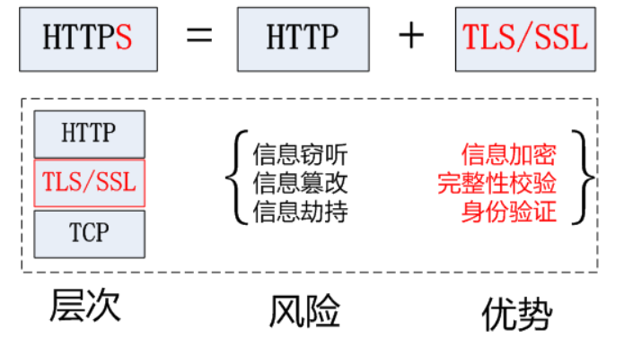
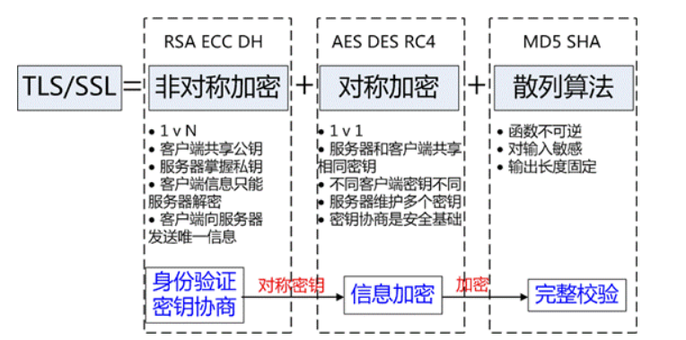
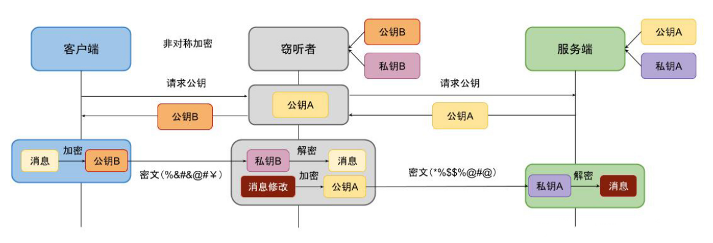
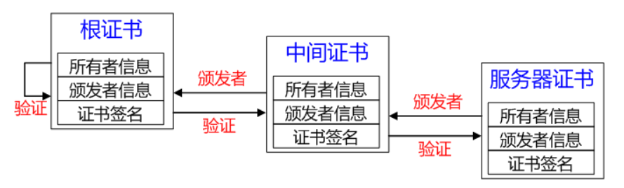
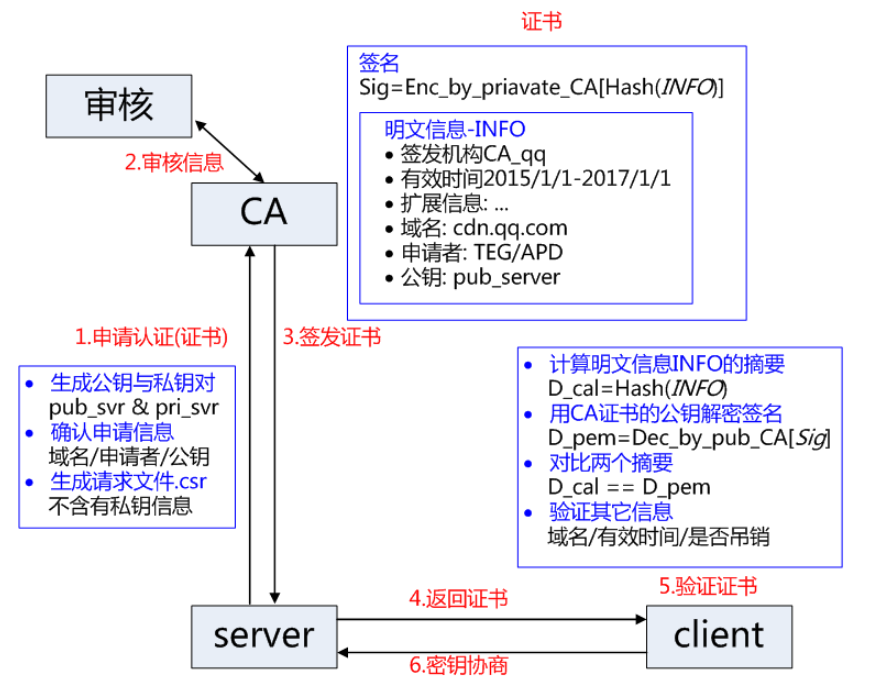
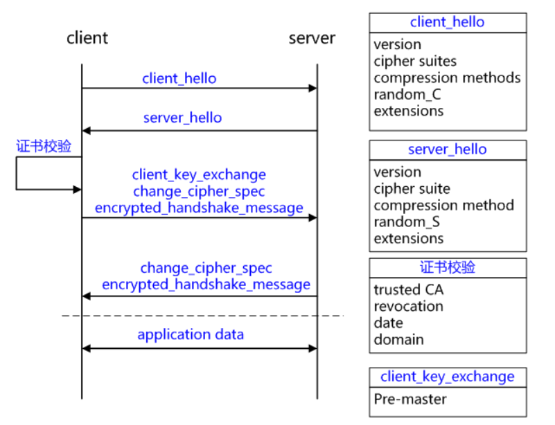
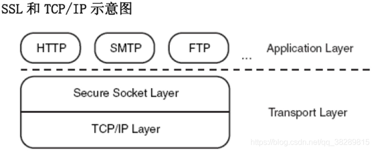
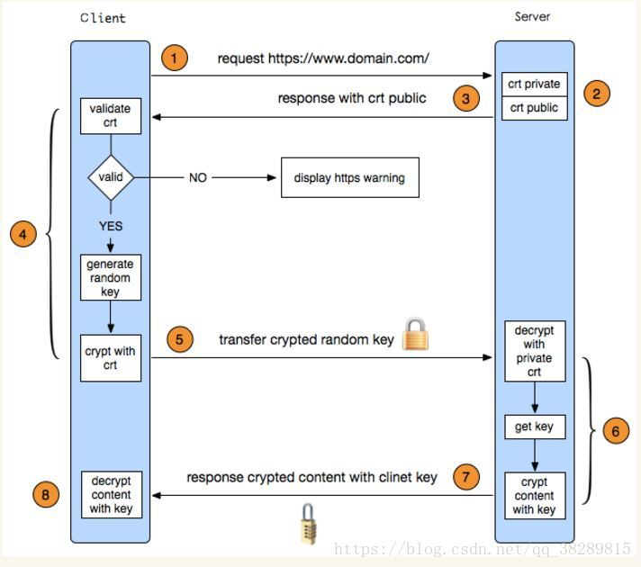
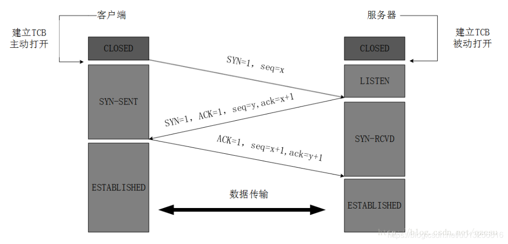
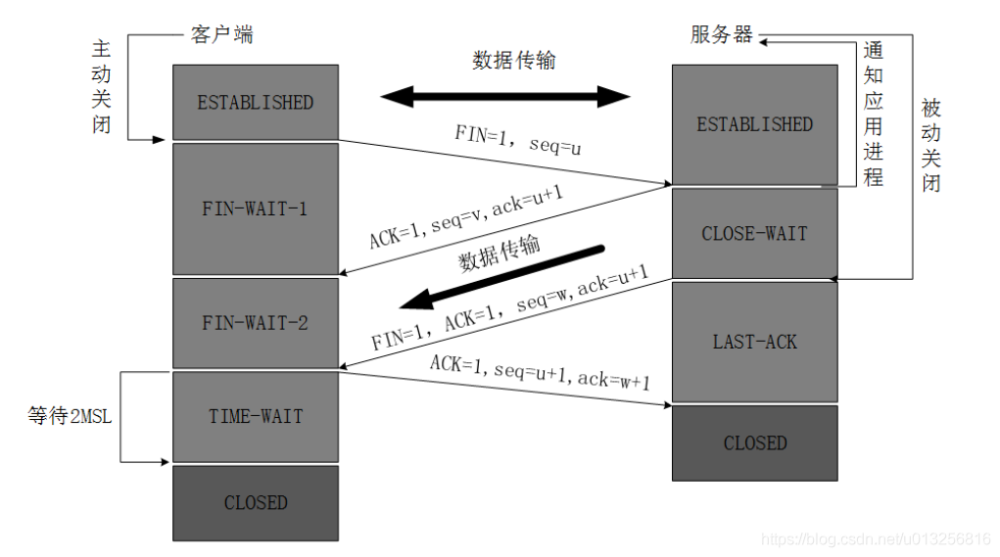

# 面试问题

## 计网

#### 简述从输入网址到浏览器显示的过程

1、**DNS域名解析系统对输入的网址进行解**

​        DNS域名解析系统本质就是一个数据服务器，里面就存储了域名和IP的对应关系；

​    最后会得到一个IP地址，通过这个IP地址，才能访问一台服务器；因为得到一个地址后，就能知道我们要访问哪一台服务器了。

2、**建立TCP连接**

​    客户端浏览器与服务器建立TCP安全连接（三次握手），为之后的HTTP响应做准备

3、**客户端（浏览器）发送HTTP请求，服务端（服务器）响应请求**

​    客户端根据用户操作（如按下回车键），向服务器发送HTTP请求；

​    服务器接收请求，然后进行处理，整合需要的资源，通过HTTP协议传输响应发送给客户端浏览器。

4、**浏览器解析渲染页面**

​    浏览器接收服务器资源，解析渲染成Web页面。

5、**连接结束**

​    通过四次挥手，断开连接。


附：

* **三次握手**

​    第一次握手：建立连接时，客户端发送syn包（syn=j）到服务器，并进入SYN_SENT状态，等待服务器确认；SYN：同步序列编号（Synchronize Sequence Numbers）。

​    第二次握手：服务器收到syn包，必须确认客户的SYN（ack=j+1），同时自己也发送一个SYN包（seq=k），即SYN+ACK包，此时服务器进入SYN_RECV状态；(ACK: 确认值Acknowledgement)

​    第三次握手：客户端收到服务器的SYN+ACK包，向服务器发送确认包ACK(ack=k+1），此包发送完毕，客户端和服务器进入ESTABLISHED（TCP连接成功）状态，完成三次握手。

* **四次挥手**

​    第一次挥手：TCP客户端发送一个FIN，用来关闭客户到服务器的数据传送。

​     第二次挥手：服务器收到这个FIN，它发回一个ACK，确认序号为收到的序号加1。和SYN一样，一个FIN将占用一个序号。

​     第三次挥手：服务器关闭客户端的连接，发送一个FIN给客户端。

​     第四次挥手：客户端发回ACK报文确认，并将确认序号设置为收到序号加1。

* **HTTP协议**

​    HTTP协议是一个简单的请求-响应协议，它通常运行在TCP之上。它指定了客户端可能发送给服务器什么样的消息以及得到什么样的响应。

* **HTTPS(超文本传输协议)**

​    是以安全为目标的HTTP通道，简单讲是HTTP的安全版。即HTTP下加入SSL层，HTTPS的安全基础是SSL，因此加密的详细内容就需要SSL。


## HTTPS

#### HTTPS 和 HTTP 的区别

1、HTTPS是加密传输协议，HTTP是名文传输协议;
2、HTTPS需要用到SSL证书，而HTTP不用;
3、HTTPS比HTTP更加安全，对搜索引擎更友好，利于SEO；
4、 HTTPS标准端口443，HTTP标准端口80;
5、 HTTPS基于传输层，HTTP基于应用层;
6、 HTTPS在浏览器显示绿色安全锁，HTTP没有显示;

#### TLS/SSL 工作原理及握手过程详解

##### TLS/SSL 基础概念

概念源自百度百科：传输层安全性协议 TLS（Transport Layer Security），及其前身安全套接层 SSL（Secure Sockets Layer）是一种安全协议，目的是为互联网通信提供安全及数据完整性保障。网景公司（Netscape）在 1994 年推出首版网页浏览器，网景导航者时，推出 HTTPS 协议，以 SSL 进行加密，这是 SSL 的起源。IETF 将 SSL 进行标准化，1999 年公布第一版 TLS 标准文件。随后又公布RFC 5246（2008年8月）与RFC 6176（2011年3月）。在浏览器、邮箱、即时通信、VoIP、网络传真等应用程序中，广泛支持这个协议。主要的网站，如 Google、Facebook 等也以这个协议来创建安全连线，发送数据。目前已成为互联网上保密通信的工业标准。



TLS/SSL 的功能实现主要依赖于三类基本算法：散列函数 Hash、对称加密和非对称加密，其利用非对称加密实现身份认证和密钥协商，对称加密算法采用协商的密钥对数据加密，基于散列函数验证信息的完整性。  



##### 散列函数 Hash

常见的有 MD5、SHA1、SHA256，该类函数特点是函数单向不可逆、对输入非常敏感、输出长度固定，针对数据的任何修改都会改变散列函数的结果，用于防止信息篡改并验证数据的完整性。在信息传输过程中，散列函数不能单独实现信息防篡改，因为明文传输，中间人可以修改信息之后重新计算信息摘要，因此需要对传输的信息以及信息摘要进行加密。

##### 对称加密

常见的有 AES-CBC、DES、3DES、AES-GCM 等，信息的加密和解密用相同的密钥，掌握密钥才能获取信息。在对称加密中，信息安全的基础是保证密钥的安全。

##### 非对称加密

即常见的 RSA 算法，还包括 ECC、DH 等算法，算法特点是，密钥成对出现，一般称为公钥(公开)和私钥(保密)。因此掌握公钥的不同客户端之间不能互相解密信息，只能和掌握私钥的服务器进行加密通信。服务器持有私钥可以实现一对多的通信，而客户端可以用公钥来验证服务器发送的数字签名。服务器只需要维持一个私钥就能够和多个客户端进行加密通信，但该算法的计算复杂，加密速度慢。

结合三类算法的特点，TLS/SSL 的基本工作方式是，**客户端使用非对称加密与服务器进行通信，实现身份验证并协商对称加密使用的密钥，然后对称加密算法采用协商密钥对信息以及信息摘要进行加密通信，不同的节点之间采用的对称密钥不同，从而可以保证信息只能通信双方获取**。

##### 密钥协商过程中存在的问题及解决办法

存在的问题

上面介绍了 TLS/SSL 在 HTTPS 信息传递中扮演的角色，我们知道了要用非对称加密与服务器进行通信，实现身份验证并协商对称加密使用的密钥。可是这个公钥是怎么传递给客户端的？


上面图中的过程是不安全的，接下来对该问题进行说明。与公钥密码加密系统相伴的一个重要挑战就是正确地决定某个主体或身份的公钥。如果 A 向 B 发送自已的公钥，M 能够在传输过程中将其修改为自己的公钥。B (也被称为依赖方)可能察觉不到自已使用的是 M 的公钥，而认为这是 A 的公钥。这样就使得 M 能够轻易地扮演 A 的角色，即如下图所示：



##### 解决办法

一种常见的方法是依靠中心化的机构，其中包括对公钥基础设施 PKI (Public Key Infrastructure) 的使用。这一方法在特定的理论假设下容易被证明是安全的。 PKI 负责提供创建、吊销、分发以及更新密钥对与证书的服务。它需要一些证书颁发机构 CA  (Certificate Authority) 才能运行。证书颁发机构是用于管理与认证一些个体与它们的公钥间的绑定关系的实体。目前有数百家商业证书颁发机构。一个证书颁发机构通常采用层次的签名构架。这意味着一个公钥可能会被一个父密钥签名，而这个父密钥可能会被一个祖父密钥签名，依次类推。最终，一个证书颁发机构会拥有一个或多个根证书，许多下属的证书都会依赖根证书来建立信任。



在实践中，系统往往要求公钥操作应当拥有知名 CA 的根证书。这些根证书是在配置时安装的 (例如，微软公司的 Intemet ExpIorer 浏览器、 Mozilia 公司的 Firefox 浏览器以及 Google 公司的 Chrome 浏览器都能够访问一个预先配置的根证书数据库)。



##### TLS/SSL 握手过程




1. **client_hello**

客户端发起请求，以明文传输请求信息，包含版本信息，加密套件候选列表，压缩算法候选列表，随机数，扩展字段等信息，相关信息如下：

(1) 支持的最高TSL协议版本version，从低到高依次 SSLv2，SSLv3，TLSv1，TLSv1.1，TLSv1.2，TLSv1.3。

(2) 客户端支持的加密套件 cipher suites 列表， 每个加密套件对应前面 TLS 原理中的四个功能的组合：认证算法 Au (身份验证)、密钥交换算法 Key Exchange(密钥协商)、对称加密算法 Enc (信息加密)和信息摘要 Mac(完整性校验)。

(3) 支持的压缩算法 compression methods 列表，用于后续的信息压缩传输。

(4) 随机数 random_C，用于后续的密钥的生成。

(5) 扩展字段 extensions，支持协议与算法的相关参数以及其它辅助信息等，常见的 SNI 就属于扩展字段，后续单独讨论该字段作用。

2. **server_hello + server_certificate + sever_hello_done**

(1) server_hello， 服务端返回协商的信息结果，包括选择使用的协议版本 version，选择的加密套件 cipher suite，选择的压缩算法 compression method、随机数 random_S 等，其中随机数用于后续的密钥协商。

(2) server_certificates，服务器端配置对应的证书链，用于身份验证与密钥交换。

(3) server_hello_done，通知客户端 server_hello 信息发送结束。

3. **证书校验**

客户端验证证书的合法性，如果验证通过才会进行后续通信，否则根据错误情况不同做出提示和操作，合法性验证包括如下：

(1) 证书链的可信性 trusted certificate path。

(2) 证书是否吊销 revocation，有两类方式离线 CRL 与在线 OCSP，不同的客户端行为会不同。

(3) 有效期 expiry date，证书是否在有效时间范围。

(4) 域名 domain，核查证书域名是否与当前的访问域名匹配，匹配规则后续分析。

4. **client_key_exchange + change_cipher_spec + encrypted_handshake_message**

(1) client_key_exchange，合法性验证通过之后，客户端计算产生随机数字 Pre-master，并用证书公钥加密，发送给服务器。

(2) 此时客户端已经获取全部的计算协商密钥需要的信息：两个明文随机数 random_C 和 random_S 与自己计算产生的 Pre-master，计算得到协商密钥： enc_key = Function(random_C, random_S, Pre-Master); 。

(3) change_cipher_spec，客户端通知服务器后续的通信都采用协商的通信密钥和加密算法进行加密通信。

(4) encrypted_handshake_message，结合之前所有通信参数的 hash 值与其它相关信息生成一段数据，采用协商密钥 session secret 与算法进行加密，然后发送给服务器用于数据与握手验证。

5. **change_cipher_spec + encrypted_handshake_message**

(1) 服务器用私钥解密加密的 Pre-master 数据，基于之前交换的两个明文随机数 random_C 和 random_S，计算得到协商密钥：enc_key = Function(random_C, random_S, Pre-Master); 。

(2) 计算之前所有接收信息的 hash 值，然后解密客户端发送的 encrypted_handshake_message，验证数据和密钥正确性。

(3) change_cipher_spec， 验证通过之后，服务器同样发送 change_cipher_spec 以告知客户端后续的通信都采用协商的密钥与算法进行加密通信。

(4) encrypted_handshake_message， 服务器也结合所有当前的通信参数信息生成一段数据并采用协商密钥 session secret 与算法加密并发送到客户端。(将随机密码加密的数据响应给客户端)

6. **握手结束**

客户端计算所有接收信息的 hash 值，并采用协商密钥解密 encrypted_handshake_message，验证服务器发送的数据和密钥，验证通过则握手完成。

7. **加密通信**

开始使用协商密钥与算法进行加密通信。注意：

(1) 服务器也可以要求验证客户端，即双向认证，可以在过程 2 要发送 client_certificate_request 信息，客户端在过程 4 中先发送  client_certificate 与 certificate_verify_message 信息，证书的验证方式基本相同，certificate_verify_message 是采用 client 的私钥加密的一段基于已经协商的通信信息得到数据，服务器可以采用对应的公钥解密并验证。

(2) 根据使用的密钥交换算法的不同，如 ECC 等，协商细节略有不同，总体相似。

(3) sever key exchange 的作用是 server certificate 没有携带足够的信息时，发送给客户端以计算 pre-master，如基于 DH 的证书，公钥不被证书中包含，需要单独发送。

(4) change cipher spec 实际可用于通知对端改版当前使用的加密通信方式，当前没有深入解析。

(5) alter message 用于指明在握手或通信过程中的状态改变或错误信息，一般告警信息触发条件是连接关闭，收到不合法的信息，信息解密失败，用户取消操作等，收到告警信息之后，通信会被断开或者由接收方决定是否断开连接。

##### 签名过程

发送报文时，发送方用一个哈希函数从报文文本中生成报文摘要，然后用发送方的私钥对这个摘要进行加密，这个加密后的摘要将作为报文的数字签名和报文一起发送给接收方。接收方首先用与发送方一样的哈希函数从接收到的原始报文中计算出报文摘要，接着再用公钥来对报文附加的数字签名进行解密，如果这两个摘要相同、那么接收方就能确认该报文是发送方的。

数字签名有两种功效：一是能确定消息确实是由发送方签名并发出来的，因为别人假冒不了发送方的签名。二是数字签名能确定消息的完整性。因为数字签名的特点是它代表了文件的特征，文件如果发生改变，数字摘要的值也将发生变化。不同的文件将得到不同的数字摘要。 一次数字签名涉及到一个哈希函数、接收者的公钥、发送方的私钥。

#### HTTP 和 HTTPS 的区别

##### 一、HTTP 和 HTTPS 的基本概念

HTTP：超文本传输协议（HTTP，HyperText Transfer Protocol）是互联网上应用最为广泛的一种网络协议。设计 HTTP 最初的目的是为了提供一种发布和接收 HTML 页面的方法。它可以使浏览器更加高效。HTTP 协议是以明文方式发送信息的，如果黑客截取了 Web 浏览器和服务器之间的传输报文，就可以直接获得其中的信息。

**HTTP 原理**

①  客户端的浏览器首先要通过网络与服务器建立连接，该连接是通过 TCP 来完成的，一般 TCP 连接的端口号是80。 建立连接后，客户机发送一个请求给服务器，请求方式的格式为：统一资源标识符（URL）、协议版本号，后边是 MIME 信息包括请求修饰符、客户机信息和许可内容。

②  服务器接到请求后，给予相应的响应信息，其格式为一个状态行，包括信息的协议版本号、一个成功或错误的代码，后边是 MIME 信息包括服务器信息、实体信息和可能的内容。

**HTTPS**：是以安全为目标的 HTTP 通道，是 HTTP 的安全版。HTTPS 的安全基础是 SSL。SSL 协议位于 TCP/IP 协议与各种应用层协议之间，为数据通讯提供安全支持。SSL 协议可分为两层：SSL 记录协议（SSL Record Protocol），它建立在可靠的传输协议（如TCP）之上，为高层协议提供数据封装、压缩、加密等基本功能的支持。SSL 握手协议（SSL Handshake Protocol），它建立在 SSL 记录协议之上，用于在实际的数据传输开始前，通讯双方进行身份认证、协商加密算法、交换加密密钥等。



**HTTPS 设计目标**：

(1) 数据保密性：保证数据内容在传输的过程中不会被第三方查看。就像快递员传递包裹一样，都进行了封装，别人无法获知里面装了什么  。

(2) 数据完整性：及时发现被第三方篡改的传输内容。就像快递员虽然不知道包裹里装了什么东西，但他有可能中途掉包，数据完整性就是指如果被掉包，我们能轻松发现并拒收 。

(3) 身份校验安全性：保证数据到达用户期望的目的地。就像我们邮寄包裹时，虽然是一个封装好的未掉包的包裹，但必须确定这个包裹不会送错地方，通过身份校验来确保送对了地方  。

##### 二、HTTP 与 HTTPS  的区别

1、HTTPS  协议需要到 CA （Certificate Authority，证书颁发机构）申请证书，一般免费证书较少，因而需要一定费用。(以前的网易官网是http，而网易邮箱是 https 。)

2、HTTP 是超文本传输协议，信息是明文传输，HTTPS 则是具有安全性的 SSL 加密传输协议。

3、HTTP 和 HTTPS 使用的是完全不同的连接方式，用的端口也不一样，前者是80，后者是443。

4、HTTP 的连接很简单，是无状态的。HTTPS 协议是由 SSL+HTTP 协议构建的可进行加密传输、身份认证的网络协议，比 HTTP 协议安全。(无状态的意思是其数据包的发送、传输和接收都是相互独立的。无连接的意思是指通信双方都不长久的维持对方的任何信息。)

##### 三、HTTPS 相对于 HTTP 的改进

**双向的身份认证**

客户端和服务端在传输数据之前，会通过基于X.509证书对双方进行身份认证 。具体过程如下：

客户端发起 SSL 握手消息给服务端要求连接。

服务端将证书发送给客户端。

客户端检查服务端证书，确认是否由自己信任的证书签发机构签发(客户端内置了所有受信任 CA 的证书)。 如果不是，将是否继续通讯的决定权交给用户选择 ( 注意，这里将是一个安全缺陷 )。如果检查无误或者用户选择继续，则客户端认可服务端的身份。

服务端要求客户端发送证书，并检查是否通过验证。失败则关闭连接，认证成功则从客户端证书中获得客户端的公钥，一般为 1024 位或者 2048 位。到此，服务器客户端双方的身份认证结束，双方确保身份都是真实可靠的。

**注意**：

(1) 采用 HTTPS 协议的服务器必须要有一套数字证书，可以自己制作，也可以向组织申请。区别就是自己颁发的证书需要客户端验证通过，才可以继续访问。这套证书其实就是一对公钥和私钥。

(2) 互联网有太多的服务需要使用证书来验证身份，以至于客户端（操作系统或浏览器等）无法内置所有证书，需要通过服务端将证书发送给客户端。

(3) 客户端内置的是 CA 的根证书(Root Certificate)，HTTPS 协议中服务器会发送证书链（Certificate Chain）给客户端。

**数据传输的机密性**

客户端和服务端在开始传输数据之前，会协商传输过程需要使用的加密算法。 客户端发送协商请求给服务端, 其中包含自己支持的非对成加密的密钥交换算法 ( 一般是RSA)，数据签名摘要算法 ( 一般是SHA或者MD5) ，加密传输数据的对称加密算法 ( 一般是DES)，以及加密密钥的长度。 服务端接收到消息之后，选中安全性最高的算法，并将选中的算法发送给客户端，完成协商。客户端生成随机的字符串，通过协商好的非对称加密算法，使用服务端的公钥对该字符串进行加密，发送给服务端。 服务端接收到之后，使用自己的私钥解密得到该字符串。在随后的数据传输当中，使用这个字符串作为密钥进行对称加密。

**防止重放攻击**

SSL 使用序列号来保护通讯方免受报文重放攻击。这个序列号被加密后作为数据包的负载。在整个 SSL 握手中，都有一个唯一的随机数来标记 SSL 握手。 这样防止了攻击者嗅探整个登录过程，获取到加密的登录数据之后，不对数据进行解密，而直接重传登录数据包的攻击手法。

可以看到，鉴于电子商务等安全上的需求，HTTPS 对比 HTTP 协议，在安全方面已经取得了极大的增强。总结来说，HTTPS 的改进点在于创造性的使用了非对称加密算法，在不安全的网路上，安全的传输了用来进行非对称加密的密钥，综合利用了非对称加密的安全性和对称加密的快速性。

##### 四、HTTPS 的优点

1、使用 HTTPS 协议可认证用户和服务器，确保数据发送到正确的客户机和服务器。

2、HTTPS 协议是由SSL+HTTP 协议构建的可进行加密传输、身份认证的网络协议，要比 HTTP 协议安全，可防止数据在传输过程中不被窃取、修改，确保数据的完整性。

3、HTTPS 是现行架构下最安全的解决方案，虽然不是绝对安全，但它大幅增加了中间人攻击的成本。

##### 五、HTTPS 的缺点（对比优点）

1、HTTPS 协议握手阶段比较费时，会使页面的加载时间延长近。

2、HTTPS 连接缓存不如 HTTP 高效，会增加数据开销，甚至已有的安全措施也会因此而受到影响。

3、HTTPS 协议的安全是有范围的，在黑客攻击、拒绝服务攻击和服务器劫持等方面几乎起不到什么作用。

4、SSL 证书通常需要绑定 IP，不能在同一 IP 上绑定多个域名，IPv4 资源不可能支撑这个消耗。

5、成本增加。部署 HTTPS 后，因为 HTTPS 协议的工作要增加额外的计算资源消耗，例如 SSL 协议加密算法和 SSL 交互次数将占用一定的计算资源和服务器成本。

6、HTTPS 协议的加密范围也比较有限。最关键的，SSL 证书的信用链体系并不安全，特别是在某些国家可以控制 CA 根证书的情况下，中间人攻击一样可行。

##### 六、HTTPS 的连接过程




图片中的过程是按 8 个步骤分的，但是网上有更详细的步骤，所以我把详细的过程和这个图片配在一起。

① 客户端的浏览器向服务器发送请求，并传送客户端 SSL 协议的版本号，加密算法的种类，产生的随机数，以及其他服务器和客户端之间通讯所需要的各种信息。

② 服务器向客户端传送 SSL 协议的版本号，加密算法的种类，随机数以及其他相关信息，同时服务器还将向客户端传送自己的证书。

③ 客户端利用服务器传过来的信息验证服务器的合法性，服务器的合法性包括：证书是否过期，发行服务器证书的 CA 是否可靠，发行者证书的公钥能否正确解开服务器证书的 "发行者的数字签名"，服务器证书上的域名是否和服务器的实际域名相匹配。如果合法性验证没有通过，通讯将断开；如果合法性验证通过，将继续进行第四步。

④ 用户端随机产生一个用于通讯的 "对称密码"，然后用服务器的公钥（服务器的公钥从步骤②中的服务器的证书中获得）对其加密，然后将加密后的“预主密码”传给服务器。

⑤ 如果服务器要求客户的身份认证（在握手过程中为可选），用户可以建立一个随机数然后对其进行数据签名，将这个含有签名的随机数和客户自己的证书以及加密过的密钥一起传给服务器。

⑥ 如果服务器要求客户的身份认证，服务器必须检验客户证书和签名随机数的合法性，具体的合法性验证过程包括：客户的证书使用日期是否有效，为客户提供证书的 CA  是否可靠，发行 CA 的公钥能否正确解开客户证书的发行 CA 的数字签名，检查客户的证书是否在证书废止列表（CRL）中。检验如果没有通过，通讯立刻中断；如果验证通过，服务器将用自己的私钥解开加密的私钥，然后执行一系列步骤来产生主通讯密码（客户端也将通过同样的方法产生相同的主通讯密码）。

⑦ 服务器和客户端用相同的对称加密密钥，对称密钥用于 SSL 协议的安全数据通讯的加解密通讯。同时在 SSL 通讯过程中还要完成数据通讯的完整性，防止数据通讯中的任何变化。

⑧ 客户端向服务器端发出信息，指明后面的数据通讯将使用的步骤 ⑦ 中的主密码为对称密钥，同时通知服务器客户端的握手过程结束。

⑨ 服务器向客户端发出信息，指明后面的数据通讯将使用的步骤 ⑦ 中的主密码为对称密钥，同时通知客户端服务器端的握手过程结束。

⑩ SSL 的握手部分结束，SSL 安全通道的数据通讯开始，客户和服务器开始使用相同的对称密钥进行数据通讯，同时进行通讯完整性的检验。

**上述的过程需要弄懂的核心思想**

**客户端解析证书**

这部分工作是由客户端的 TLS 来完成的，首先会验证公钥是否有效，比如颁发机构，过期时间等等，如果发现异常，则会弹出一个警告框，提示证书存在问题。如果证书没有问题，那么就生成一个对称加密密钥，然后用公钥对该密钥进行非对称加密。

**传送加密信息**

这部分传送的是用公钥加密后的对称加密密钥，目的就是让服务端得到这个密钥，以后客户端和服务端的通信就可以通过这个密钥来进行加密解密了。

**服务端解密信息**

服务端用非对称加密算法里的私钥解密后，得到了客户端传过来的对称加密算法的私钥，然后把之后传输的内容通过该值进行对称加密。

**为什么用非对称加密协商对称加密密钥**

对称加密的特点：对称密码体制中只有一种密钥，并且是非公开的。如果要解密就得让对方知道密钥，所以想要保证其安全性就要保证密钥的安全。

非对称加密的特点：算法强度复杂、安全性依赖于算法与密钥但是由于其算法复杂，而使得加密解密速度没有对称加密解密的速度快。非对称密钥体制有两种密钥，其中一个是公开的，这样就可以不需要像对称密码那样传输对方的密钥了，这样安全性就大了很多。

非对称加密公钥和私钥的使用方法：(1) 公钥加密私钥解密。(2) 私钥做数字签名，公钥验证。

##### 补充：

**SSL 提供服务**

(1) 认证用户和服务器，确保数据发送到正确的客户机和服务器；

(2) 加密数据以防止数据中途被窃取；

(3) 维护数据的完整性，确保数据在传输过程中不被改变。

**SSL 工作流程**

**服务器认证阶段**：

(1) 客户端向服务器发送一个开始信息 "Hello" 以便开始一个新的会话连接；

(2) 服务器根据客户的信息确定是否需要生成新的主密钥，如需要则服务器在响应客户的 "Hello" 信息时将包含生成主密钥所需的信息；

(3) 客户根据收到的服务器响应信息，产生一个主密钥，并用服务器的公开密钥加密后传给服务器；

(4) 服务器回复该主密钥，并返回给客户一个用主密钥认证的信息，以此让客户认证服务器。


**用户认证阶段**：在此之前，服务器已经通过了客户认证，这一阶段主要完成对客户的认证。经认证的服务器发送一个提问给客户，客户则返回（数字）签名后的提问和其公开密钥，从而向服务器提供认证。

 

SSL 协议提供的安全通道有以下三个特性：

**机密性**：SSL 协议使用密钥加密通信数据。

**可靠性**：服务器和客户都会被认证，客户的认证是可选的。

**完整性**：SSL 协议会对传送的数据进行完整性检查。

 

**服务器证书**(server certificates)是 SSL 数字证书的一种形式，意指通过提交数字证书来证明您的身份或表明您有权访问在线服务。再者简单来说，通过使用服务器证书可为不同站点提供身份鉴定并保证该站点拥有高强度加密安全。是组成 Web 服务器的 SSL 安全功能的唯一的数字标识。通过相互信任的第三方组织获得，并为用户提供验证您 Web 站点身份的手段。服务器证书包含详细的身份验证信息，如服务器内容附属的组织、颁发证书的组织以及称为公开密钥的唯一的身份验证文件。

## 网址访问过程

在面试过程中常常会遇到这样一个问题：请你详细描述一下从我们在浏览器中输入网址到最后看到网页，这个过程中发生了什么？这个问题涉及面十分广，几乎涵盖了计网的全部相关问题，这个题的答案因人而异，可以挑选一两个着重点进行详细说明，其他的略过。


#### 全过程简要概述
当我们将网址输入到浏览器后，第一件事就是解析 url 得到域名，通过 DNS 协议 获取到该域名的 ip 地址，得到 ip 后浏览器会先与服务器通过 TCP 三次握手建立连接，然后构建 HTTP 请求，将 HTTP 的传输工作交给操作系统的协议栈，发送请求成功后，浏览器会从服务端拿到该页面的 HTML 以及资源文件，浏览器会 渲染页面，呈现出我们所看到的模样。

在这整个过程中，涉及到了 DNS 解析，http请求，TCP\IP 协议栈、页面渲染等知识，当然也可以继续扩展，比如从 HTTP 可以说到 HTTPS，可以说到对称加密与非对称加密，可以说到网络安全等等，主要目的就是让整个面试过程跟着你的技术栈走，而不被面试官带到你不会的地方。

在这里我将重点写一下我在面试中喜欢拓展的方向，并拟出一份答案。


#### DNS 解析
浏览器在拿到 url 时，首先会对 url 进行解析，将域名与实际的文件路径分离，然后需要使用 DNS 协议，通过域名得到 IP 地址。

首先浏览器会查询浏览器缓存，如果有这个网址就可以直接获取到 IP，如果没有就进一步访问本机缓存，如果本机缓存也没有才会发起 DNS 请求。

而 DNS 的服务器是一个树状结构，对于域名来说是倒着进行解析的，根节点是根 DNS 服务器，他的子节点为 com、cn 这种顶级域 dns 服务器，然后进一步向下进行解析。

以 baidu.com 为例，当我们的电脑需要发起 DNS 请求的时候，会先对根 DNS 服务器发起请求，这个服务器的 IP 地址一般在每台电脑上都有，我们一般会设置为 8.8.8.8 或者 114.114.114.114，我们的电脑在访问根 DNS 服务器后，会得到 com 域 DNS 服务器的 IP，然后会继续访问 com 域 DNS 服务器，这时就能得到 baicu.com 的 IP 地址了。


#### HTTP 请求
在解析 url 时，我们能获取到需要请求资源的资源路径、端口号、请求参数等信息，这些信息会被存储在 http 头中，通过 DNS 请求获取到ip后，浏览器会构建并发送 HTTP 请求或者 HTTPS 请求，HTTPS 就是在 HTTP 的基础上加了一个 TLS 协议来进行数据加密，这个我们待会说。

HTTP 请求有很多种，但对资源的操作离不开增删改查，也就对应着 POST、DELETE、PUT、GET 请求。最常用的是 GET 和 POST，其区别在于 GET 的参数是在 url 中的，而 POST 的参数是在请求的 body 中。

以 GET 为例，当需要发送 HTTP 请求的时候，同样也不是直接就发送了，需要先查询浏览器缓存。浏览器中的缓存分为强缓存和协商缓存，浏览器发起 HTTP 请求时首先会根据 http 头信息来判断是存有强缓存，以及其是否过期，如果有强缓存且未过期则命中，不会发送请求到服务器了。如果强缓存没命中，则会向服务器发起请求，这个请求的 Header 头中会带有浏览器最后一次请求该资源的时间和一个资源校验码(使用资源修改时间、资源大小等信息生成)，服务器收到这个请求后会判断协商缓存是否过期，如果过期则返回新的资源信息，如果没过期则返回 304 状态码，表示资源未更新，可以使用缓存中的资源。


#### TCP->网络层连接
TCP 这一块内容比较多，所以一般不会在这个问题中详细说明，这里只写一个过渡段，想要了解 TCP 相关问题解答的可以看我的另一篇博客：TCP详解

HTTP 请求发出后会将数据包交给下层协议栈处理，在传输层和网络层该数据包会被分别加上 TCP 头和 IP 头，并且被发送出去，沿路的网关会收到这个数据包并进行识别和转发，直到该数据包被服务器收到，通过相同的流程返回回复数据包。


#### 页面渲染
由于我对前端不熟悉，就不展开讲，被问到的话就说是通过写爬虫来了解DOM树的，前端只会简单的 Vue 开发，底层原理不了解

一般来说，浏览器第一次从服务器请求的资源都是一个 HTML 文件，例如服务端默认的 index.html 等，浏览器获取到这个 HTML 文件就会对其进行解析，构建出一棵 DOM 树，并通过执行其中的 js 代码发起更多的请求，请求渲染页面需要的其他资源，CSS 或者一些外链的图片等，拿到 CSS 后将其与 DOM 树结合进行更进一步的渲染，我们就能看到页面了。


#### HTTPS
由于 HTTP 是使用信息明文传播，所以会有窃听、篡改、冒充等风险，所以 HTTPS 在 HTTP 的基础上加上了 SSL 层，通过加密的方式来保证数据安全。

**SSL 通过加密防止窃听，通过签名来防止篡改，通过证书来防止冒充**。

HTTPS 协议在客户端与服务端开始通信前，会进行密钥协商，通过一轮非对称加密，一般是RSA加密来传递后序通信过程使用的对称密钥，由于非对称加密较慢，后续通信过程中使用对称加密。在密钥协商的过程中，服务端会将自己的证书发送给客户端，客户端会到CA机构通过摘要值验证证书的合法性，从而防止中间人攻击。


#### 补充提问：你对中间人攻击有哪些了解？
中间人攻击主要分为 SSL 劫持攻击、SSL 剥离攻击以及针对 SSL 算法的攻击

SSL 劫持攻击即 SSL 证书欺骗攻击，攻击者为了获得HTTPS传输的明文数据，需要先将自己接入到客户端和目标网站之间；在传输过程中伪造服务器的证书，将服务器的公钥替换成自己的公钥，这样中间人就可以解密客户端和服务端的数据传输内容。可以通过在网站前端加入证书校验来预防 SSL 劫持攻击。

SSL 剥离攻击，即将 HTTPS 连接降级到 HTTP 连接。假如客户端直接访问 HTTPS 的 URL，攻击者是没办法直接进行降级的，该攻击方式主要是利用用户并不会每次都直接在浏览器上输入 https 来访问网站或者有些网站并非全网 HTTPS，中间人攻击者在劫持了客户端与服务端的 HTTP 会话后，将 HTTP 页面里面所有的 https:// 超链接都换成 http:// ，用户在点击相应的链接时，是使用 HTTP 协议来进行访问。可以通过在网站前端检查 URL 是否被篡改来预防 SSL 剥离攻击。

针对 SSL 算法的攻击：低版本的 SSL 协议是存在漏洞的，这些漏洞可能会被公共者利用，及时升级服务端的 SSL 配置可以预防针对 SSL 算法的攻击。


#### 最终答案
浏览器在拿到 url 时，首先会对 url 进行解析，将域名与实际的文件路径分离，然后需要使用 DNS 协议，通过域名得到 IP 地址。
浏览器会查询浏览器缓存，如果有这个网址的缓存就可以直接获取到 IP，如果没有就进一步访问本机缓存，如果本机缓存也没有才会发起 DNS 请求。
而 DNS 的服务器是一个树状结构，对于域名来说是倒着进行解析的，根节点是根 DNS 服务器，他的子节点为 com、cn 这种顶级域 dns 服务器，然后进一步向下进行解析。
以 baidu.com 为例，当我们的电脑需要发起 DNS 请求的时候，会先对根 DNS 服务器发起请求，这个服务器的 IP 地址一般在每台电脑上都有，我们一般会设置为 8.8.8.8 或者 114.114.114.114，我们的电脑在访问根 DNS 服务器后，会得到 com 域 DNS 服务器的 IP，然后会继续访问 com 域 DNS 服务器，这时就能得到 baicu.com 的 IP 地址了。

得到 ip 后浏览器会先与服务器通过 TCP 三次握手建立连接，然后构建 HTTP 请求。
在解析 url 时，我们能获取到需要请求资源的资源路径、端口号、请求参数等信息，这些信息会被存储在 http 头中，通过 DNS 请求获取到 ip 后，浏览器会构建并发送 HTTP 请求或者 HTTPS 请求，HTTPS 就是在 HTTP 的基础上加了一个 TLS 协议来进行数据加密，这个我们待会说。
HTTP 请求有很多种，但对资源的操作离不开增删改查，也就对应着 POST、DELETE、PUT、GET 请求。最常用的是 GET 和 POST，其区别在于 GET 的参数是在 url 中的，而 POST 的参数是在请求的 body 中。
以 GET 为例，当需要发送 HTTP 请求的时候，同样也不是直接就发送了，需要先查询浏览器缓存。浏览器中的缓存分为强缓存和协商缓存，浏览器发起 HTTP 请求时首先会根据 http 头信息来判断是存有强缓存，以及其是否过期，如果有强缓存且未过期则命中，不会发送请求到服务器了。如果强缓存没命中，则会向服务器发起请求，这个请求的 Header 头中会带有浏览器最后一次请求该资源的时间和一个资源校验码(使用资源修改时间、资源大小等信息生成)，服务器收到这个请求后会判断协商缓存是否过期，如果过期则返回新的资源信息，如果没过期则返回 304 状态码，表示资源未更新，可以使用缓存中的资源。

HTTP 请求发出后会将数据包交给下层协议栈处理，在传输层和网络层该数据包会被分别加上 TCP 头和 IP 头，并且被发送出去，沿路的网关会收到这个数据包并进行识别和转发，直到该数据包被服务器收到，通过相同的流程返回回复数据包。

一般来说，浏览器第一次从服务器请求的资源都是一个 HTML 文件，例如服务端默认的 index.html 等，浏览器获取到这个 HTML 文件就会对其进行解析，构建出一棵DOM树，并通过执行其中的 js 代码发起更多的请求，请求渲染页面需要的其他资源，CSS 或者一些外链的图片等，拿到 CSS 后将其与 DOM 树结合进行更进一步的渲染，我们就能看到页面了。

最后再补充一下 HTTPS，由于 HTTP 是使用信息明文传播，所以会有窃听、篡改、冒充等风险，所以 HTTPS 在 HTTP 的基础上加上了 SSL 层，通过加密的方式来保证数据安全。
SSL 通过加密防止窃听，通过签名来防止篡改，通过证书来防止冒充。
HTTPS 协议在客户端与服务端开始通信前，会进行密钥协商，通过一轮非对称加密，一般是RSA加密来传递后序通信过程使用的对称密钥，由于非对称加密较慢，后续通信过程中使用对称加密。在密钥协商的过程中，服务端会将自己的证书发送给客户端，客户端会到 CA 机构通过摘要值验证证书的合法性，从而防止中间人攻击。


## TCP

#### TCP 三次握手的目的是什么？为什么不用两次和四次？
TCP 三次握手的主要目的是防止失效的连接请求报文被服务端接受

如果只有两次握手，假设当客户端发送第一次连接请求由于网络拥塞的原因，迟迟未到服务端，客户端没接收到确认报文，认为服务端没有收到，于是重新发送请求报文并与服务端建立连接，等这次连接断开了，之前滞留的那个请求报文又到达了服务端，就会让服务端与客户端再次连接成功，这时服务端就会一直等待客户端发送请求，造成了资源的浪费。

两次握手只能保证单向链路是可以通信的，理论上来说，要保证双向链路可以通信需要四次握手，但实际上服务端给客户端的 SYN 和 ACK 数据包可以合为一次握手，所以实际上只需要三次握手即可。

* 加问：那挥手为什么需要四次呢？三次不行吗？
  答：挥手阶段中服务端的 ACK 和 FIN 数据包不能合为一次。因为挥手阶段的流程为客户端发送FIN数据包表示自己发完了，服务端立即回复 ACK 数据包表示自己知道了，此时客户端到服务端的连接已经释放了，客户端不会再发送数据了，但服务端还可以继续向客户端发送数据，等到服务端也完成了数据发送，才会发送 FIN，这时客户端回复 ACK，就可以结束通信了。

* 加问：TCP 在四次挥手的过程中为什么客户端最后还要等待 2MSL(Maximum Segment Lifetime)？
  答：因为客户端要保证他的 ACK 包顺利到达服务端，如果客户端的ACK数据包丢失，则服务端或重新发送 FIN 包到客户端，而这两个过程的最长时间为 1MSL，加起来为 2MSL，如果 2MSL 后客户端还没有收到服务端重发的 FIN 包，则说明 ACK 包顺利到达，可以关闭连接了。


#### TCP 在握手阶段怎么管理客户端的连接？
TCP 在握手阶段服务端维护了两个队列：半连接队列和全连接队列

在客户端发起第一次握手时，服务端会把此请求放入半连接队列，并回复 SYN+ACK
在客户端回复 ACK，也就是第三次握手时，服务端将此连接加入到全连接队列
如果全连接队列满，则服务端的处理方式和 tcp_abort_on_overflow 参数的设置有关，如果该参数为 0，则丢弃该 ACK，如果为 1 则发送 RST 到客户端，直接放弃此次连接。
此条是我在了解DDOS时发现的，并非常考点，SYN Flood 攻击时会造成服务端的半连接队列被占满，从而影响到服务。


#### TCP 通过哪些方式来保证数据的可靠性？

网络基础：TCP协议-如何保证传输可靠性

https://blog.csdn.net/liuchenxia8/article/details/80428157

```
（1）为了保证数据包的可靠传递，发送方必须把已发送的数据包保留在缓冲区；

（2）并为每个已发送的数据包启动一个超时定时器；

（3）如在定时器超时之前收到了对方发来的应答信息（可能是对本包的应答，也可以是对本包后续包的应答），则释放该数据包占用的缓冲区;

（4）否则，重传该数据包，直到收到应答或重传次数超过规定的最大次数为止。

（5）接收方收到数据包后，先进行CRC校验，如果正确则把数据交给上层协议，然后给发送方发送一个累计应答包，表明该数据已收到，如果接收方正好也有数据要发给发送方，应答包也可方在数据包中捎带过去。
```

TCP 保证数据可靠性的方式大致可以分为三类：

在数据包层面：校验和
在数据包传输层面：序列号、确认应答、超时重传
在流量控制层面：拥塞控制


##### 校验和

计算方式：在数据传输的过程中，将发送的数据段都当做一个 16 位的整数。将这些整数加起来。并且加上进位，最后取反，得到校验和。
TCP 与 UDP 校验方式相同


##### 序列号、确认应答、超时重传
在数据包传输的过程中，每个数据包都有一个序列号，当数据到达接收方时，接收方会发出一个确认应答，表示收到该数据包，并会说明下一次需要接收到的数据包序列号(32 位确认序列号)。如果发送端在一段时间内(2RTT 没有收到确认应答，则说明可能是发送的数据包丢失或者确认应答包丢失，此时发送端会进行数据包重传。

但发送端并不是一定要等到接收到上一个数据包的确认应答再发送下一个数据包，TCP 会利用窗口控制来提高传输速度，在一个发送窗口大小内，不用一定要等到应答才能发送下一段数据，发送窗口大小就是无需等待确认而可以继续发送数据的最大值。而发送窗口的大小是由接收端的接受窗口的剩余大小和拥塞窗口来决定的。(TCP 会话的双方都各自维护一个发送窗口和一个接收窗口)


##### 拥塞控制
发送端维持一个叫做拥塞窗口 cwnd（congestion window）的状态变量。拥塞窗口的大小取决于网络的拥塞程度，并且动态地在变化。发送端让自己的发送窗口等于拥塞窗口，另外考虑到接受方的接收能力，发送窗口可能小于拥塞窗口。

TCP 的拥塞控制主要是采用慢启动以及增性加，乘性减的机制，TCP一开始将拥塞窗口设置的很小，在逐渐经过一段时间的指数增长后超过门限，进入增性加阶段，此时窗口大小的增长是线性的，比之前的指数增长要慢很多，而当发生网络拥塞时，拥塞窗口大小直接减半（乘性减）。


#### TCP 长连接和短连接有什么区别？
TCP 短连接是指客户端与服务端连接后只进行一次读写就关闭连接，一般是客户端关闭。
而长连接则是指在进行完一次读写后不关闭连接，直到服务端压力过大则选择关闭一些长时间为进行读写的连接。

TCP 短连接的优点在于管理简单，而且不会对服务端造成太大的压力，而缺点是每次读写都需要连接耗时较长。

TCP 长连接的优点是可以迅速进行多次读写，缺点是对服务端压力大，且容易被恶意连接影响服务。

长短连接的区别就在于客户端和服务端选择的关闭策略不同，具体需要根据应用场景来选择合适的策略。


#### TCP 粘包、拆包及解决方法？
TCP 之所以会产生粘包和拆包拆包问题，是因为他本身就是一种字节流协议，TCP 本身就没有数据包的概念，需要发送和接受的数据是没有格式的，以字节流的形式传输，而在传输过程中会被分割为一段段数据块，也就是报文。TCP 要发送的数据会被先放置在数据缓冲区，接收数据也是从缓冲区获取，而缓冲区的大小即为最大报文长度，如果需要发送的数据长度大于缓冲区剩余的大小或者大于最大报文长度，则会出现拆包，如果是需要发送的数据很少，而短时间内又有其他数据包需要发送，就会出现粘包的现象。

解决方案有很多种，可以在数据包头加上数据包长度，或者把每个数据包封装为固定长度，不够则补 0，以及可以使用特定分割符号等等

我们在项目中也遇到过这种问题，因为我们在做流量检测的时候，有时候难以找到恶意软件的流量特征，会把数据包长度当做特征来使用，有些恶意软件内部无论会把这些数据包长度写死，这样恶意软件本身就不存在有无法解析粘包和拆包的情况，但对于我们来说，检测就会遇到障碍，尤其是攻击者可以设置 MSS 来使得数据包长度改变，对于这种攻击我们目前也没有很好的方案来解决。


#### **三次握手**



1、TCP服务器进程先创建传输控制块TCB，时刻准备接受客户进程的连接请求，此时服务器就进入了**LISTEN（监听）**状态；

2、TCP客户进程也是先创建传输控制块TCB，然后向服务器发出连接请求报文，这是报文首部中的**同部位SYN=1，同时选择一个初始序列号 seq=x **，此时，TCP客户端进程进入了 SYN-SENT（同步已发送状态）状态。TCP规定，SYN报文段（SYN=1的报文段）不能携带数据，但需要消耗掉一个序号。

3、TCP服务器收到请求报文后，如果同意连接，则发出确认报文。确认报文中应该 ACK=1，SYN=1，确认号是ack=x+1，同时也要为自己初始化一个序列号 seq=y，此时，TCP服务器进程进入了**SYN-RCVD（同步收到）**状态。这个报文也不能携带数据，但是同样要消耗一个序号。

4、TCP客户进程收到确认后，还要向服务器给出确认。确认报文的ACK=1，ack=y+1，自己的序列号seq=x+1，此时，TCP连接建立，客户端进入**ESTABLISHED（已建立连接）**状态。TCP规定，ACK报文段可以携带数据，但是如果不携带数据则不消耗序号。

5、当服务器收到客户端的确认后也进入ESTABLISHED状态，此后双方就可以开始通信了。

**四次挥手**



1、客户端进程发出连接释放报文，并且停止发送数据。释放数据报文首部，FIN=1，其序列号为seq=u（等于前面已经传送过来的数据的最后一个字节的序号加1），此时，客户端进入FIN-WAIT-1（终止等待1）状态。 TCP规定，FIN报文段即使不携带数据，也要消耗一个序号。

2、服务器收到连接释放报文，发出确认报文，ACK=1，ack=u+1，并且带上自己的序列号seq=v，此时，服务端就进入了CLOSE-WAIT（关闭等待）状态。TCP服务器通知高层的应用进程，客户端向服务器的方向就释放了，这时候处于半关闭状态，即客户端已经没有数据要发送了，但是服务器若发送数据，客户端依然要接受。这个状态还要持续一段时间，也就是整个CLOSE-WAIT状态持续的时间。

3、客户端收到服务器的确认请求后，此时，客户端就进入**FIN-WAIT-2（终止等待2）**状态，等待服务器发送连接释放报文（在这之前还需要接受服务器发送的最后的数据）。

4、服务器将最后的数据发送完毕后，就向客户端发送连接释放报文，FIN=1，ack=u+1，由于在半关闭状态，服务器很可能又发送了一些数据，假定此时的序列号为seq=w，此时，服务器就进入了**LAST-ACK（最后确认）**状态，等待客户端的确认。

5、客户端收到服务器的连接释放报文后，必须发出确认，ACK=1，ack=w+1，而自己的序列号是seq=u+1，此时，客户端就进入了TIME-WAIT（时间等待）状态。注意此时TCP连接还没有释放，必须经过2MSL（最长报文段寿命）的时间后，当客户端撤销相应的TCB后，才进入CLOSED状态。

6、服务器只要收到了客户端发出的确认，立即进入CLOSED状态。同样，撤销TCB后，就结束了这次的TCP连接。可以看到，服务器结束TCP连接的时间要比客户端早一些。


##### **TIME_WAIT**：

主动要求关闭的机器表示收到了对方的FIN报文，并发送出了ACK报文，进入TIME_WAIT状态，等2MSL后即可进入到CLOSED状态。如果FIN_WAIT_1状态下，同时收到待FIN标识和ACK标识的报文时，可以直接进入TIME_WAIT状态，而无需经过FIN_WAIT_2状态。

##### **CLOSE_WAIT**：

被动关闭的机器收到对方请求关闭连接的FIN报文，在第一次ACK应答后，马上进入CLOSE_WAIT状态。这种状态其实标识在等待关闭，并且通知应用发送剩余数据，处理现场信息，关闭相关资源。

##### **2MSL**

MSL（Maximum Segment Lifetime），TCP允许不同的实现可以设置不同的MSL值。**第一，保证客户端发送的最后一个ACK报文能够到达服务器，因为这个ACK报文可能丢失。**站在服务器的角度看来，我已经发送了FIN+ACK报文请求断开了，客户端还没有给我回应，应该是我发送的请求断开报文它没有收到，于是服务器又会重新发送一次，而客户端就能在这个2MSL时间段内收到这个重传的报文，接着给出回应报文，并且会重启2MSL计时器。如果客户端收到服务端的FIN+ACK报文后，发送一个ACK给服务端之后就“自私”地立马进入CLOSED状态，可能会导致服务端无法确认收到最后的ACK指令，也就无法进入CLOSED状态，这是客户端不负责任的表现。**第二，防止失效请求。**防止类似与“三次握手”中提到了的“已经失效的连接请求报文段”出现在本连接中。客户端发送完最后一个确认报文后，在这个2MSL时间中，就可以使本连接持续的时间内所产生的所有报文段都从网络中消失。这样新的连接中不会出现旧连接的请求报文。

在TIME_WAIT状态无法真正释放句柄资源，在此期间，Socket中使用的本地端口在默认情况下不能再被使用。该限制对于客户端机器来说是无所谓的，但对于高并发服务器来说，会极大地限制有效连接的创建数量，称为性能瓶颈。所以建议将高并发服务器TIME_WAIT超时时间调小。RFC793中规定MSL为2分钟。但是在当前的高速网络中，2分钟的等待时间会造成资源的极大浪费，在高并发服务器上通常会使用更小的值。


## 操作系统

#### 简述进程切换的流程
如果想要从A进程切换到 B 进程，必定要先从用户态切换到内核态，因为这个切换的工作你不能让用户进程去实现，不然当 CPU 在用户进程手上的时候，他可以选择一直执行，不让出 CPU，这肯定是不允许的。所以操作系统需要先挂起正在占用 CPU 的 A 进程，才能切换到 B 进程。

由于从用户态切换到内核态的时候，CPU 是在用户进程手中，所以这个是通过硬中断来实现的。在从用户态切换到内核态之前需要保存用户进程的上下文，以便下一次执行时可以继续之前的工作。

这个上下文就是进程执行的环境，包括所有的寄存器变量，进程打开的文件、内存信息等。一个进程的上下文可以分为用户级上下文，寄存器上下文，系统级上下文。用户级上下文存储的是用户进程的内存数据以及堆栈数据等；寄存器上下文是一些通用寄存器；系统级上下文是内核栈、PCB (进程控制块)等。

##### PCB (进程控制块)

进程控制块（Processing Control Block），是[操作系统](https://baike.baidu.com/item/操作系统/192)[核心](https://baike.baidu.com/item/核心/33149)中一种数据结构，主要表示[进程](https://baike.baidu.com/item/进程)状态。其作用是使一个在[多道程序](https://baike.baidu.com/item/多道程序/8192392)环境下不能独立运行的程序（含数据），成为一个能独立运行的基本单位或与其它进程并发执行的进程。或者说，OS是根据PCB来对并发执行的进程进行控制和管理的。 PCB通常是系统内存占用区中的一个连续存区，它存放着[操作系统](https://baike.baidu.com/item/操作系统/192)用于描述进程情况及控制进程运行所需的全部信息，它使一个在[多道程序](https://baike.baidu.com/item/多道程序/8192392)环境下不能独立运行的程序成为一个能独立运行的基本单位或一个能与其他进程并发执行的进程。


#### 进程在地址空间中会划分为哪些区域
以 Window 平台为例，在 PE 文件中，有一个叫节的概念，节是PE文件中存放代码和数据的基本单元，用以存储不同类型的数据，比如 data 节、code 节等，一个节的所有原始数据必须加载到连续的内存空间里，这也就造成了在虚拟地址空间中的区块划分。

在虚拟地址空间中会按照节划分为代码段、数据段、未初始化的数据段以及堆栈这些区块。


#### 栈与堆有什么区别
我们常说堆栈堆栈，其实堆栈是两个不同的概念，最直观的理解，堆是由用户来控制的，我们可以使用 malloc 这种命令来在堆中申请内存，而栈是由操作系统控制的，在栈中存储的是这个进程的局部变量等，比如我们用 malloc 来申请一块内存，内存本身是在堆中开辟的，而指向这块内存的指针存储在栈中。


#### 操作系统为什么分内核态和用户态，这两者之间如何切换

因为在CPU的指令中，有一些是非常危险的，比如清理内存、设置时钟等，如果所有的程序都能使用，就可能造成系统的崩溃，所以，CPU 将指令分为特权指令和非特权指令，对于那些危险的指令，只允许操作系统使用。CPU 的特权级别有四级，从 Ring0 到 Ring3，正常使用时一般只有两级，即用户态的 Ring3 和内核态的 Ring0。Ring3 状态不能访问 Ring0 的地址空间，包括代码和数据。


#### 用户态切换到内核态的三种方式

a. 系统调用（系统调用是通过软中断实现的）

这是用户态进程主动要求切换到内核态的一种方式，用户态进程通过系统调用申请使用操作系统提供的服务程序完成工作，比如fork()实际上就是执行了一个创建新进程的系统调用。而系统调用的机制其核心还是使用了操作系统为用户特别开放的一个中断来实现，例如Linux的int 80h中断。

b. 异常       

当CPU在执行运行在用户态下的程序时，发生了某些事先不可知的异常，这时会触发由当前运行进程切换到处理此异常的内核相关程序中，也就转到了内核态，比如缺页异常。

c. 外围设备的中断（硬）

当外围设备完成用户请求的操作后，会向CPU发出相应的中断信号，这时CPU会暂停执行下一条即将要执行的指令转而去执行与中断信号对应的处理程序，如果先前执行的指令是用户态下的程序，那么这个转换的过程自然也就发生了由用户态到内核态的切换。比如硬盘读写操作完成，系统会切换到硬盘读写的中断处理程序中执行后续操作等。

其中系统调用可以认为是用户进程主动发起的，异常和外围设备中断则是被动的。


#### malloc的实现机制
malloc 本质上是维护了一个内存空闲链表，每次我们调用 malloc 申请空间的时候，链表就会从头开始遍历，来寻找一个合适的空闲内存空间，然后把这个空间给分割开，一部分分配给用户，另一部分继续标注为空闲，而当没有足够大的空闲块时，malloc 就会通过系统调用来申请更多的内存块。而我们调用 free 来释放内存块的时候，该内存块就会回到链表中，并且相邻的内存块会被合并。

搜索空闲块的算法主要有首次适配、下一次适配、最佳适配，首次适配即第一次找到足够大的内存块就分配，但这样会产生很多的内存碎片，也因此第二次适配被提出来缓解这个问题。另一个极端则是最佳适配，即找到一块刚好大于我们所需内存大小的内存块，这种做法一方面耗时长，另一方面也会产生一些极小的内存碎片。
这两种思路可以看出是在性能和空间利用率上寻找一个平衡点，在工程中实际上有很多这种没有完美解决方案，只能寻找平衡的问题。


#### 虚拟地址怎么映射到物理地址

虚拟地址的构成为页目录索引 (10位) +页表索引 (10位) +表内偏移 (12位)

以 win32 系统为例，页目录和页表都为 1024 个，页表大小为 4KB，一共是 4G 的虚拟内存空间

而从虚拟地址映射到物理地址实际上就是通过页目录和页表的索引找到内存页。

在页表项中有一位标志位，用来标识包含此数据的页是否在物理内存中，如果在的话，就直接做地址映射，否则，抛出缺页中断，操作系统会把次数据页调入内存。


#### socket 编程中怎么处理并发请求
对多线程的处理与单线程不同的位置在于各个不同的进程可能会访问相同的资源，如果是对资源进行修改的话，就需要用到锁。


#### 简述 IO 多路复用
Linux的IO访问通常是先将数据拷贝到操作系统的内核缓冲区，然后再从内核缓冲区拷贝到应用程序的地址空间。在这两个阶段中，有不同的 IO 方式，主要分为阻塞 IO、非阻塞 IO、异步 IO 以及 IO 多路复用。

a). 阻塞 IO 即当数据还未准备好，也就是数据还在操作系统的内核缓存区时，用户进程就会一直阻塞，等待数据从操作系统内核缓冲区拷贝到应用程序的地址空间。阻塞IO在这两个阶段都是阻塞的。

b). 非阻塞 IO 则是如果数据还没准备好，操作系统会给应用程序返回一个 error，并不阻塞应用程序，而一般应用程序会持续询问内核数据是否准备好，所以从另一个角度来说也是阻塞的。

c). 而异步 IO 才是真正的不阻塞，当用户程序发起read后，操作系统会立即进行回复，这样用户程序就可以去做其他事情，当数据被拷贝到用户程序的地中空间后，操作系统会给用户程序发一个信号，而用户程序可以采用回调函数的方式对这个信号进行响应。

d). IO 多路复用则是允许一个程序同时等待多个文件描述符，当任意一个文件描述符就绪，select 函数就会返回，当然 IO 多路复用在本质上还术语阻塞IO，只不过可以同时进行多个 IO 操作。


#### Linux 的 IO 多路复用机制中有 select、poll、epoll 三种，
select 和 poll 的时间复杂度都是 O(n),因为他们都是在对IO列表进行轮询，不同点在于 select 能监视的文件描述符有上限，一般为 1024，当然这个是在 Linux 内核中进行的宏定义，是可以修改的，而 poll 是基于链表来存储的，所以没有这个上限。

epoll 是基于事件驱动的，所以不需要轮询，epoll 会把事件和每一个IO流对应起来。并且 epoll 是通过一块共享内存来实现内核空间和用户空间的通信的，比起 select 和 poll 的大量数据拷贝效率更高。

不过select 的优点在于兼容不同的操作系统，而 poll 和 epoll 都只能在 linux 上使用。


#### 简述进程通信的各种方法

进程间通信的方式通常分为管道、系统 IPC、套接字三种，其中管道有无名管道、命名管道，系统 IPC 有消息队列、信号、共享内存

1). 无名管道的本质是在内核缓冲区的环形队列，每次读取数据后缓冲区都会移动，并且无名管道只能在有亲缘关系的进程间使用

2). 命名管道则以文件的形式存在，由于有一个路径名，使用没有亲缘关系的进程间也可以使用命名管道

3). 消息队列是存放在内核中的消息链表，具有特定的格式，支持多种数据类型，且允许多个进程进行读写

4). 信号是软件层次上对中断机制的一种模拟，是一种异步通信方式，并且信号可以在用户空间进程和内核之间直接交互

5). 共享内存顾名思义就是两个进行对同一块内存进行读写，是最快的 IPC 形式，但不适合大量的数据传输

6). Socket 是对 TCP/IP 协议族的封装，不仅可以用于本机上的进程间通信，更多的被用于网络通信中


#### 进程的互斥与同步

在操作系统中，进程是占有资源的最小单位，对于那种只能同时被一个进程持有的资源我们称为临界资源，对于临界资源的访问，必须是互斥的。（对于；临界资源的访问过程分为：进入区、临界区、退出区、剩余区）

而进程之间访问临界资源时可以构成同步与互斥两种关系，同步即两个进程的资源访问必须是先后关系，比如经典的生产者消费者问题，读者写着问题。而互斥则是两种在进行资源抢到，比如购票问题。

**通常在软件层面可以使用替换算法来实现**，即每个进程持有一个标志，每次当使用资源时则将自己的标志与资源的标志互换，如果在互换的过程中发现自己获得的标志是正在使用的状态，则在此循环等待。这种方法的缺点在于每个进程都需要进行循环等待，比较低效。所以一般是通过硬件层面的信号量即PV操作来实现进程的临界资源管理。


#### 临界资源

虽然多个进程可以共享系统中的各种资源，但其中许多资源一次只能为一个进程所使用，我们把一次仅允许一个进程使用的资源称为临界资源。许多物理设备都属于临界资源，如打印机等。此外，还有许多变量、数据等都可以被若干进程共享，也属于临界资源。

对临界资源的访问，必须互斥地进行，在每个进程中，访问临界资源的那段代码称为临界区。为了保证临界资源的正确使用，可以把临界资源的访问过程分成四个部分：

- 进入区。为了进入临界区使用临界资源，在进入区要检查可否进入临界区，如果可以进入临界区，则应设置正在访问临界区的标志，以阻止其他进程同时进入临界区。
- 临界区。进程中访问临界资源的那段代码，又称临界段。
- 退出区。将正在访问临界区的标志清除。
- 剩余区。代码中的其余部分。


## 同步

同步亦称直接制约关系，它是指为完成某种任务而建立的两个或多个进程，这些进程因为需要在某些位置上协调它们的工作次序而等待、传递信息所产生的制约关系。进程间的直接制约关系就是源于它们之间的相互合作。

例如，输入进程A通过单缓冲向进程B提供数据。当该缓冲区空时，进程B不能获得所需数据而阻塞，一旦进程A将数据送入缓冲区，进程B被唤醒。反之，当缓冲区满时，进程A被阻塞，仅当进程B取走缓冲数据时，才唤醒进程A。


## 互斥

互斥亦称间接制约关系。当一个进程进入临界区使用临界资源时，另一个进程必须等待, 当占用临界资源的进程退出临界区后，另一进程才允许去访问此临界资源。

例如，在仅有一台打印机的系统中，有两个进程A和进程B，如果进程A需要打印时, 系统已将打印机分配给进程B,则进程A必须阻塞。一旦进程B将打印机释放，系统便将进程A唤醒，并将其由阻塞状态变为就绪状态。

为禁止两个进程同时进入临界区，同步机制应遵循以下准则：

- 空闲让进。临界区空闲时，可以允许一个请求进入临界区的进程立即进入临界区。
- 忙则等待。当已有进程进入临界区时，其他试图进入临界区的进程必须等待。
- 有限等待。对请求访问的进程，应保证能在有限时间内进入临界区。(受惠的是进程自己）。
- 让权等待。当进程不能进入临界区时，应立即释放处理器，防止进程忙等待。(受惠的是其他进程）


#### 死锁的解决方法

死锁的产生是在这样一种环境中：比如我们有两个进程AB，他们都需要资源1和资源2，当进程A持有资源1，进线程B持有资源2的时候，他们都需要对方手上的进程，而一般操作系统又不允许抢占，这个时候就发生了死锁。

从这个例子中其实可以总结出死锁的几个必要条件：

1.一个资源只能被一个进程所占有，不能共享
2.一个线程请求资源失败时，它会等待而不是释放
3.一个线程在释放资源之前其他进程不能抢夺资源
4.循环等待

从死锁产生的原因未明可以设计一些方法去避免死锁的发生

1.静态分配资源，一开始就把一个进程所需的全部资源都分配给它，但这样会降低资源的使用效率
2.允许抢占，需要设置进程的不同优先级，高优先级的进程可以抢占低优先级的进程的资源
3.把资源进行编号，申请资源必须按照资源的编号顺序来申请

如果死锁已经发生了，就需要去解开死锁，其本质思想就是分配资源打破循环等待

1.可以运行抢占，从一个或多个进程中抢出资源来给其他进程
2.也可以终止一些进程，来达到释放资源的目的


#### 进程调度算法

* 先来先服务调度算法
  对长作业比较有利，但对短作业不利
* 时间片轮转调度法
  每个进程只能运行一个时间片
  时间片的大小对系统性能的影响很大，时间片过大就和先来先服务算法一样，时间片过小会导致进行切换开销大
* 短作业优先调度算法
  对长作业不利，不能保证紧迫性作业（进程）被及时处理
* 最短剩余时间优先
  允许抢占，总是选择预期剩余时间最短的进程
* 高响应比优先调度算法
  R=(w+s)/s （R 为响应比，w 为等待处理的时间，s 为预计的服务时间），选择 R 最大的进行执行
* 优先级调度算法
  进程优先级可以分为静态优先级和动态优先级
* 多级反馈队列调度算法
  分为多个队列，每个队列中按时间片轮转调度算法来进行进程调度，每一级的队列时间片大小也不一样，如果进行在第一个队列的时间片内没有完成，就会进入第二个队列，以此类推，只有当第一个队列为空才执行第二个队列的进行
  短作业有限且长作业不会太长时间不被处理


#### 磁盘调度算法
* 先来先服务算法（FCFS）
  根据进程请求访问磁盘的先后次序进行调度
  优点是公平、简单
  缺点是吞吐量低，寻道时间长

* 最短寻道时间优先算法（SSTF）
  访问与当前磁头所在的磁道距离最近的磁道
  优点是可以得到比较好的吞吐量
  缺点是对内外边缘磁道的请求将会被无限延迟

* 扫描算法（SCAN）电梯调度算法
  优先考虑磁头当前的移动方向，再考虑欲访问的磁道与当前磁道的距离
  优点是避免了饥饿现象的出现
  缺点是两侧磁道被访问的频率仍低于中间磁道

* 循环扫描算法（CSCAN）
  在SCAN算法的基础上，磁头只单向移动，当磁头移到最外的被访问磁道时，磁头立即返回到最里的欲访磁道
  优点是访问请求均匀分布


#### 页面调度算法
* 先进先出调度算法（FIFO，First In First Out）
* 最近最少使用算法(LFU, Least Frequently Used)
* 最近最久未使用算法（LRU，Least Recently Used）
* 时钟置换算法——为每一页设置访问位和修改位，将内存中所有页面通过连接指针接成循环队列，当页面被访问时访问位置 1，被修改则修改位置 1，每次淘汰时，从指针当前位置开始循环遍历，第一次寻找访问位和修改位都为0的页面，如果没有则将扫描过的节点访问位为 1 的置为 0，找到第一个访问位为 0 的将其淘汰。这个算法的原则就的在LRU的基础上偏向于淘汰未被修改的页面。
* 最佳置换算法——理想算法，找一个未来最长时间才会被访问的页面进行淘汰。


## 数据库


## C++


#### 静态多态（编译时多态）与动态多态（运行时多态）分别是怎么实现的？有什么区别？

* 动态多态的设计思想：
  对于相关的对象类型，确定它们之间的一个共同功能集，然后在基类中，把这些共同的功能声明为多个公共的虚函数接口。各个子类重写这些虚函数，以完成具体的功能。客户端的代码（操作函数）通过指向基类的引用或指针来操作这些对象，对虚函数的调用会自动绑定到实际提供的子类对象上去。
* 静态多态的设计思想：
  对于相关的对象类型，直接实现它们各自的定义，不需要共有基类，甚至可以没有任何关系。只需要各个具体类的实现中要求相同的接口声明，这里的接口称之为隐式接口。客户端把操作这些对象的函数定义为模板，当需要操作什么类型的对象时，直接对模板指定该类型实参即可（或通过实参演绎获得）。

##### 动态多态和静态多态的比较

* 静态多态
  * 优点：
    由于静态多态是在编译期完成的，因此效率较高，编译器也可以进行优化；
    有很强的适配性和松耦合性，比如可以通过偏特化、全特化来处理特殊类型；
    最重要一点是静态多态通过模板编程为C++带来了泛型设计的概念，比如强大的STL库。
  * 缺点：
    由于是模板来实现静态多态，因此模板的不足也就是静多态的劣势，比如调试困难、编译耗时、代码膨胀、编译器支持的兼容性
    不能够处理异质对象集合

* 动态多态
  * 优点：
    OO设计，对是客观世界的直觉认识；
    实现与接口分离，可复用
    处理同一继承体系下异质对象集合的强大威力
  * 缺点：
    运行期绑定，导致一定程度的运行时开销；
    编译器无法对虚函数进行优化
    笨重的类继承体系，对接口的修改影响整个类层次；

* 不同点：
  本质不同，**静态多态在编译期决定，由模板具现完成，而动态多态在运行期决定，由继承、虚函数实现**；
  动态多态中接口是显式的，以函数签名为中心，多态通过虚函数在运行期实现，静态多台中接口是隐式的，以有效表达式为中心，多态通过模板具现在编译期完成

* 相同点：
  都能够实现多态性，静态多态/编译期多态、动态多态/运行期多态；
  都能够使接口和实现相分离，一个是模板定义接口，类型参数定义实现，一个是基类虚函数定义接口，继承类负责实现。