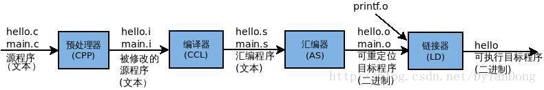

## 程序编译过程

#### 概述

hello.c(源程序)是一条高级C语言程序，虽然它是以一种易读的形式，让人们容易理解。但是，它却无法直接驱动硬件CPU直接执行。为了我们编写的hello.c程序可以被执行，驱动硬件电路工作，hello.c程序必须经过一些列处理步骤，将源程序转化为可执行性的目标程序。

而我们知道，机器语言就是处理器可以直接理解（与生俱来就能理解）的编程语言，机器语言有时也被叫做原生代码（Native Code），而机器语言是一种以“0、1、0、1”的表现形式二进制代码，因此源程序的编译过程任务即就是：将以高级语言编写的程序转换为以二进制代码的可执行性目标程序。

#### 四个阶段

GCC编译C源代码有四个步骤：预处理—->编译—->汇编—->链接。



以下述代码为例：

```c
#include <stdio.h>
int main()
{
    printf("hello, world!\n");
    return 0;
}
```

##### 1). 预处理阶段（.c—.i）

宏的替换，还有注释的消除，还有找到相关的库文件，将#include文件的全部内容插入。若用<>括起文件则在系统的INCLUDE目录中寻找文件，若用" "括起文件则在当前目录中寻找文件。

可以用gcc的参数-E来参看。

命令：unix>gcc –o hello hello.c
作用：将hello.c预处理输出hello.i

##### 2). 编译（.i—.s）转换为汇编语言文件

这个阶段编译器主要做词法分析、语法分析、语义分析等，在检查无错误后后，把代码翻译成汇编语言。可用gcc的参数-S来参看。
编译器(ccl)将文本文件hello.i 翻译成文本文件hello.s, 它包含一个汇编语言程序。
一条低级机器语言指令。
命令：gcc -S hello.i -o hello.s
作用：将预处理输出文件hello.i汇编成hello.s文件

##### 3). 汇编阶段（.s—.o）得到机器语言

汇编器as 将hello.s 翻译成机器语言保存在hello.o 中（二进制文本形式）。

##### 4). 链接阶段

printf函数存在于一个名为printf.o的单独预编译目标文件中。必须得将其并入到hello.o的程序中，链接器就是负责处理这两个的并入，结果得到hello文件，它就是一个可执行的目标文件。这里有函数库的概念。

##### 查看头文件默认路径

gcc :  

```shell
echo 'main(){}' | gcc -E -v -
```

即可找到gcc 默认的头文件和库文件路径

arm-linux-gcc :  

```sh
echo 'main(){}' | arm-linux-gcc -E -v -
```

即可找到arm-linux-gcc 默认的头文件和库文件路径

#### 函数库

函数库一般分为静态库和动态库两种。

##### **静态库:**

当程序与静态库连接时，库中目标文件所含的所有将被程序使用的函数的机器码被 copy 到最终的可执行文件中。这就会导致最终生成的可执行代码量相对变多，相当于编译器将代码补充完整了，这样运行起来相对就快些。

不过会有个缺点: 占用磁盘和内存空间. 静态库会被添加到和它连接的每个程序中, 而且这些程序运行时, 都会被加载到内存中. 无形中又多消耗了更多的内存空间。

##### **动态库:**

与共享库连接的可执行文件只包含它需要的函数的引用表，而不是所有的函数代码，只有在程序执行时, 那些需要的函数代码才被拷贝到内存中。这样就使可执行文件比较小, 节省磁盘空间，更进一步，操作系统使用虚拟内存，使得一份**共享库**驻留在内存中被多个程序使用，也同时节约了内存(**共享库的好处**是，不同的应用程序如果调用相同的库，那么在内存里只需要有一份该共享库的实例。)。

不过由于运行时要去链接库会花费一定的时间，执行速度相对会慢一些，总的来说静态库是牺牲了空间效率，换取了时间效率，共享库是牺牲了时间效率换取了空间效率，没有好与坏的区别，只看具体需要了。

##### 比较

1). gcc/g++ 在编译时默认使用动态库。

Windows 中：.dll 动态库 .lib 静态库。

Linux 中：.so 动态库 .a 静态库。

无论静态库，还是动态库，都是由.o二进制文件创建的。Windows 和Linux 的本质不同，因此二者库的二进制是不兼容的。

2). 静态库在程序编译时会被连接到目标代码中，程序运行时将不再需要该静态库。动态库在程序编译时并不会被连接到目标代码中，而是在程序运行是才被载入，因此在程序运行时还需要动态库存在。

3). 一个程序编好后，有时需要做一些修改和优化，如果我们要修改的刚好是库函数的话，在接口不变的前提下，**使用共享库的程序只需要将共享库重新编译**就可以了，而**使用静态库的程序则需要将静态库重新编译好后，将程序再重新编译一便**。

4).  Linux 下：

**库存在的意义?**

库是别人写好的现有的，成熟的，可以复用的代码，你可以使用但要记得遵守许可协议。现实中每个程序都要依赖很多基础的底层库，不可能每个人的代码都从零开始，因此库的存在意义非同寻常。

共享库的好处是，不同的应用程序如果调用相同的库，那么在内存里只需要有一份该共享库的实例。

**库文件是如何产生的在 linux 下?**

静态库的后缀是.a，它的产生分两步

Step 1.由源文件编译生成一堆.o，每个.o里都包含这个编译单元的符号表

Step 2.ar命令将很多.o转换成.a，成文静态库

动态库的后缀是.so，它由gcc加特定参数编译产生。

**如何知道一个可执行程序依赖哪些库？**

Linux 下ldd 命令可以查看一个可执行程序依赖的共享库。

```shell
leo@leo-virtual-machine:~/桌面/cpp/dynamic$ ldd main
	linux-vdso.so.1 (0x00007ffe41324000)
	libdynamic.so => not found
	libstdc++.so.6 => /usr/lib/x86_64-linux-gnu/libstdc++.so.6 (0x00007f9b0cbf2000)
	libc.so.6 => /lib/x86_64-linux-gnu/libc.so.6 (0x00007f9b0c801000)
	libm.so.6 => /lib/x86_64-linux-gnu/libm.so.6 (0x00007f9b0c463000)
	/lib64/ld-linux-x86-64.so.2 (0x00007f9b0d17d000)
	libgcc_s.so.1 => /lib/x86_64-linux-gnu/libgcc_s.so.1 (0x00007f9b0c24b000)

```

**可执行程序在执行的时候如何定位共享库文件？**

当系统加载可执行代码时候，能够知道其所依赖的库的名字，但是还需要知道绝对路径，此时就需要系统动态载入器(dynamiclinker/loader)。

对于elf格式的可执行程序，是由ld-linux.so*来完成的。它先后搜索elf文件的 DT_RPATH段—环境变量LD_LIBRARY_PATH—/etc/ld.so.cache 文件列表—/lib/ , /usr/lib 目录；找到库文件后将其载入内存。

**在新安装一个库之后如何让系统能够找到他?**

如果安装在/lib 或者/usr/lib 下，那么ld 默认能够找到，无需其他操作。

如果安装在其他目录，需要将其添加到/etc/ld.so.cache 文件中，步骤如下

1.编辑/etc/ld.so.conf 文件，加入库文件所在目录的路径

2.运行ldconfig，该命令会重建/etc/ld.so.cache 文件

## C 语言

#### #typedef

typedef只是为了增加可读性而为标识符另起的新名称(仅仅只是个别名)，它是语言编译过程的一部分，但它并不实际分配内存空间。

**用途一**

定义一种类型的别名，而不只是简单的宏替换。可以用作同时声明指针型的多个对象。在需要大量指针的地方，typedef的方式更省事，比如：

```c
char* pa1, pb1;       // pa1是指向字符变量的指针，pb1是字符变量
typedef char* PCHAR;  // 一般用大写
PCHAR pa2, pb2;       // 可行，同时声明了两个指向字符变量的指针
char *pa3, *pb3;     // 同时声明了两个指向字符变量的指针
```

**用途二**

用在传统旧的C代码中，声明struct 新对象时，必须要带上struct，即形式为：  `struct  结构名  对象名`。使用typedef 时，可以不带struct 显得更清晰。

```C
struct tagPOINT1
{
    int   x;
    int   y;
};

struct tagPOINT1 p1; // 旧的C 需要带struct

typedef  struct tagPOINT2
{
    int   x;
    int   y;
}POINT2;

POINT2 p2; // 这样就比原来的方式少写了一个struct，比较省事，
```

**用途三**

用typedef来定义与平台无关的类型。
比如定义一个叫  REAL  的浮点类型，在目标平台一上，让它表示最高精度的类型为：`typedef  long  double  REAL;`  

在不支持  long  double  的平台二上，改为：`typedef  double  REAL;`  

在连  double  都不支持的平台三上，改为：`typedef  float  REAL;`  

也就是说，当跨平台时，只要改下  typedef  本身就行，不用对其他源码做任何修改。标准库就广泛使用了这个技巧，比如size_t。

另外，*因为typedef是定义了一种类型的新别名，不是简单的字符串替换，所以它比宏来得稳健？*（虽然用宏有时也可以完成以上的用途）。

----是指define 简单替换后，可能造成运算优先级之类的问题？

**用途四**

为复杂的声明定义一个新的简单的别名。方法是：在原来的声明里逐步用别名替换一部分复杂声明，如此循环，把带变量名的部分留到最后替换，得到的就是原声明的最简化版。

替换举例：

```
1.原声明：int   *(*a[5])(int,   char*);
变量名为a，直接用一个新别名pFun替换a就可以了：
typedef   int   *(*pFun)(int,   char*);  
原声明的最简化版：
pFun   a[5];  

2.原声明：void   (*b[10])   (void   (*)());
变量名为b，先替换右边部分括号里的，pFunParam为别名一：
typedef   void   (*pFunParam)();
再替换左边的变量b，pFunx为别名二：
typedef   void   (*pFunx)(pFunParam);
原声明的最简化版：
pFunx   b[10];

3.原声明：doube(*)()   (*e)[9];  
变量名为e，先替换左边部分，pFuny为别名一：
typedef   double(*pFuny)();
再替换右边的变量e，pFunParamy为别名二
typedef   pFuny   (*pFunParamy)[9];
原声明的最简化版：
pFunParamy   e;  
```

另：理解复杂声明：

```
    理解复杂声明可用的“右左法则”：从变量名看起，先往右，再往左，碰到一个圆括号就调转阅读的方向；括号内分析完就跳出括号，还是按先右后左的顺序，如此循环，直到整个声明分析完。举例：

int (*func)(int *p);
    首先找到变量名func，外面有一对圆括号，而且左边是一个*号，这说明func是一个指针；然后跳出这个圆括号，先看右边，又遇到圆括号，这说明(*func)是一个函数，所以func是一个指向这类函数的指针，即函数指针，这类函数具有int*类型的形参，返回值类型是int。
int (*func[5])(int *);
    func右边是一个[]运算符，说明func是具有5个元素的数组；func的左边有一个*，说明func的元素是指针（注意这里的*不是修饰func，而是修饰func[5]的，原因是[]运算符优先级比*高，func先跟[]结合）。跳出这个括号，看右边，又遇到圆括号，说明func数组的元素是函数类型的指针，它指向的函数具有int*类型的形参，返回值类型为int。
```

可以谨记：

typedef  (\*)(....) 函数指针 
typedef  (\*)[]     数组指针 

**陷阱一**
记住，typedef是定义了一种类型的新别名，不同于宏，它不是简单的字符串替换。比如：

```C
typedef  char*  PSTR;

int  mystrcmp(const  PSTR,  const  PSTR);
```

const  PSTR实际上相当于const  char\*吗？不是的，它实际上相当于char \* const。原因在于const给予了整个指针本身以常量性，也就是形成了常量指针char*  const。

简单来说，记住当const和typedef一起出现时，typedef不会是简单的字符串替换就行。

**陷阱二**

typedef在语法上是一个存储类的关键字（如auto、extern、mutable、static、register等一样），虽然它并不真正影响对象的存储特性，如：

编译将失败，会提示“指定了一个以上的存储类”。

```c
typedef  static  int  INT2;  //不可行
```

编译将失败，会提示“指定了一个以上的存储类”。

#### #define

\#define为一宏定义语句，通常用它来定义常量(包括无参量与带参量)，以及用来实现那些“表面似和善、背后一长串”的宏，它本身并不在编

译过程中进行，而是在这之前(预处理过程)就已经完成了，但也因此难以[发现](http://action.vogate.com/click/click.php?r=http%3A//www.google.cn/search%3Fcomplete%3D1%26hl%3Dzh-CN%26inlang%3Dzh-CN%26newwindow%3D1%26q%3Dtypedef%26btnG%3DGoogle+%25E6%2590%259C%25E7%25B4%25A2%26meta%3D%26aq%3Dnull&ads_id=3593&site_id=6235007045036118&click=1&url=http%3A//yahoo.37you.com&v=0&k=%u53D1%u73B0&s=http%3A//www.sf.org.cn/Article/base/200608/18988.html&rn=842957)潜在的错误及其它代码维护问题，它的实例像：

```c
#define  INT      int;
#define  TRUE     1;
#define  Add(a,b) ((a)+(b));
#define  Loop_10  for (int i=0; i<10; i++);
```

Scott Mayer 建议对于单纯变量用const, enum 替换 #define ; 用 inline 函数代替形似函数的宏（macros )。

#### #define 与 #typedef  区别

（1）原理不同

\#define 是C语言中定义的语法，是预处理指令，在预处理时进行简单而机械的字符串替换，不作正确性检查，只有在编译已被展开的源程序时才会发现可能的错误并报错。

#typedef 是关键字，在编译时处理，有类型检查功能。它在自己的作用域内给一个已经存在的类型一个别名，但不能在一个函数定义里面使用typedef。用typedef定义数组、指针、结构等类型会带来很大的方便，不仅使程序书写简单，也使意义明确，增强可读性。

（2）功能不同

typedef用来定义类型的别名，起到类型易于记忆的功能。另一个功能是定义机器无关的类型。如定义一个REAL的浮点类型，在目标机器上它可以获得最高的精度：typedef long double REAL， 在不支持long double的机器上，看起来是这样的，typedef double REAL，在不支持double的机器上，是这样的，typedef float REAL。

\#define不只是可以为类型取别名，还可以定义常量、变量、编译开关等。

（3）作用域不同

#typedef：如果放在所有函数之外，它的作用域就是从它定义开始直到文件尾；如果放在某个函数内，定义域就是从定义开始直到该函数结尾；

#define: 不管是在某个函数内，还是在所有函数之外，作用域都是从定义开始直到整个文件结尾。

#### 宏定义

##### 无参宏定义

```C
#define 标识符 替换列表
```

替换列表可以是数值常量、字符常量、字符串常量等，故可以把宏定义理解为使用标识符表示一常量，或称符号常量。

说明：

1) # 可以不在行首，但只允许它前面有空格符。例如：

```c
#define PI 3.1416 //正确，该行#前允许有空格
int a;#define N 5 //错误，该行#前不允许有空格外的其他字符
```

 2) 标识符和替换列表之间不能加赋值号 =，替换列表后不能加分号

```C
#define N =5 //虽语法正确，但预处理器会把N替换成=5
int a[N];    //错误，因为宏替换之后为 int a[=5];
```

宏定义不是语句，是预处理指令，故结尾不加分号。如果不小心添加了分号，虽然有时该宏定义没问题，但在宏替换时，可能导致 C 语法错误，或得不到预期结果。例如：

```c
#define N 5; //虽语法正确，但会把N替换成5;
int a[N]; //语法错误，宏替换后，为int a[5;];错误
```

3) 由于宏定义仅是做简单的文本替换，故替换列表中如有表达式，必须把该表达式用括号括起来，否则可能会出现逻辑上的“错误”。例如：

```C
#define N 3+2int r=N*N;
```

宏替换后为:

```C
int r=3+2*3+2;  // r=11
```

如果采用如下形式的宏定义:

```C
#define N (3+2)int r=N*N;
```

则宏替换后，为:

```C
int r=(3+2)*(3+2);  //r=25
```


4) 当替换列表一行写不下时，可以使用反斜线\作为续行符延续到下一行。例如：

```c
#define USA "The United \
States of \
America"
```

该宏定义中替换列表为字符串常量，如果该串较长，或为了使替换列表的结构更清晰，可使用续行符 \ 把该串分若干行来写，除最后一行外，每行行尾都必须加续行符 \。

如果调用 printf 函数，以串的形式输出该符号常量，即：

```c
printf("%s\n",USA);
```

则输出结果为:`The United States of America`

注意：续行符后直接按回车键换行，不能含有包括空格在内的任何字符，否则是错误的宏定义形式。

##### 带参宏定义

带参数的宏定义格式为：

```c
#define 标识符(参数1,参数2,...,参数n) 替换列表
```

例如，求两个参数中最大值的带参宏定义为：

```c
#define MAX(a,b) ((a)>(b)?(a) : (b))
```

当有如下语句时：

```c
int c=MAX(5,3);
```

预处理器会将带参数的宏替换成如下形式：

```c
int c=((5)>(3)?(5) : (3));
```

故计算结果c=5。

删除宏定义的格式为：

```c
#undef 标识符
```

说明：
1) 标识符与参数表的左括号之间不能有空格，否则预处理器会把该宏理解为普通的无参宏定义，故以下是错误的带参宏定义形式。

```c
#define MAX (a,b) ( (a) > (b) ? (a) : (b) ) //错误的带参宏定义格式
```

2) 宏替换列表中每个参数及整个替换列表，都必须用一对小括号 () 括起来，否则可能会出现歧义。

##### 带参宏定义 VS 函教调用

接下来将从调用发生时间、参数类型检查、参数是否需要空间、运行速度等几个主要方面进行对比分析带参宏定义与函数调用的差异。

**调用发生的时间**

在源程序进行编译之前，即预处理阶段进行宏替换；而函数调用则发生在程序运行期间。

**参数类型检查**

函数参数类型检查严格。程序在编译阶段，需要检查实参与形参个数是否相等及类型是否匹配或兼容，若参数个数不相同或类型不兼容，则会编译不通过。

在预处理阶段，对带参宏调用中的参数不做检查。即宏定义时不需要指定参数类型，既可以认为这是宏的优点，即适用于多种数据类型，又可以认为这是宏的一个缺点，即类型不安全。故在宏调用时，需要程序设计者自行确保宏调用参数的类型正确。

**参数是否需要空间**

函数调用时，需要为形参分配空间，并把实参的值复制一份赋给形参分配的空间中。而宏替换，仅是简单的文本替换，且替换完就把宏名对应标识符删除掉，即不需要分配空间。

**执行速度**

函数在编译阶段需要检查参数个数是否相同、类型等是否匹配等多个语法，而宏替换仅 是简单文本替换，不做任何语法或逻辑检查。

函数在运行阶段参数需入栈和出栈操作，速度相对较慢。

**代码长度**

由于宏替换是文本替换，即如果需替换的文本较长，则替换后会影响代码长度；而函数不会影响代码长度。

故使用较频繁且代码量较小的功能，一般采用宏定义的形式，比采用函数形式更合适。前面章节频繁使用的 getchar()，准确地说，是宏而非函数。

为了使该宏调用像函数调用，故把该宏设计成了带参数的宏定义：

```c
#define getchar() getc(stdin)
```

故调用该宏时，需要加括号，即传空参数：getchar()。

##### 宏中 "#" 和 "##" 的用法 

一、一般用法 
我们使用#把宏参数变为一个字符串,用##把两个宏参数贴合在一起. 

```C
#include <stdio.h>

using namespace std; 

#define STR(s)     #s 
#define CONS(a,b)  int(a##e##b) 

int main() 
{ 
    printf(STR(vck));           // 输出字符串"vck" 
    printf("%d\n", CONS(2,3));  // 2e3 输出:2000 
    return 0; 
} 
```

二、当宏参数是另一个宏的时候 
需要注意的是凡宏定义里有用'#'或'##'的地方宏参数是不会再展开. 

三、'#'和'##'的一些应用特例 
1、合并匿名变量名 

2、填充结构 

3、记录文件名 

4、得到一个数值类型所对应的字符串缓冲大小 