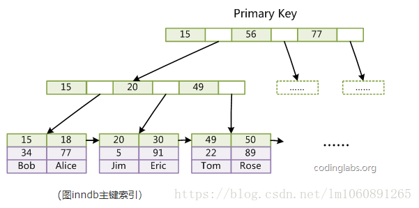
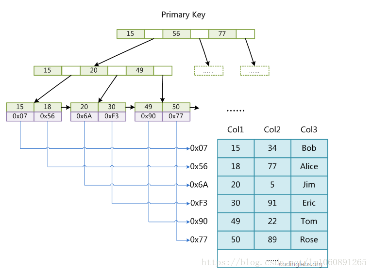

# 数据库

## B+ 树 & B 树

#### 索引

加索引是数据库加速查询的一种方式，那么为什么用索引可以加快查询呢？

讲到索引，其实我们经常会听到一个图书馆的例子，图书馆里的书目繁杂，我们如何从若干本书里面找到一本我们想要的书呢？

我们根据图书馆系统检索，可以找到某本书对应的图书编号。

在基于书籍按照一定规则排列的前提下，我们可以根据图书编号找到这本书。

例如，假设图书编号根据：

第几个书架 - 书架上第几个格子 - 从左到右数第几个位置

这样的规则编排，

我们就可以轻松的获取到我们想要的书籍。

你也许发现了，这个例子中，藏着两个信息：

按照一定的规则排列

有序

按照一定的规则，建立一定的映射关系，这让你联想到了什么？

没错，就是哈希表

#### 基于哈希表实现的哈希索引

在 Mysql 的 InnoDB 引擎中，自适应哈希索引就是用哈希表实现的。

哈希索引是数据库自身创建并使用的，DBA  (数据库管理员)本身不能对其进行干预，但是可以通过参数来禁止或者启用此特性。

显然用哈希表实现索引的好处是非常明显的，查找单个指定数据只需要 O(1) 的时间复杂度。

例如下面的 sql 语句：

```sql
select id from tablename where id == 1;
```


但是对于这种查找指定范围的 sql 语句，哈希索引就无能为力了。

```sql
select id from tablename where id BETWEEN 20 AND 23;
```


说明：因为哈希表本身是无序的，所以不利于范围查询

* 拓展

到这里我们遇到了一个问题，就是哈希表虽然从查找效率上满足了我们查找单个数据的要求，但是显然，当遇到范围查询时，由于哈希表本身的无序性，不利于指定范围查找。

也就是说，我们的需求增加了，我们希望数据的组织方式，既要有一定规则，又要有序。

在引出这种数据结构之前，我们首先来看一种查找方式：二分查找。

#### 二分查找

二分查找的核心思想是给定一个 有序 的数组，在查找过程中采用跳跃式的方式查找，即先以有序数列的中点位置为比较对象，如果要查找的元素小于中点元素，则将待查序列缩小为左半部分，否则为右半部分。通过每次比较，将查找区间减少一半，直到找到所需元素。

比如要从以下序列中查找到数字 4

`[1,3,4,5,6,7,8]`

需要经过下面的查找步骤：

* 取中心位置对应元素，显然 5 大于 4，在左边区间 [1,3,4] 进行查找

* 继续取中心位置对应元素 3，显然 3 大于 4,在右边区间 [4] 进行查找

* 4 等于 4，所以我们查找成功。

可以看到二分查找的效率是 O(log n)。

由于有序数组自身的有序性，所以范围查询依然可以通过二分查找的方式查找区间的边界来实现。

这样看来，如果单从查询效率上来说，有序的数组是一种很好的选择。

但是显然有序数组对于插入和删除并不友好，假设我们要插入元素或者删除元素，都需要把部分元素全部向后或者向前移动，最糟糕的时间复杂度是 O(n)O(n)。

有没有这样一种数据结构，既有一定顺序，又方便插入和删除呢？事实上，基于二分查找的思想，诞生了这样一种数据结构：二分查找树。

#### 基于二分查找思想的二分查找

二叉查找树（Binary Search Tree）即BST树是这样的一种数据结构,如下图：


在二叉搜索树中：

1). 若任意结点的左子树不空，则左子树上所有结点的值均不大于它的根结点的值。

2). 若任意结点的右子树不空，则右子树上所有结点的值均不小于它的根结点的值。

3). 任意结点的左、右子树也分别为二叉搜索树。

这样的结构非常适合用二分查找的思维查找元素。

比如我们需要查找键值为8的记录：

1). 先从根找起，找到 6；

2). 显然 8>6，所以接着找到 6 的右子树，找到 7；

3). 显然 8>7, 所以找 7 的右子树，找到了 8，查找结束。

这样一棵子树高度差不大于 1 的二叉查找树的查找效率接近与 O(log n)O(logn);

但是当二叉树的构造变成这样时,


此时我们再查找 8 时,查找效率就沦为接近顺序遍历查找的效率。

显然这不是我们想要的，二叉查找树也需要 balance。

#### 升级版的BST树：AVL 树

我们对二叉查找树做个限制，限制必须满足任何节点的两个子树的最大差为 1，也是AVL 树的定义，这样我们的查找效率就有了一定的保障。

AVL 树 是一种自平衡二叉查找树(self-balancing binary search tree)。

当然，维护AVL 树也是需要一定开销的，即当树插入/更新/删除新的数据时假设破坏了树的平衡性，那么需要通过左旋和右旋来维护树的平衡。

当数据量很多时，同样也会出现二叉树过高的情况。

我们知道AVL 树的查找效率为 O(log n)，也就是说，当树过高时，查找效率会下降。

另外由于我们的索引文件并不小，所以是存储在磁盘上的。

文件系统需要从磁盘读取数据时，一般以页为单位进行读取，假设一个页内的数据过少，
那么操作系统就需要读取更多的页，涉及磁盘随机 I/O 访问的次数就更多。

将数据从磁盘读入内存涉及随机 I/O 的访问，是数据库里面成本最高的操作之一。

因而这种树高会随数据量增多急剧增加，每次更新数据又需要通过左旋和右旋维护平衡的二叉树，不太适合用于存储在磁盘上的索引文件。

#### 更符合磁盘特征的B树

前面我们看到，虽然AVL树既有链表的快速插入与删除操作的特点，又有数组快速查找的优势，但是这并不是最符合磁盘读写特征的数据结构。

也就是说，我们要找到这样一种数据结构，能够有效的控制树高，那么我们把二叉树变成m叉树，也就是下图的这种数据结构:B 树。

B树是一种这样的数据结构：


1). 根结点至少有两个子结点;

2). 每个中间节点都包含 k-1 个元素和k个子结点，其中 m/2 <= k <= m;

3). 每一个叶子结点都包含 k-1 个元素，其中 m/2 <= k <= m;

4). 所有的叶子结点都位于同一层;

5). 每个结点中关键字从小到大排列，并且当该结点的孩子是非叶子结点时，该 k-1 个元素正好是 k 个子结点包含的元素的值域的分划。

可以看到，B树在保留二叉树预划分范围从而提升查询效率的思想的前提下，做了以下优化：

二叉树变成 m 叉树，这个 m 的大小可以根据单个页的大小做对应调整，从而使得一个页可以存储更多的数据，从磁盘中读取一个页可以读到的数据就更多，随机 IO 次数变少，大大提升效率。

但是我们看到，我们只能通过中序遍历查询全表，当进行范围查询时，可能会需要中序回溯。

#### 不断优化的B树：B+ 树


B+树在B树的基础上加了以下优化：

1). 叶子结点增加了指针进行连接，即叶子结点间形成了链表；

2). 非叶子结点只存关键字 key，不再存储数据，只在叶子结点存储数据；

说明：叶子之间用双向链表连接比单向链表连接多出的好处是通过链表中任一结点都可以通过往前或者往后遍历找到链表中指定的其他结点。

这样做的好处是：

1). 范围查询时可以通过访问叶子节点的链表进行有序遍历，而不再需要中序回溯访问结点。

2). 非叶子结点只存储关键字key，一方面这种结构相当于划分出了更多的范围，加快了查询速度，另一方面相当于单个索引值大小变小，同一个页可以存储更多的关键字，读取单个页就可以得到更多的关键字，可检索的范围变大了，相对 IO 读写次数就降低了。

#### 总结

##### **B+ 树和 B 树的区别？**

1). B 树非叶子结点和叶子结点都存储数据,因此查询数据时，时间复杂度最好为 O(1),最坏为 O(log n)。

B+ 树只在叶子结点存储数据，非叶子结点存储关键字，且不同非叶子结点的关键字可能重复，因此查询数据时，时间复杂度固定为 O(log n)。

2). B+ 树叶子结点之间用链表相互连接，因而只需扫描叶子结点的链表就可以完成一次遍历操作，B树只能通过中序遍历。

##### **为什么 B+ 树比 B 树更适合应用于数据库索引？**

1). B+ 树更加适应磁盘的特性，相比 B 树减少了 I/O 读写的次数。由于索引文件很大因此索引文件存储在磁盘上，B+ 树的非叶子结点只存关键字不存数据，因而单个页可以存储更多的关键字，即一次性读入内存的需要查找的关键字也就越多，磁盘的随机 I/O 读取次数相对就减少了。

2). B+ 树的查询效率相比B树更加稳定，由于数据只存在在叶子结点上，所以查找效率固定为 O(log n)。

3). B+ 树叶子结点之间用链表有序连接，所以扫描全部数据只需扫描一遍叶子结点，利于扫库和范围查询；B 树由于非叶子结点也存数据，所以只能通过中序遍历按序来扫。也就是说，对于范围查询和有序遍历而言，B+ 树的效率更高。

## MySQL

#### 文件

* 表结构文件

  * frm 文件

    MySQL 数据的存储是基于表的，每个表都有一个对应的表结构文件。不论表使用的哪一种存储引擎，MySQL 都会为表生成一个frm 为后缀名的文件，这个文件记录了这个表的表结构定义。

* InnoDB 数据文件

  * idb 文件

    使用独享表空间存储表数据和索引信息，一张表对应一个ibd 文件。

  * ibdata 文件

    使用共享表空间存储表数据和索引信息，所有表共同使用一个或者多个ibdata文件。

* MyIsam 数据文件

  * myd 文件

    主要用来存储表数据信息。

  * myi 文件

    

#### 范式

规范化目的是使结构更合理，消除存储异常，使数据冗余尽量小。便于插入、删除和更新。

* 第一范式：具有**原子性**

  数据库表中的所有字段值都是不可分解的原子值。

* 第二范式：主键列与非主键列遵循**完全函数依赖关系**

  满足第二范式（2NF）必须先满足第一范式（1NF）。第二范式（2NF）要求数据库表中的每个实例或行必须可以被惟一地区分。为实现区分通常需要我们设计一个主键来实现(这里的主键不包含业务逻辑)。

  第二范式（2NF）要求实体的属性完全依赖于主关键字。所谓完全依赖是指不能存在仅依赖主关键字一部分的属性，如果存在，那么这个属性和主关键字的这一部分应该分离出来形成一个新的实体，新实体与原实体之间是一对多的关系。为实现区分通常需要为表加上一个列，以存储各个实例的惟一标识。简而言之，第二范式就是属性完全依赖于主键。

* 第三范式：非主键列之间没有**传递函数依赖关系**

  第三范式需要确保数据表中的每一列数据都和主键直接相关，而不能间接相关。

  满足第三范式（3NF）必须先满足第二范式（2NF）。简而言之，第三范式（3NF）要求一个数据库表中不包含已在其它表中已包含的非主键字段。就是说，表的信息，如果能够被推导出来，就不应该单独的设计一个字段来存放(能尽量外键join就用外键join)。

第二范式（2NF）和第三范式（3NF）的概念很容易混淆，区分它们的关键点在于，2NF：非主键列是否完全依赖于主键，还是依赖于主键的一部分；3NF：非主键列是直接依赖于主键，还是直接依赖于非主键列。

* 反三范式

  规范化的优点是明显的，它避免了大量的数据冗余，节省了存储空间，保持了数据的一致性。当一个库里的数据经常发生变化时，达到3NF的库可以使用户不必在超过两个以上的地方更改同一个值。

  那么是不是只要把所有的表都规范为3NF后，数据库的设计就是最优的呢?这可不一定。范式越高意味着表的划分更细，一个数据库中需要的表也就越多，用户不得不将原本相关联的数据分摊到多个表中。当用户同时需要这些数据时只能采用连接表的形式将数据重新合并在一起。同时把多个表联接在一起的花费是巨大的，尤其是当需要连接的两张或者多张表数据非常庞大的时候，表连接操作几乎是一个噩梦，这严重地降低了系统运行性能。

  没有冗余的数据库未必是最好的数据库，有时为了提高运行效率，提高读性能，就必须降低范式标准，适当保留冗余数据。具体做法是： 在概念数据模型设计时遵守第三范式，降低范式标准的工作放到物理数据模型设计时考虑。降低范式就是增加字段，减少了查询时的关联，提高查询效率。但是反范式化一定要适度，并且在原本已满足三范式的基础上再做调整的

#### 索引

**一、概述**

在mysql 中，索引（index）又叫键（key），它是存储引擎用于快速找到所需记录的一种数据结构。在越来越大的表中，索引是对查询性能优化最有效的手段，索引对性能影响非常关键。另外，mysql 的索引是在存储引擎层实现，而不是在服务器层。

索引是一种特殊的文件(InnoDB数据表上的索引是表空间的一个组成部分)，它们包含着对数据表里所有记录的引用指针。

索引分为聚簇索引和非聚簇索引两种，聚簇索引是按照数据存放的物理位置为顺序的，而非聚簇索引就不一样了；聚簇索引能提高多行检索的速度，而非聚簇索引对于单行的检索很快。

**二、索引的工作原理**

我们知道，在看一本书某章的时候，首先我们会查找目录索引，找到对应的页码然后快速找到相应的内容。mysql 索引也一样，存储引擎利用类似的方法使用索引，先在索引中找到对应的值，然后根据匹配的索引记录找到对应的数据行，然后返回结果。

例如，我们想在一个10W条记录表 table 中查询name等于“张三”的数据行，select * from table where name ='张三'。那么在没有对name字段建立索引的情况下，我们需要扫描全表也就是扫描10W条数据来找到这条数据；如果我们为name字段建立索引，我们只需要查找索引，然后根据索引找到对应的数据行，只需要查找一条记录，性能会得到很大的提高。

**三、索引分类**

索引按照实现方式不同可以分为 **B-Tree 索引**、**hash 索引**、**空间数据索引**以及**全文索引**等。如果没有特别指明，多半用的是B-Tree索引，B-Tree 对索引列是顺序存储的，因此很适合查找范围数据。它能够加快访问数据的速度，因为存储引擎不再需要进行全表扫描来获取需要的数据。

**四、索引类型**

索引主要分为：单列索引（普通索引、主键索引、唯一索引）和组合索引。

1). **普通索引**

这是最基本的索引，它没有任何限制，MyIASM中默认的B-TREE类型的索引，也是我们大多数情况下用到的索引。

```sql
--直接创建索引
CREATE INDEX index_name ON table(column(length))
--修改表结构的方式添加索引
ALTER TABLE table_name ADD INDEX index_name ON (column(length))
--创建表的时候同时创建索引
CREATE TABLE `table` (
`id` int(11) NOT NULL AUTO_INCREMENT ,
`title` char(255) CHARACTER SET utf8 COLLATE utf8_general_ci NOT NULL ,
`content` text CHARACTER SET utf8 COLLATE utf8_general_ci NULL ,
`time` int(10) NULL DEFAULT NULL ,
PRIMARY KEY (`id`),
INDEX index_name (title(length))
)
--删除索引
DROP INDEX index_name ON table
```

2). **唯一索引**

与普通索引类似，不同的就是：索引列的值必须唯一，但允许有空值（注意和主键不同）。如果是组合索引，则列值的组合必须唯一，创建方法和普通索引类似。

```sql
--创建唯一索引
CREATE UNIQUE INDEX indexName ON table(column(length))
--修改表结构
ALTER TABLE table_name ADD UNIQUE indexName ON (column(length))
--创建表的时候直接指定
CREATE TABLE `table` (
`id` int(11) NOT NULL AUTO_INCREMENT ,
`title` char(255) CHARACTER SET utf8 COLLATE utf8_general_ci NOT NULL ,
`content` text CHARACTER SET utf8 COLLATE utf8_general_ci NULL ,
`time` int(10) NULL DEFAULT NULL ,
PRIMARY KEY (`id`),
UNIQUE indexName (title(length))
);
```

3). **全文索引（FULLTEXT）**

MySQL从3.23.23版开始支持全文索引和全文检索，FULLTEXT索引仅可用于 MyISAM 表；他们可以从CHAR、VARCHAR或TEXT列中作为CREATE TABLE语句的一部分被创建，或是随后使用ALTER TABLE 或CREATE INDEX被添加。

对于较大的数据集，将你的资料输入一个没有FULLTEXT索引的表中，然后创建索引，其速度比把资料输入现有FULLTEXT索引的速度更为快。不过切记对于大容量的数据表，生成全文索引是一个非常消耗时间非常消耗硬盘空间的做法。

```sql
--创建表的适合添加全文索引
CREATE TABLE `table` (
`id` int(11) NOT NULL AUTO_INCREMENT ,
`title` char(255) CHARACTER SET utf8 COLLATE utf8_general_ci NOT NULL ,
`content` text CHARACTER SET utf8 COLLATE utf8_general_ci NULL ,
`time` int(10) NULL DEFAULT NULL ,
PRIMARY KEY (`id`),
FULLTEXT (content)
);
--修改表结构添加全文索引
ALTER TABLE article ADD FULLTEXT index_content(content)
--直接创建索引
CREATE FULLTEXT INDEX index_content ON article(content)
```

4). **单列索引、多列索引**

多个单列索引与单个多列索引的查询效果不同，因为执行查询时，MySQL只能使用一个索引，会从多个索引中选择一个限制最为严格的索引。

5). **组合索引（最左前缀）**

组合索引就是一个表中一个索引包括多个字段，一个表中多个单列索引并不是组合索引。

平时用的SQL查询语句一般都有比较多的限制条件，所以为了进一步榨取MySQL的效率，就要考虑建立组合索引。例如上表中针对title和time建立一个组合索引：ALTER TABLE article ADD INDEX index_titme_time (title(50),time(10))。建立这样的组合索引，其实是相当于分别建立了下面两组组合索引：

–title,time

–title

为什么没有time这样的组合索引呢？这是因为MySQL组合索引“最左前缀”的结果。简单的理解就是只从最左面的开始组合。并不是只要包含这两列的查询都会用到该组合索引，如下面的几个SQL所示：

```sql
--使用到上面的索引
SELECT * FROM article WHREE title='测试' AND time=1234567890;
SELECT * FROM article WHREE utitle='测试';
--不使用上面的索引
SELECT * FROM article WHREE time=1234567890;
```

**五、组合索引的查询规则（什么情况下有效，什么情况下无效）**

B-Tree 索引适用于全键值、键值范围或键前缀查找，其中键前缀查找只适用于根据最左前缀查找。我们建立表user（id, last_name, first_name, age , birthday,sex）,建立组合索引 key（last_name, first_name, birthday）,那么它实际上包括三个索引（last_name），（last_name, first_name）, （last_name，first_name，birthday）。

下面我们来分析组合索引有效以及无效的情况，mysql在使用组合索引查询的时候需要遵循“最左前缀”规则，什么是“最左前缀”规则呢，就是在使用组合索引查询，where的条件要按照从左到右的顺序，last_name first_name birthday，可以是只有last_name，或者包括last_name、first_name，或者last_name、first_name、birthday，这个从左到右的顺序不能变，也不能跳过；如果是直接first_name='ruby' 组合索引不生效，或者跳过first_name，last_name=‘allon’ and birthday = ‘2012’，组合索引只有last_name生效，后面的所有不生效。

例如：

1、全键值匹配：select * from user where last_name=‘allon’ and first_name='java' and birthday=‘2017-12'是生效的，如果 select * from user where first_name='java' and birthday=‘2017-12'组合索引是不生效的，因为没有key(first_name,birthday)的索引。

2、键前缀查找：select * from user where last_name=‘allon’；这个索引存在，也是有效的，但不能select * from user where first_name='java'，这样不生效。

3、like模糊查询：比如只匹配组合索引第一列的值的开头部分，查询last_name姓张的人，select * from user where last_name like ‘张%’；但是不能select * from user where last_name like ‘%张’；组合索引也无法查找以张结尾的人。 

再如 select * from user where last_name='allon' and first_name like '三%' and birthday = '2012-11-06'，因为first_name用了like这个范围查询条件，那么查询只用到了组合索引的前两列，范围查询右面的列birthday无法用索引优化查询。

如果查询中有某个列的范围查询，则该列右边的所有列都无法使用索引优化查找

4、匹配范围值：select * from user where last_name between ’allon‘ and 'clitton';这里只使用了组合索引的第一列，是生效的。

**六、MySQL索引的优化**

上面都在说使用索引的好处，但过多的使用索引将会造成滥用。因此索引也会有它的缺点：虽然索引大大提高了查询速度，同时却会降低更新表的速度，如对表进行INSERT、UPDATE和DELETE。因为更新表时，MySQL不仅要保存数据，还要保存一下索引文件。建立索引会占用磁盘空间的索引文件。一般情况这个问题不太严重，但如果你在一个大表上创建了多种组合索引，索引文件的会膨胀很快。索引只是提高效率的一个因素，如果你的MySQL有大数据量的表，就需要花时间研究建立最优秀的索引，或优化查询语句。下面是一些总结以及收藏的MySQL索引的注意事项和优化方法。

**1. 何时使用聚集索引或非聚集索引？**

| 动作描述           | 使用聚集索引 | 使用非聚集索引 |
| ------------------ | ------------ | -------------- |
| 列经常被分组排序   | 使用         | 使用           |
| 返回某范围内的数据 | 使用         | 不使用         |
| 一个或极少不同值   | 不使用       | 不使用         |
| 小数目的不同值     | 使用         | 不使用         |
| 大数目的不同值     | 不使用       | 使用           |
| 频繁更新的列       | 不使用       | 使用           |
| 外键列             | 使用         | 使用           |
| 主键列             | 使用         | 使用           |
| 频繁修改索引列     | 不使用       | 使用           |

事实上，我们可以通过前面聚集索引和非聚集索引的定义的例子来理解上表。如：返回某范围内的数据一项。比如您的某个表有一个时间列，恰好您把聚合索引建立在了该列，这时您查询2004年1月1日至2004年10月1日之间的全部数据时，这个速度就将是很快的，因为您的这本字典正文是按日期进行排序的，聚类索引只需要找到要检索的所有数据中的开头和结尾数据即可；而不像非聚集索引，必须先查到目录中查到每一项数据对应的页码，然后再根据页码查到具体内容。其实这个具体用法我还不是很理解，只能等待后期的项目开发中慢慢学学了。

**2. 索引不会包含有NULL值的列**

只要列中包含有NULL值都将不会被包含在索引中，复合索引中只要有一列含有NULL值，那么这一列对于此复合索引就是无效的。所以我们在数据库设计时不要让字段的默认值为NULL。

**3. 使用短索引**

对串列进行索引，如果可能应该指定一个前缀长度。例如，如果有一个CHAR(255)的列，如果在前10个或20个字符内，多数值是惟一的，那么就不要对整个列进行索引。短索引不仅可以提高查询速度而且可以节省磁盘空间和I/O操作。

**4. 索引列排序**

MySQL查询只使用一个索引，因此如果where子句中已经使用了索引的话，那么order by中的列是不会使用索引的。因此数据库默认排序可以符合要求的情况下不要使用排序操作；尽量不要包含多个列的排序，如果需要最好给这些列创建复合索引。

**5. like语句操作**

一般情况下不鼓励使用like操作，如果非使用不可，如何使用也是一个问题。like “%aaa%” 不会使用索引而like “aaa%”可以使用索引。

**6. 不要在列上进行运算**

例如：select * from users where YEAR(adddate)<2007，将在每个行上进行运算，这将导致索引失效而进行全表扫描，因此我们可以改成：select * from users where adddate<’2007-01-01′。

**七、索引的优缺点**

* 为什么要创建索引呢？

​    这是因为，创建索引可以大大提高系统的性能。 

​    第一、通过创建唯一性索引（主键索引&唯一索引），可以保证数据库表中每一行数据的唯一性。 
​    第二、可以大大加快数据的检索速度，这也是创建索引的最主要的原因。 
​    第三、可以加速表和表之间的连接，特别是在实现数据的参考完整性方面特别有意义。 
​    第四、在使用分组和排序子句进行数据检索时，同样可以显著减少查询中分组和排序的时间。 
​    第五、通过合理使用索引，可以在查询的过程中，使用优化隐藏器，提高系统的性能。

* 增加索引也有许多不利的一个方面:

​    也许会有人要问：增加索引有如此多的优点，为什么不对表中的每一个列创建一个索引呢？这种想法固然有其合理性，然而也有其片面性。虽然，索引有许多优点， 但是，为表中的每一个列都增加索引，是非常不明智的。

​    第一、创建索引和维护索引要耗费时间，这种时间随着数据量的增加而增加。 

​    第二、索引需要占物理空间，除了数据表占数据空间之外，每一个索引还要占一定的物理空间。如果要建立聚簇索引，那么需要的空间就会更大。 

​    第三、当对表中的数据进行增加、删除和修改的时候，索引也要动态的维护，这样就降低了数据的维护速度。

* 什么样的字段适合创建索引:

​     索引是建立在数据库表中的某些列的上面。因此，在创建索引的时候，应该仔细考虑在哪些列上可以创建索引，在哪些列上不能创建索引。

​    一般来说，应该在这些列上创建索引，例如：

​    第一、在经常需要搜索的列上，可以加快搜索的速度； 

​    第二、在作为主键的列上，强制该列的唯一性和组织表中数据的排列结构； 

​    第三、在经常用在连接的列上，这些列主要是一些外键，可以加快连接的速度； 

​    第四、在经常需要根据范围进行搜索的列上创建索引，因为索引已经排序，其指定的范围是连续的； 

​    第五、在经常需要排序的列上创建索引，因为索引已经排序，这样查询可以利用索引的排序，加快排序查询时间； 

​    第六、在经常使用在WHERE子句中的列上面创建索引，加快条件的判断速度。

​    建立索引，一般按照select的where条件来建立，比如： select的条件是where f1 and f2，那么如果我们在字段f1或字段f2上简历索引是没有用的，只有在字段f1和f2上同时建立索引才有用等。

* 什么样的字段不适合创建索引:

​    同样，对于有些列不应该创建索引。一般来说，不应该创建索引的的这些列具有下列特点：

　第一，对于那些在查询中很少使用或者参考的列不应该创建索引。这是因为，既然这些列很少使用到，因此有索引或者无索引，并不能提高查询速度。相反，由于增加了索引，反而降低了系统的维护速度和增大了空间需求。 
    第二，对于那些只有很少数据值的列也不应该增加索引。这是因为，由于这些列的取值很少，例如人事表的性别列，在查询的结果中，结果集的数据行占了表中数据行的很大比 例，即需要在表中搜索的数据行的比例很大。增加索引，并不能明显加快检索速度。 
    第三，对于那些定义为text, image和bit数据类型的列不应该增加索引。这是因为，这些列的数据量要么相当大，要么取值很少。 
    第四，当修改性能远远大于检索性能时，不应该创建索引。这是因为，修改性能和检索性能是互相矛盾的。当增加索引时，会提高检索性能，但是会降低修改性能。当减少索引时，会提高修改性能，降低检索性能。因此，当修改性能远远大于检索性能时，不应该创建索引。


## 聚簇索引和非聚簇索引

总结：**InnoDB中，表数据文件本身就是按B+Tree组织的一个索引结构，聚簇索引就是按照每张表的主键构造一颗B+树，同时叶子节点中存放的就是整张表的行记录数据，也将聚集索引的叶子节点称为数据页。这个特性决定了索引组织表中数据也是索引的一部分；**

　　**一般建表会用一个自增主键做聚簇索引，没有的话MySQL会默认创建，但是这个主键如果更改代价较高，故建表时要考虑自增ID不能频繁update这点。**

　　**我们日常工作中，根据实际情况自行添加的索引都是辅助索引，辅助索引就是一个为了需找主键索引的二级索引，现在找到主键索引再通过主键索引找数据；**


聚簇索引并不是一种单独的索引类型，而**是一种数据存储方式**。具体细节依赖于其实现方式。

MySQL数据库中InnoDB 存储引擎，B+树索引可以分为聚簇索引（也称聚集索引，clustered index）和辅助索引（有时也称非聚簇索引或二级索引，secondary index，non-clustered index）。这两种索引内部都是B+树，聚集索引的叶子节点存放着一整行的数据。

InnoDB 中的主键索引是一种聚簇索引，非聚簇索引都是辅助索引，像复合索引、前缀索引、唯一索引。

InnoDB 使用的是聚簇索引，MyISAM 使用的是非聚簇索引

#### 聚簇索引(聚集索引)

　　聚簇索引就是按照每张表的主键构造一颗B+ 树，同时叶子节点中存放的就是整张表的行记录数据，也将聚集索引的叶子节点称为数据页。这个特性决定了索引组织表中数据也是索引的一部分，每张表只能拥有一个聚簇索引。

　　InnoDB通过主键聚集数据，如果没有定义主键，InnoDB会选择非空的唯一索引代替。如果没有这样的索引，InnoDB会隐式的定义一个主键来作为聚簇索引。

聚簇索引的优缺点

　　优点：

　　　　1.数据访问更快，因为聚簇索引将索引和数据保存在同一个B+树中，因此从聚簇索引中获取数据比非聚簇索引更快

　　　　2.聚簇索引对于主键的排序查找和范围查找速度非常快
　　缺点：

　　　　1.插入速度严重依赖于插入顺序，按照主键的**顺序插入**是最快的方式，否则将会出现页分裂，严重影响性能。因此，对于InnoDB表，我们一般都会定义一个**自增的ID列为主键**
　　　　2.**更新主键的代价很高**，因为将会导致被更新的行移动。因此，对于InnoDB表，我们一般定义主键为不可更新。
　　　　3.二级索引访问需要两次索引查找，第一次找到主键值，第二次根据主键值找到行数据。

#### 辅助索引（非聚簇索引）

　　在**聚簇索引之上创建的索引称之为辅助索引**，辅助索引访问数据总是需要二次查找。辅助索引叶子节点存储的不再是行的物理位置，而是主键值。通过辅助索引首先找到的是主键值，再通过主键值找到数据行的数据页，再通过数据页中的Page Directory找到数据行。

　　InnoDB 辅助索引的叶子节点并**不包含行记录的全部数据**，叶子节点除了包含键值外，还包含了相应行数据的聚簇索引键。

　　辅助索引的存在不影响数据在聚簇索引中的组织，所以一张表可以有多个辅助索引。在InnoDB中有时也称辅助索引为二级索引。


 

 

　　InnoDB聚簇索引和MyIsam非聚簇索引的比较说明
　　参考博客：https://www.cnblogs.com/zlcxbb/p/5757245.html

#### InnoDB索引实现

　　InnoDB**也使用B+Tree作为索引结构**，但具体实现方式却与MyISAM截然不同.

　　1）主键索引：

　　　　**MyISAM索引文件和数据文件是分离的**，**索引文件仅保存数据记录的地址**。而在**InnoDB中，表数据文件本身就是按B+Tree组织的一个索引结构**，这棵树的叶节点data域保存了完整的数据记录。这个索引的key是数据表的主键，因此InnoDB表数据文件本身就是主索引。

 

　　(图inndb主键索引）是InnoDB主索引（同时也是数据文件）的示意图，可以看到叶节点包含了完整的数据记录。这种索引叫做聚集索引。因为InnoDB的数据文件本身要按主键聚集，所以InnoDB要求表必须有主键（MyISAM可以没有），如果没有显式指定，则MySQL系统会自动选择一个可以唯一标识数据记录的列作为主键，如果不存在这种列，则**MySQL自动为InnoDB表生成一个隐含字段作为主键，这个字段长度为6个字节，类型为长整形**。

2）InnoDB的辅助索引

  InnoDB的所有辅助索引都引用主键作为data域。例如，下图为定义在Col3上的一个辅助索引：

 

 

 

　　InnoDB 表是基于聚簇索引建立的。因此InnoDB 的索引能提供一种非常快速的主键查找性能。不过，它的辅助索引（Secondary Index， 也就是非主键索引）也会包含主键列，所以，**如果主键定义的比较大，其他索引也将很大**。如果想在表上定义 、很多索引，则争取尽量把主键定义得小一些。InnoDB 不会压缩索引。

　　文字符的ASCII码作为比较准则。聚集索引这种实现方式使得按主键的搜索十分高效，但是辅助索引搜索需要检索两遍索引：首先检索辅助索引获得主键，然后用主键到主索引中检索获得记录。

　　不同存储引擎的索引实现方式对于正确使用和优化索引都非常有帮助，例如知道了InnoDB的索引实现后，就很容易明白：

　　　　1、为什么不建议使用过长的字段作为主键，因为所有辅助索引都引用主索引，过长的主索引会令辅助索引变得过大。再例如，

　　　　2、用非单调的字段作为主键在InnoDB中不是个好主意，因为InnoDB数据文件本身是一颗B+Tree，非单调的主键会造成在插入新记录时数据文件为了维持B+Tree的特性而频繁的分裂调整，十分低效，而使用自增字段作为主键则是一个很好的选择。

　　InnoDB使用的是聚簇索引，将主键组织到一棵B+树中，而行数据就储存在叶子节点上，若使用"where id = 14"这样的条件查找主键，则按照B+树的检索算法即可查找到对应的叶节点，之后获得行数据。若对Name列进行条件搜索，则需要两个步骤：第一步在辅助索引B+树中检索Name，到达其叶子节点获取对应的主键。第二步使用主键在主索引B+树种再执行一次B+树检索操作，最终到达叶子节点即可获取整行数据。

#### MyISAM索引实现

MyISAM索引文件和数据文件是分离的，索引文件仅保存数据记录的地址

1）主键索引：

MyISAM引擎使用B+Tree作为索引结构，叶节点的**data域存放的是数据记录的地址**。下图是MyISAM主键索引的原理图：



这里设表一共有三列，假设我们以Col1为主键，图myisam1是一个MyISAM表的主索引（Primary key）示意。可以看出MyISAM的索引文件仅仅保存数据记录的地址。

2）辅助索引（Secondary key）

在MyISAM中，主索引和辅助索引（Secondary key）在结构上没有任何区别，**只是主索引要求key是唯一的，而辅助索引的key可以重复**。如果我们在Col2上建立一个辅助索引，则此索引的结构如下图所示：

 

　　同样也是一颗B+Tree，data域保存数据记录的地址。因此，MyISAM中索引检索的算法为首先按照B+Tree搜索算法搜索索引，如果指定的Key存在，则取出其data域的值，然后以data域的值为地址，读取相应数据记录。

MyISAM的索引方式也叫做“非聚集”的，之所以这么称呼是为了与InnoDB的聚集索引区分。

　　**MyISM使用的是非聚簇索引**，非聚簇索引的两棵B+树看上去没什么不同，节点的结构完全一致只是存储的内容不同而已，主键索引B+树的节点存储了主键，辅助键索引B+树存储了辅助键。表数据存储在独立的地方，这两颗B+树的叶子节点都使用一个地址指向真正的表数据，对于表数据来说，这两个键没有任何差别。由于索引树是独立的，通过辅助键检索无需访问主键的索引树。

为了更形象说明这两种索引的区别，我们假想一个表如下图存储了4行数据。其中Id作为主索引，Name作为辅助索引。图示清晰的显示了聚簇索引和非聚簇索引的差异。


#### 问题：

* 主键索引是聚集索引还是非聚集索引？

在InnoDB下主键索引是聚集索引，在Myisam下主键索引是非聚集索引

* 聚簇索引和非聚簇索引的区别

聚簇索引的叶子节点存放的是主键值和数据行，**支持覆盖索引**；二级索引的叶子节点存放的是主键值或指向数据行的指针。

由于节子节点(数据页)只能按照一颗B+树排序，故**一张表只能有一个聚簇索引**。辅助索引的存在不影响聚簇索引中数据的组织，所以一张表可以有多个辅助索引

注： 覆盖索引（covering index）指一个查询语句的执行只用从索引中就能够取得，不必从数据表中读取。也可以称之为实现了索引覆盖。 当一条查询语句符合覆盖索引条件时，MySQL只需要通过索引就可以返回查询所需要的数据，这样避免了查到索引后再返回表操作，减少I/O提高效率。 如，表covering_index_sample中有一个普通索引 idx_key1_key2(key1,key2)。当我们通过SQL语句：select key2 from covering_index_sample where key1 = ‘keytest’;的时候，就可以通过覆盖索引查询，无需回表。

## 事务

#### 概念

数据库事务( transaction)是访问并可能操作各种[数据项](https://baike.baidu.com/item/数据项/3227309)的一个数据库操作[序列](https://baike.baidu.com/item/序列/1302588)，这些操作要么全部执行,要么全部不执行，是一个不可分割的工作单位。事务由事务开始与事务结束之间执行的全部数据库操作组成。

#### ACID 特征

1、**原子性(Atomicity)**：事务中的全部操作在数据库中是不可分割的，要么全部完成，要么全部不执行。

2、**一致性(Consistency)**：几个并行执行的事务，其执行结果必须与按某一顺序 串行执行的结果相一致。

​    一致性是指在事务开始之前和事务结束以后，数据库的完整性约束没有被破坏。这是说数据库事务不能破坏关系数据的完整性以及业务逻辑上的一致性。这里简而言之数据库的约束就是一些限制条件，限制你可以做什么不可以做什么。比如银行转账，无论成功与否，总数必然不变。

3、**持久性(Durability)**:对于任意已提交事务，系统必须保证该事务对数据库的改变不被丢失，即使数据库出现故障。

sql service 通过write ahead transaction log 来保证事务的持久性，write ahead transaction log即在事务对数据库的改变写入数据库之前首先写入事务日志文件，而事务日志文件将按顺序排序。当数据库发生意外情况后，重启sql service后首先会对事务事务日志顺序号进行检查，将本应该对数据库做改变却未做的部分持久化到数据库，来保证事务的持久性。

4、**隔离性(Isolation)**：事务的执行不受其他事务的干扰，事务执行的中间结果对其他事务必须是透明的。

指多个事务并发执行时，相互之间无影响。
主要是在，多用户，多并发的情况下，多个事务对同一个数据进行访问时，只能看到这个数据在上一个事务修改前的状态或者修改后的状态，不会看到中间状态的数据。

##### 事物之间相互影响的种类

* 脏读

  一个事务读取了另一个事务未提交的数据

  

* 不可重复读

  就是在一个事务范围内，两次相同的查询会返回两个不同的数据,是因为在此间隔内有其他事务对数据进行了修改。

  

* 幻读

  幻读，是指当事务不是独立执行时发生的一种现象，例如第一个事务对一个表中的数据进行了修改，这种修改涉及到表中的全部数据行。同时，第二个事务也修改这个表中的数据，这种修改是向表中插入一行新数据。那么，以后就会发生操作第一个事务的用户发现表中还有没有修改的数据行，就好象发生了幻觉一样.

  

* 丢失更新

  两个事务同时读取同一条记录，A先修改记录，B也修改记录（B是不知道A修改过），B提交数据后B的修改结果覆盖了A的修改结果。

##### sql server 中的数据库的事务隔离级别

数据库的事务隔离级别（TRANSACTION ISOLATION LEVEL）是为了尽可能的避免上述事务之间的影响而产生的隔离级别。


sql server 隔离事务之间的影响是通过锁来实现的，通过阻塞来隔离上述影响，级别越高，加的锁越多，效率越地下。
未提交读:在读取数据时不会加任何锁，也不会进行检测，可能会读到没有提交的数据。
已提交读:只读取提交的数据等待其他事物释放排他锁，读数据的共享锁在读操作完成后会立即释放。这个隔离级别是sql server默认的隔离级别。
可重复读:像已提交读一样，但共享锁会保持到事物结束才会释放。
可串行读:类似于可重复读，但锁不仅会锁定所查询的数据，也会锁定所查询的范围，这样就阻止了新数据插入所查询的范围。

#### 总结

​    事务的（ACID）特性是由关系数据库管理系统（RDBMS，数据库系统）来实现的。数据库管理系统采用日志来保证事务的原子性、一致性和持久性。日志记录了事务对数据库所做的更新，如果某个事务在执行过程中发生错误，就可以根据日志，撤销事务对数据库已做的更新，使数据库退回到执行事务前的初始状态。

　　数据库管理系统采用锁机制来实现事务的隔离性。当多个事务同时更新数据库中相同的数据时，只允许持有锁的事务能更新该数据，其他事务必须等待，直到前一个事务释放了锁，其他事务才有机会更新该数据。

## 其他

#### 前缀索引

当索引的字符串列很大时，创建的索引也就变得很大，为了减小索引体积，提高索引的扫描速度，就用索引的前部分字串索引，这样索引占用的空间就会大大减少，并且索引的选择性也不会降低很多。而且是对BLOB和TEXT列进行索引，或者非常长的VARCHAR列，就必须使用前缀索引，因为MySQL不允许索引它们的全部长度。

使用：
列的前缀的长度选择很重要，又要节约索引空间，又要保证前缀索引的选择性要和索引全长度选择性接近。

#### 覆盖索引(covering index)

提出问题：如果可以通过索引直接获取行的数据，这样就不需要再去读取数据行。也就是说，如果叶子节点中已经包含要查询的数据，那还有什么必要再回表查询呢？

一个索引已经包含（或覆盖）所有需要查询的字段，称之为“覆盖索引”

覆盖索引(或称索引覆盖)，即从辅助索引中就可以得到要查询的记录，而不需要查询聚簇索引中的记录(显然，聚簇索引是一种覆盖索引，因为聚簇索引中包含了数据行的全部数据)

换句话说：就是select的数据列只用从索引中就能够取得，不必从数据表中读取，换句话说查询列要被所使用的索引覆盖。

举例说明：例如student表中有一个联合索引(name,age)，如果MySQL只需要访问这两列，就可以使用这个索引做覆盖。

当执行Select name,age from student查询语句时，可以从索引中获取要查询的数据，不用再回表查询。
