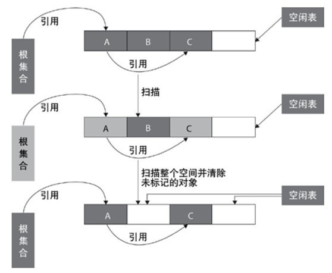
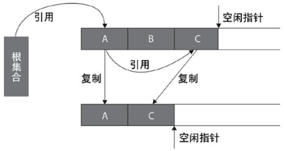
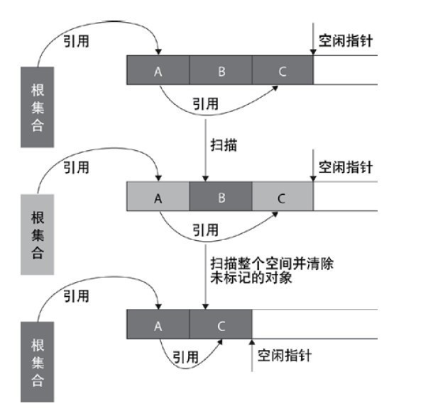
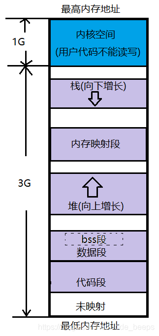

## 端口

端口的作用是对TCP/IP体系的应用进程进行统一的标志，使运行不同操作系统的计算机的应用进程能够互相通信。

我们知道一台主机(对应一个IP地址)可以提供很多服务，比如web服务，ftp服务，SMTP服务等等。如果只有一个IP，无法却分不同的网络服务，所以我们采用”IP+端口号”来区分不同的服务。

需要注意的是，端口并不是一一对应的。比如你的电脑作为客户机访 问一台WWW服务器时，WWW服务器使用“80”端口与你的电脑通信，但你的电脑则可能使用“3457”这样的端口。

端口号是标识主机内唯一的一个进程，IP+端口号就可以标识网络中的唯一进程。在我们通常用的Socket编程中，IP+端口号就是套接字。

端口号是由16比特进程编号，范围是0-65535。

**端口分类**

1、公认端口（Well Known Ports）：从0到1023，它们紧密绑定（binding）于一些服务。通常这些端口的通讯明确表明了某种服务的协议。例如：80端口实际上总是HTTP通讯。

80端口分配给www服务，21端口分配给FTP服务，22给SSH。在IE的地址栏里输入一个网址的时候是不必指定端口号的，因为在默认情况下WWW服务的端口是“80”。网络服务是可以使用其他端口号的，如果不是默认的端口号则应该在 地址栏上指定端口号，方法是在地址后面加上冒号“：”（半角），再加上端口号。比如使用“8080”作为WWW服务的端口，则需要在地址栏里输入“网址：8080”。

但是有些系统协议使用固定的端口号，它是不能被改变的，比如139 端口专门用于NetBIOS与TCP/IP之间的通信，不能手动改变。

2、注册端口（Registered Ports）

从1024到49151。松散地绑定于一些服务。也就是说有许多服务绑定于这些端口，这些端口同样用于许多其它目的。例如：许多系统处理动态端口从1024左右开始。

端口1024到49151，分配给用户进程或应用程序。这些进程主要是用户选择安装的一些应用程序，而不是已经分配好了公认端口的常用程序。

这些端口在没有被服务器资源占用的时候，可以用用户端动态选用为源端口。

3、动态和/或私有端口（Dynamicand / or PrivatePorts）

从49152到65535。之所以称为动态端口，是因为它 一般不固定分配某种服务，而是动态分配。

理论上，不应为服务分配这些端口。实际上，机器通常从1024起分配动态端口。但也有例外：SUN的RPC端口从32768开始。

**端口类型**

端口，不是计算机硬件的[I/O端口](https://baike.baidu.com/item/I%2FO端口)，而是软件形式上的概念。根据提供[服务类型](https://baike.baidu.com/item/服务类型)的不同，端口分为两种，一种是[TCP端口](https://baike.baidu.com/item/TCP端口)，一种是UDP端口。计算机之间相互通信的时候，分为两种方式：一种是发送信息以后，可以确认信息是否到达，也就是有应答的方式，这种方式大多采用TCP协议；一种是发送以后就不管了，不去确认信息是否到达，这种方式大多采用[UDP协议](https://baike.baidu.com/item/UDP协议)。对应这两种协议的服务提供的端口，也就分为[TCP端口](https://baike.baidu.com/item/TCP端口/9603009)和UDP端口。

**查看端口**

linux/Windows 下查看所用端口状态

```shell
>netstat /an
```

linux下查看端口是否被占用

```shell
>netstat -anp  |grep   端口号
```

linux下查看当前所有已经使用的端口情况

```shell
>netstat -nultp
```

**常用端口**

TCP 21=文件传输。定义了文件传输协议,使用21端口。常说某某主机开了 ftp服务便是文件传输服务。下载文件，上传主页，都要用到ftp服务。这是TCP端口。

TCP 22=[远程登录协议 ](https://baike.baidu.com/item/远程登录协议) ssh

TCP 23=Telnet.以前的BBS是纯字符界面的，支持BBS的服务器将23端口打开，对外提供服务。其实Telnet的真正意思是远程登陆：用户可以以自己的身份远程连接到主机上。这是TCP端口。

TCP 25=电子邮件(SMTP),SMTP服务器所开放的端口，用于发送邮件。这是TCP端口。

TCP 53=DNS。[DNS服务器](https://baike.baidu.com/item/DNS服务器/8079460)所开放的端口，入侵者可能是试图进行区域传递（TCP），欺骗DNS（UDP）或隐藏其他的通信。因此_blank">防火墙常常过滤或记录此端口。这是UDP端口。

TCP 80=[超文本](https://baike.baidu.com/item/超文本)服务器（Http)。用于网页浏览。上网浏览网页就需要用到它，那么提供网页资源的主机就得打开其80端口以提供服务。我们常说“提供www服务”、“Web服务器”就是这个意思。这是TCP端口。

TCP 110=电子邮件（Pop3)。和smtp对应，pop3用于接收邮件。通常情况下，pop3协议所用的是110端口。在263等免费邮箱中，几乎都有pop3收信功能。也就是说，只要你有相应的使用pop3协议的程序（例如Foxmail或Outlook），不需要从Web方式登陆进邮箱界面，即可以收信。这是TCP端口。

TCP 123=[网络时间协议](https://baike.baidu.com/item/网络时间协议)(NTP)

TCP 443=安全服务（HTTPS）

TCP 161=Snmp。简单网络管理协议，使用161端口，是用来管理网络设备的。由于网络设备很多，无连接的服务就体现出其优势。这是UDP端口。

TCP 1723=VPN 网关（PPTP）

TCP 4000=腾讯QQ 客户端。这是UDP 端口。

TCP 8000=腾讯OICQ 服务器端。这是UDP 端口。

聊天软件Oicq : Oicq 的程序既接受服务，又提供服务，这样两个聊天的人才是平等的。oicq 用的是无连接的协议，其服务器使用8000端口，侦听是否有信息到来;客户端使用4000端口，向外发送信息。如果上述两个端口正在使用（有很多人同时和几个好友聊天），就顺序往上加。

## 导航系统

通常导航系统是一些基础功能的集合,包括:“定位”、“目的地选择”、“路径计算”和“路径指导”。系统在其较高的性能系列中也提供彩色地图显示。所有这些功能要求有一个道路网的数字化地图，它通常存储在CDROM中。


## JVM 垃圾回收

常用垃圾收集算法

##### java引用

其实无论通过那种算法来判断对象是否已死，判断都与“引用”有关。Java中引用可分为强引用、软引用、弱引用、虚引用四种，这4中引用强度依次降低：

1）强引用：程序间普遍存在的，类似“Object obj = new Object()”这类引用，只要强引用还存在，垃圾收集器就永远不会回收掉被引用的对象

2）软引用：用来描述一些还有用但并非必须的对象。对于软引用关联的对象，在系统将要发生内存溢出异常之前，将会把这些对象列进回收范围之中进行第二次回收。如果这次回收还没有足够的内存，才会抛出内存溢出异常

3）弱引用：也是用来描述非必须对象的，但是它的强度比软引用更弱一些，被弱引用关联的对象只能生存到下一次垃圾收集发生之前。当垃圾收集器工作时，无论当前内存是否足够，都会回收掉被弱引用关联的对象

4）虚引用：也成为幽灵引用或者欢迎引用，它是最弱的一种引用关系。一个对象是否具有虚引用的存在，完全不会对其生存时间构成影响，也无法通过虚引用来取得一个对象实例

##### 引用计数法

实现简单，效率较高。其原理是：给对象添加一个引用计数器，每当有一个地方引用该对象时，计数器加1，当引用失效时，计数器减1，当计数器值为0时表示该对象不再被使用。需要注意的是：引用计数法很难解决对象之间相互循环引用的问题，主流Java虚拟机没有选用引用计数法来管理内存。

##### 标记-清除算法（Mark-Sweep）

这是最基础的垃圾回收算法，之所以说它是最基础的是因为它最容易实现，思想也是最简单的。标记-清除算法分为两个阶段：标记阶段和清除阶段。标记阶段的任务是标记出所有需要被回收的对象，清除阶段就是回收被标记的对象所占用的空间。具体过程如下图所示：


从图中可以很容易看出标记-清除算法实现起来比较容易，但是有一个比较严重的问题就是容易产生内存碎片，碎片太多可能会导致后续过程中需要为大对象分配空间时无法找到足够的空间而提前触发新的一次垃圾收集动作。  

标记-清除算法采用从根集合（GC Roots）进行扫描，对存活的对象进行标记，标记完毕后，再扫描整个空间中未被标记的对象，进行回收，如下图所示。标记-清除算法不需要进行对象的移动，只需对不存活的对象进行处理，在存活对象比较多的情况下极为高效，但由于标记-清除算法直接回收不存活的对象，因此会造成内存碎片。



##### 复制算法(Copying)

为了解决Mark-Sweep算法的缺陷，Copying算法就被提了出来。它将可用内存按容量划分为大小相等的两块，每次只使用其中的一块。当这一块的内存用完了，就将还存活着的对象复制到另外一块上面，然后再把已使用的内存空间一次清理掉，这样一来就不容易出现内存碎片的问题。具体过程如下图所示：

这种算法虽然实现简单，运行高效且不容易产生内存碎片，但是却对内存空间的使用做出了高昂的代价，因为能够使用的内存缩减到原来的一半。

很显然，Copying算法的效率跟存活对象的数目多少有很大的关系，如果存活对象很多，那么Copying算法的效率将会大大降低。  

复制算法的提出是为了克服句柄的开销和解决内存碎片的问题。它开始时把堆分成 一个对象 面和多个空闲面， 程序从对象面为对象分配空间，当对象满了，基于copying算法的垃圾 收集就从根集合（GC Roots）中扫描活动对象，并将每个 活动对象复制到空闲面(使得活动对象所占的内存之间没有空闲洞)，这样空闲面变成了对象面，原来的对象面变成了空闲面，程序会在新的对象面中分配内存。



##### 标记-整理算法(Mark-compact)

为了解决Copying算法的缺陷，充分利用内存空间，提出了Mark-Compact算法。**该算法标记阶段和Mark-Sweep一样，但是在完成标记之后，它不是直接清理可回收对象，而是将存活对象都向一端移动(美团面试题目，记住是完成标记之后，先不清理，先移动再清理回收对象)，然后清理掉端边界以外的内存(美团问过)**  

标记-整理算法采用标记-清除算法一样的方式进行对象的标记，但在清除时不同，在回收不存活的对象占用的空间后，会将所有的存活对象往左端空闲空间移动，并更新对应的指针**。标记-整理算法是在标记-清除算法的基础上，又进行了对象的移动**，因此成本更高，但是却解决了内存碎片的问题。具体流程见下图：



##### 分代收集算法 **Generational Collection（分代收集）算法**  

分代收集算法是目前大部分JVM 的垃圾收集器采用的算法。它的核心思想是根据对象存活的生命周期将内存划分为若干个不同的区域。一般情况下将堆区划分为老年代（Tenured Generation）和新生代（Young Generation），在堆区之外还有一个代就是永久代（Permanet Generation）。老年代的特点是每次垃圾收集时只有少量对象需要被回收，而新生代的特点是每次垃圾回收时都有大量的对象需要被回收，那么就可以根据不同代的特点采取最适合的收集算法。

目前大部分垃圾收集器对于**新生代都采取Copying算法**，因为新生代中每次垃圾回收都要回收大部分对象，也就是说需要复制的操作次数较少**，但是实际中并不是按照1：1的比例来划分新生代的空间的，一般来说是将新生代划分为一块较大的Eden空间和两块较小的Survivor空间（一般为8:1:1），每次使用Eden空间和其中的一块Survivor空间，当进行回收时，将Eden和Survivor中还存活的对象复制到另一块Survivor空间中，然后清理掉Eden和刚才使用过的Survivor空间**。

而由于**老年代的特点是每次回收都只回收少量对象，一般使用的是Mark-Compact算法。**


###### 年轻代（Young Generation）的回收算法 (回收主要以Copying为主)

a) 所有新生成的对象首先都是放在年轻代的。年轻代的目标就是尽可能快速的收集掉那些生命周期短的对象。

b) 新生代内存按照8:1:1的比例分为一个eden区和两个survivor(survivor0,survivor1)区。一个Eden区，两个 Survivor区(一般而言)。大部分对象在Eden区中生成。回收时先将eden区存活对象复制到一个survivor0区，然后清空eden区，当这个survivor0区也存放满了时，则将eden区和survivor0区存活对象复制到另一个survivor1区，然后清空eden和这个survivor0区，此时survivor0区是空的，然后将survivor0区和survivor1区交换，**即保持survivor1区为空(美团面试，问的太细，为啥保持survivor1为空，答案：为了让eden和survivor0 交换存活对象)**， 如此往复。当Eden没有足够空间的时候就会 触发jvm发起一次Minor GC

c) 当survivor1区不足以存放 eden和survivor0的存活对象时，就将存活对象直接存放到老年代。若是老年代也满了就会触发一次Full GC(Major GC)，也就是新生代、老年代都进行回收。

d) 新生代发生的GC也叫做Minor GC，MinorGC发生频率比较高(不一定等Eden区满了才触发)。

###### 年老代（Old Generation）的回收算法（回收主要以Mark-Compact为主）

a) 在年轻代中经历了N次垃圾回收后仍然存活的对象，就会被放到年老代中。因此，可以认为年老代中存放的都是一些生命周期较长的对象。

b) 内存比新生代也大很多(大概比例是1:2)，当老年代内存满时触发Major GC即Full GC，Full GC发生频率比较低，老年代对象存活时间比较长，存活率标记高。

######  持久代（Permanent Generation）(也就是方法区)的回收算法

  用于存放静态文件，如Java类、方法等。持久代对垃圾回收没有显著影响，但是有些应用可能动态生成或者调用一些class，例如Hibernate 等，在这种时候需要设置一个比较大的持久代空间来存放这些运行过程中新增的类。持久代也称方法区，具体的回收可参见上文2.5节。

  再写一遍：

​    方法区存储内容是否需要回收的判断可就不一样咯。方法区主要回收的内容有：废弃常量和无用的类。对于废弃常量也可通过引用的可达性来判断，但是对于无用的类则需要同时满足下面3个条件：

- 该类所有的实例都已经被回收，也就是Java堆中不存在该类的任何实例；
- 加载该类的`ClassLoader`已经被回收；
- 该类对应的`java.lang.Class`对象没有在任何地方被引用，**无法在任何地方通过反射访问该类的方法。**

 

######  新生代和老年代的区别(**阿里面试官的题目**)： 

所谓的新生代和老年代是针对于分代收集算法来定义的，新生代又分为Eden和Survivor两个区。加上老年代就这三个区。数据会首先分配到Eden区 当中（当然也有特殊情况，如果是大对象那么会直接放入到老年代（大对象是指需要大量连续内存空间的java对象）。），当Eden没有足够空间的时候就会 触发jvm发起一次Minor GC。如果对象经过一次Minor GC还存活，并且又能被Survivor空间接受，那么将被移动到Survivor空 间当中。并将其年龄设为1，对象在Survivor每熬过一次Minor GC，年龄就加1，当年龄达到一定的程度（默认为15）时，就会被晋升到老年代 中了，当然晋升老年代的年龄是可以设置的。如果老年代满了就执行：Full GC 因为不经常执行，因此采用了 Mark-Compact算法清理.

其实新生代和老年代就是针对于对象做分区存储，更便于回收等等.

#### HTTP 头部信息

HTTP消息中header头部信息的讲解

本文导读：HTTP消息包括客户机向服务器的请求消息和服务器向客户机的响应消息。这两种类型的消息由一个起始行，一个或者多个头域，一个只是头域结束的空行和可选的消息体组成。HTTP的头域包括通用头，请求头，响应头和实体头四个部分。每个头域由一个域名，冒号（:）和域值三部分组成

**HTTP Request的Header信息**

##### **1、HTTP请求方式**

如下表：

| GET     | 向Web服务器请求一个文件                  |
| ------- | ---------------------------------------- |
| POST    | 向Web服务器发送数据让Web服务器进行处理   |
| PUT     | 向Web服务器发送数据并存储在Web服务器内部 |
| HEAD    | 检查一个对象是否存在                     |
| DELETE  | 从Web服务器上删除一个文件                |
| CONNECT | 对通道提供支持                           |
| TRACE   | 跟踪到服务器的路径                       |
| OPTIONS | 查询Web服务器的性能                      |

**说明：**主要使用到“GET”和“POST”。

**实例：**POST /test/tupian/cm HTTP/1.1

**分成三部分：**

（1）POST：HTTP请求方式

（2）/test/tupian/cm：请求Web服务器的目录地址（或者指令）

（3）HTTP/1.1: URI（Uniform Resource Identifier，统一资源标识符）及其版本

**备注：**在Ajax中，对应method属性设置。

##### **2、Host**

说明：请求的web服务器域名地址

##### **3、User-Agent**

说明：HTTP客户端运行的浏览器类型的详细信息。通过该头部信息，web服务器可以判断到当前HTTP请求的客户端浏览器类别。

实例：User-Agent: Mozilla/5.0 (Windows; U; Windows NT 5.1; zh-CN; rv:1.8.1.11) Gecko/20071127 Firefox/2.0.0.11

##### **4、Accept**

说明：指定客户端能够接收的内容类型，内容类型中的先后次序表示客户端接收的先后次序。

**例如：**Accept:text/xml,application/xml,application/xhtml+xml,text/html;q=0.9,text/plain;q=0.8,image/png,*/*;q=0.5

**备注：**

在Prototyp（1.5）的Ajax代码封装中，将Accept默认设置为“text/javascript, text/html, application/xml, text/xml, */*”。这是因为Ajax默认获取服务器返回的Json数据模式。

在Ajax代码中，可以使用XMLHttpRequest 对象中setRequestHeader函数方法来动态设置这些Header信息。

##### **5、Accept-Language**

说明：指定HTTP客户端浏览器用来展示返回信息所优先选择的语言。

实例：Accept-Language: zh-cn, zh;q=0.5。这里默认为中文。

##### **6、Accept-Encoding**

说明：指定客户端浏览器可以支持的web服务器返回内容压缩编码类型。表示允许服务器在将输出内容发送到客户端以前进行压缩，以节约带宽。而这里设置的就是客户端浏览器所能够支持的返回压缩格式。

实例：Accept-Encoding: gzip,deflate。

备注：其实在百度很多产品线中，apache在给客户端返回页面数据之前，将数据以gzip格式进行压缩。

##### **7、Accept-Charset**

说明：浏览器可以接受的字符编码集。

实例：Accept-Charset: gb2312,utf-8;q=0.7,*;q=0.7

##### **8、Content-Type**

说明：显示此HTTP请求提交的内容类型。一般只有post提交时才需要设置该属性。

实例：Content-type: application/x-www-form-urlencoded;charset:UTF-8

有关Content-Type属性值可以如下两种编码类型：

（1）“application/x-www-form-urlencoded”： 表单数据向服务器提交时所采用的编码类型，默认的缺省值就是“application/x-www-form-urlencoded”。 然而，在向服务器发送大量的文本、包含非ASCII字符的文本或二进制数据时这种编码方式效率很低。

（2）“multipart/form-data”： 在文件上载时，所使用的编码类型应当是“multipart/form-data”，它既可以发送文本数据，也支持二进制数据上载。

当提交为单单数据时，可以使用“application/x-www-form-urlencoded”；当提交的是文件时，就需要使用“multipart/form-data”编码类型。

在Content-Type属性当中还是指定提交内容的charset字符编码。一般不进行设置，它只是告诉web服务器post提交的数据采用的何种字符编码。

一般在开发过程，是由前端工程与后端UI工程师商量好使用什么字符编码格式来post提交的，然后后端ui工程师按照固定的字符编码来解析提交的数据。所以这里设置的charset没有多大作用。

##### **9、Connection**

说明：表示是否需要持久连接。如果web服务器端看到这里的值为“Keep-Alive”，或者看到请求使用的是HTTP 1.1（HTTP 1.1默认进行持久连接），它就可以利用持久连接的优点，当页面包含多个元素时（例如Applet，图片），显著地减少下载所需要的时间。要实现这一点， web服务器需要在返回给客户端HTTP头信息中发送一个Content-Length（返回信息正文的长度）头，最简单的实现方法是：先把内容写入ByteArrayOutputStream，然后在正式写出内容之前计算它的大小。

实例：**Connection: keep-alive**

##### **10、Keep-Alive**

说明：

显示此HTTP连接的Keep-Alive时间。使客户端到服务器端的连接持续有效，当出现对服务器的后继请求时，Keep-Alive功能避免了建立或者重新建立连接。

以前HTTP请求是一站式连接，从HTTP/1.1协议之后，就有了长连接，即在规定的Keep-Alive时间内，连接是不会断开的。

有时候我们不希望组件被重新渲染影响使用体验；或者处于性能考虑，避免多次重复渲染降低性能。而是希望组件可以缓存下来,维持当前的状态。这时候就可以用到keep-alive组件。

如果未使用keep-alive组件，则在页面回退时仍然会重新渲染页面，触发created钩子，使用体验不好。 在以下场景中使用keep-alive组件会显著提高用户体验，菜单存在多级关系，多见于列表页+详情页的场景如： 商品列表页点击商品跳转到商品详情，返回后仍显示原有信息 订单列表跳转到订单详情，返回，等等场景。

实例：

**Keep-Alive: 300**

##### **11、cookie**

说明：HTTP请求发送时，会把保存在该请求域名下的所有cookie值一起发送给web服务器。

**12、Referer**

**说明：**包含一个URL，用户从该URL代表的页面出发访问当前请求的页面

**Responses** 部分

| Header             | 解释                                                         | 示例                                                  |
| ------------------ | ------------------------------------------------------------ | ----------------------------------------------------- |
| Accept-Ranges      | 表明服务器是否支持指定范围请求及哪种类型的分段请求           | Accept-Ranges: bytes                                  |
| Age                | 从原始服务器到代理缓存形成的估算时间（以秒计，非负）         | Age: 12                                               |
| Allow              | 对某网络资源的有效的请求行为，不允许则返回405                | Allow: GET, HEAD                                      |
| Cache-Control      | 告诉所有的缓存机制是否可以缓存及哪种类型                     | Cache-Control: no-cache                               |
| Content-Encoding   | web服务器支持的返回内容压缩编码类型。                        | Content-Encoding: gzip                                |
| Content-Language   | 响应体的语言                                                 | Content-Language: en,zh                               |
| Content-Length     | 响应体的长度                                                 | Content-Length: 348                                   |
| Content-Location   | 请求资源可替代的备用的另一地址                               | Content-Location: /index.htm                          |
| Content-MD5        | 返回资源的MD5校验值                                          | Content-MD5: Q2hlY2sgSW50ZWdyaXR5IQ==                 |
| Content-Range      | 在整个返回体中本部分的字节位置                               | Content-Range: bytes 21010-47021/47022                |
| Content-Type       | 返回内容的MIME类型                                           | Content-Type: text/html; charset=utf-8                |
| Date               | 原始服务器消息发出的时间                                     | Date: Tue, 15 Nov 2010 08:12:31 GMT                   |
| ETag               | 请求变量的实体标签的当前值                                   | ETag: “737060cd8c284d8af7ad3082f209582d”              |
| Expires            | 响应过期的日期和时间                                         | Expires: Thu, 01 Dec 2010 16:00:00 GMT                |
| Last-Modified      | 请求资源的最后修改时间                                       | Last-Modified: Tue, 15 Nov 2010 12:45:26 GMT          |
| Location           | 用来重定向接收方到非请求URL的位置来完成请求或标识新的资源    | Location: http://www.zcmhi.com/archives/94.html       |
| Pragma             | 包括实现特定的指令，它可应用到响应链上的任何接收方           | Pragma: no-cache                                      |
| Proxy-Authenticate | 它指出认证方案和可应用到代理的该URL上的参数                  | Proxy-Authenticate: Basic                             |
| refresh            | 应用于重定向或一个新的资源被创造，在5秒之后重定向（由网景提出，被大部分浏览器支持） | Refresh: 5; url=http://www.zcmhi.com/archives/94.html |
| Retry-After        | 如果实体暂时不可取，通知客户端在指定时间之后再次尝试         | Retry-After: 120                                      |
| Server             | web服务器软件名称                                            | Server: Apache/1.3.27 (Unix) (Red-Hat/Linux)          |
| Set-Cookie         | 设置Http Cookie                                              | Set-Cookie: UserID=JohnDoe; Max-Age=3600; Version=1   |
| Trailer            | 指出头域在分块传输编码的尾部存在                             | Trailer: Max-Forwards                                 |
| Transfer-Encoding  | 文件传输编码                                                 | Transfer-Encoding:chunked                             |
| Vary               | 告诉下游代理是使用缓存响应还是从原始服务器请求               | Vary: *                                               |
| Via                | 告知代理客户端响应是通过哪里发送的                           | Via: 1.0 fred, 1.1 nowhere.com (Apache/1.1)           |
| Warning            | 警告实体可能存在的问题                                       | Warning: 199 Miscellaneous warning                    |
| WWW-Authenticate   | 表明客户端请求实体应该使用的授权方案                         | WWW-Authenticate: Basic                               |

## C++

#### new() malloc()

new和malloc的区别是C/C++一道经典的面试题，我也遇到过几次，回答的都不是很好，今天特意整理了一下。

0.       属性

new/delete是C++关键字，需要编译器支持。malloc/free是库函数，需要头文件支持。

1. 参数

   使用new操作符申请内存分配时无须指定内存块的大小，编译器会根据类型信息自行计算。而malloc则需要显式地指出所需内存的尺寸。

2. 返回类型

   new操作符内存分配成功时，返回的是对象类型的指针，类型严格与对象匹配，无须进行类型转换，故new是符合类型安全性的操作符。而malloc内存分配成功则是返回void * ，需要通过强制类型转换将void*指针转换成我们需要的类型。

3. 分配失败

   new内存分配失败时，会抛出bac_alloc异常。malloc分配内存失败时返回NULL。

4. 自定义类型

   new会先调用operator new函数，申请足够的内存（通常底层使用malloc实现）。然后调用类型的构造函数，初始化成员变量，最后返回自定义类型指针。delete先调用析构函数，然后调用operator delete函数释放内存（通常底层使用free实现）。

    malloc/free是库函数，只能动态的申请和释放内存，无法强制要求其做自定义类型对象构造和析构工作。

5. 重载

   C++允许重载new/delete操作符，特别的，布局new的就不需要为对象分配内存，而是指定了一个地址作为内存起始区域，new在这段内存上为对象调用构造函数完成初始化工作，并返回此地址。而malloc不允许重载。

6. 内存区域

   new操作符从自由存储区（free store）上为对象动态分配内存空间，而malloc函数从堆上动态分配内存。自由存储区是C++基于new操作符的一个抽象概念，凡是通过new操作符进行内存申请，该内存即为自由存储区。而堆是操作系统中的术语，是操作系统所维护的一块特殊内存，用于程序的内存动态分配，C语言使用malloc从堆上分配内存，使用free释放已分配的对应内存。自由存储区不等于堆，如上所述，布局new就可以不位于堆中。

#### 自由存储区和堆

自由存储区和堆的区别是一个老生常谈的问题了，就像面试题new和malloc的区别一样。事实上，网上多说人认为，自由存储区与堆的划分标准是申请和释放内存是使用的new/delete还是malloc/free。C++标准并没有给出new/delete应该如何实现，但很多编译器的new/delete都是以malloc/free为基础来实现的。从技术上来说，堆（heap）是C语言和操作系统的术语，堆是操作系统所维护的一块特殊内存，它提供了动态分配的功能，使用malloc()、free（）来申请/释放内存。而自由存储是C++中通过new和delete动态分配和释放对象的抽象概念。基本上，所有的C++编译器默认使用堆来实现自由存储。也就是说，默认的全局运算符new和delete也许会使用malloc和free的方式申请和释放存储空间，也就是说自由存储区就位于堆上。但程序员也可以通过重载操作符，改用其他内存来实现自由存储，例如全局变量做的对象池，这时自由存储区就不位于堆上了。

因此，我认为自由存储区和堆的区别是：**堆是操作系统维护的一块内存，是一个物理概念，而自由存储是C++中通过new与delete动态分配和释放的对象的存储区，是一个逻辑概念。**

#### C++ 内存布局



一、首先进程地址空间的 1G 内核空间是给操作系统使用的，我们用户是没有操作权限的。
二、剩下的 3G 内存空间中，分为了栈区、内存映射段、堆区、数据段、bss段、代码段
1）栈区：这里的栈和数据结构的栈并不相同，数据结构的栈是一种后进先出的数据结构，而内存划分的栈是操作系统按照栈的特性，给用户划分出的内存区间。
   栈区一般存放：函数体的局部变量、函数调用期间的所有参数压栈、函数的返回值
注意栈区这段内存是由操作系统自己维护的，所以函数结束，在栈上的空间会由操作系统自己回收。

2）堆区：用户所操作的内存就是堆上的空间，用户可以使用 malloc / calloc / realloc / new 申请堆上的空间，但是用户申请堆上的空间必须自己手动释放，不然会造成内存泄漏。

3）内存映射段：里面存放 动态库 / 静态库，以及文件映射，匿名映射等等一切有依赖性的东西都在这段区域

4）可执行程序包括BSS段、[数据段](https://baike.baidu.com/item/数据段)、[代码段](https://baike.baidu.com/item/代码段)（也称文本段）

   数据段：存放全局变量、静态类型的变量。当代码编译完后，在可执行程序这个文件中已经把这些数据的空间划分好了，这种类型的数据，在程序运行以前，操作系统就将数据段中的数据加载到内存了。也就是说在进入 main 函数之前这些数据已经划分号空间了。

   bss段：其实在 C 语言中，数据段中还有一个 bss 段，这里面存放的是未初始化的全局变量和静态数据，而数据段中存放的是已经初始化过的全局变量和静态数据。数据段中的所有数据已经划分好空间了，但是 bss 段并没有给其中的数据划分空间。Block Started by Symbol。

   代码段：存放可执行代码，以及只读常量(字符串常量等等)。这段内存是只读的。

#### C++多态技术

##### 摘要

本文描述了C++中的各种多态性。重点阐述了面向对象的动态多态和基于模板的静态多态，并初步探讨了两种技术的结合使用。

##### 关键词

多态 继续 虚函数 模板 宏 函数重载 泛型编程 泛型模式 

##### 导言

   多态（polymorphism）一词最初来源于希腊语polumorphos，含义是具有多种形式或形态的情形。在程序设计领域，一个广泛认可的定义是“一种将不同的非凡行为和单个泛化记号相关联的能力”。和纯粹的面向对象程序设计语言不同，C++中的多态有着更广泛的含义。除了常见的通过类继续和虚函数机制生效于运行期的动态多态（dynamic polymorphism）外，模板也答应将不同的非凡行为和单个泛化记号相关联，由于这种关联处理于编译期而非运行期，因此被称为静态多态（static polymorphism）。 
   事实上，带变量的宏和函数重载机制也答应将不同的非凡行为和单个泛化记号相关联。然而，习惯上我们并不将它们展现出来的行为称为多态（或静态多态）。今天，当我们谈及多态时，假如没有明确所指，默认就是动态多态，而静态多态则是指基于模板的多态。不过，在这篇以C++各种多态技术为主题的文章中，我们首先还是回顾一下C++社群争论已久的另一种“多态”：函数多态（function polymorphism），以及更不常提的“宏多态（macro polymorphism）”。

##### **1. 函数多态**

   也就是我们常说的函数重载（function overloading）。基于不同的参数列表，同一个函数名字可以指向不同的函数定义： 

```C++
// overload_poly.cpp

#include <iostream>
#include <string>

// 定义两个重载函数
int my_add(int a, int b)
{
  return a + b;
}

int my_add(int a, std::string b)
{
  return a + atoi(b.c_str());
}

int main()
{
  int i = my_add(1, 2);        // 两个整数相加
  int s = my_add(1, "2");       // 一个整数和一个字符串相加
  std::cout << "i = " << i << "\n";
  std::cout << "s = " << s << "\n";
}
```

   根据参数列表的不同（类型、个数或兼而有之），my_add(1, 2)和my_add(1, "2")被分别编译为对my_add(int, int)和my_add(int, std::string)的调用。实现原理在于编译器根据不同的参数列表对同名函数进行名字重整，而后这些同名函数就变成了彼此不同的函数。比方说，也许某个编译器会将my_add()函数名字分别重整为my_add_int_int()和my_add_int_str()。

##### **2. 宏多态**

   带变量的宏可以实现一种初级形式的静态多态： 

```C++
// macro_poly.cpp

#include <iostream>
#include <string>

// 定义泛化记号：宏ADD
#define ADD(A, B) (A) + (B);

int main()
{
  int i1(1), i2(2);
  std::string s1("Hello, "), s2("world!");
  int i = ADD(i1, i2);            // 两个整数相加
  std::string s = ADD(s1, s2);        // 两个字符串“相加”
  std::cout << "i = " << i << "\n";
  std::cout << "s = " << s << "\n";
}
```

   当程序被编译时，表达式ADD(i1, i2)和ADD(s1, s2)分别被替换为两个整数相加和两个字符串相加的具体表达式。整数相加体现为求和，而字符串相加则体现为连接。程序的输出结果符合直觉： 

```
1 + 2 = 3
Hello, + world! = Hello, world!
```

   当程序被编译时，表达式ADD(i1, i2)和ADD(s1, s2)分别被替换为两个整数相加和两个字符串相加的具体表达式。整数相加体现为求和，而字符串相加则体现为连接。程序的输出结果符合直觉： 
   1 + 2 = 3
   Hello, + world! = Hello, world!

**3. 动态多态**

   这就是众所周知的的多态。现代面向对象语言对这个概念的定义是一致的。其技术基础在于继承机制和虚函数。例如，我们可以定义一个抽象基类Vehicle和两个派生于Vehicle的具体类Car和Airplane：

```C++
// dynamic_poly.h
#include <iostream>

// 公共抽象基类Vehicle
class Vehicle
{
public:
  virtual void run() const = 0;
};

// 派生于Vehicle的具体类Car
class Car: public Vehicle
{
public:
  virtual void run() const
  {
    std::cout << "run a car\n";
  }
};

// 派生于Vehicle的具体类Airplane
class Airplane: public Vehicle
{
public:
  virtual void run() const
  {
    std::cout << "run a airplane\n";
  }
}; 
```


   客户程序可以通过指向基类Vehicle的指针（或引用）来操纵具体对象。通过指向基类对象的指针（或引用）来调用一个虚函数，会导致对被指向的具体对象之相应成员的调用：

```c++
// dynamic_poly_1.cpp

#include <iostream>
#include <vector>
#include "dynamic_poly.h"

// 通过指针run任何vehicle
void run_vehicle(const Vehicle* vehicle)
{
  vehicle->run();        // 根据vehicle的具体类型调用对应的run()
}

int main()
{
  Car car;
  Airplane airplane;
  run_vehicle(&car);       // 调用Car::run()
  run_vehicle(&airplane);  // 调用Airplane::run()
}
```

   此例中，要害的多态接口元素为虚函数run()。由于run_vehicle()的参数为指向基类Vehicle的指针，因而无法在编译期决定使用哪一个版本的run()。在运行期，为了分派函数调用，虚函数被调用的那个对象的完整动态类型将被访问。这样一来，对一个Car对象调用run_vehicle()，实际上将调用Car::run()，而对于Airplane对象而言将调用Airplane::run()。 
   或许动态多态最吸引人之处在于处理异质对象集合的能力： 

```c++
// dynamic_poly_2.cpp

#include <iostream>
#include <vector>
#include "dynamic_poly.h"

// run异质vehicles集合
void run_vehicles(const std::vector<Vehicle*>& vehicles)
{
  for (unsigned int i = 0; i < vehicles.size(); ++i)
  {
    vehicles[i]->run();   // 根据具体vehicle的类型调用对应的run()
  }
}

int main()
{
  Car car;
  Airplane airplane;
  std::vector<Vehicle*> v;  // 异质vehicles集合
  v.push_back(&car);
  v.push_back(&airplane);
  run_vehicles(v);          // run不同类型的vehicles
}
```


   在run_vehicles()中，vehicles[i]->run()依据正被迭代的元素的类型而调用不同的成员函数。这从一个侧面体现了面向对象编程风格的优雅。

**4. 静态多态**

   假如说动态多态是通过虚函数来表达共同接口的话，那么静态多态则是通过“彼此单独定义但支持共同操作的具体类”来表达共同性，换句话说，必须存在必需的同名成员函数。 
   我们可以采用静态多态机制重写上一节的例子。这一次，我们不再定义vehicles类层次结构，相反，我们编写彼此无关的具体类Car和Airplane（它们都有一个run()成员函数）： 

```c++
// static_poly.h

#include <iostream>

//具体类Car
class Car
{
public:
  void run() const
  {
    std::cout << "run a car\n";
  }
};

//具体类Airplane
class Airplane
{
public:
  void run() const
  {
    std::cout << "run a airplane\n";
  }
};
```

run_vehicle()应用程序被改写如下：

```c++
// static_poly_1.cpp

#include <iostream>
#include <vector>
#include "static_poly.h"

// 通过引用而run任何vehicle
template <typename Vehicle>
void run_vehicle(const Vehicle& vehicle)
{
  vehicle.run();      // 根据vehicle的具体类型调用对应的run()
}
 
int main()
{
  Car car;
  Airplane airplane;
  run_vehicle(car);     // 调用Car::run()
  run_vehicle(airplane);  // 调用Airplane::run()
} 
```

   现在Vehicle用作模板参数而非公共基类对象（事实上，这里的Vehicle只是一个符合直觉的记号而已，此外别无它意）。经过编译器处理后，我们最终会得到run_vehicle<Car>()和 run_vehicle<Airplane>()两个不同的函数。这和动态多态不同，动态多态凭借虚函数分派机制在运行期只有一个run_vehicle()函数。 
   我们无法再透明地处理异质对象集合了，因为所有类型都必须在编译期予以决定。不过，为不同的vehicles引入不同的集合只是举手之劳。由于无需再将集合元素局限于指针或引用，我们现在可以从执行性能和类型安全两方面获得好处：

```c++
// static_poly_2.cpp

#include <iostream>
#include <vector>
#include "static_poly.h"

// run同质vehicles集合
template <typename Vehicle>
void run_vehicles(const std::vector<Vehicle>& vehicles)
{
  for (unsigned int i = 0; i < vehicles.size(); ++i)
  {
    vehicles[i].run();      // 根据vehicle的具体类型调用相应的run()
  }
}

int main()
{
  Car car1, car2;
  Airplane airplane1, airplane2;

  std::vector<Car> vc;       // 同质cars集合
  vc.push_back(car1);
  vc.push_back(car2);
  //vc.push_back(airplane1);    // 错误：类型不匹配
  run_vehicles(vc);         // run cars

  std::vector<Airplane> vs;     // 同质airplanes集合
  vs.push_back(airplane1);
  vs.push_back(airplane2);
  //vs.push_back(car1);       // 错误：类型不匹配
  run_vehicles(vs);         // run airplanes
}
```

**5. 两种多态机制的结合使用** 

   在一些高级C++应用中，我们可能需要结合使用动态多态和静态多态两种机制，以期达到对象操作的优雅、安全和高效。例如，我们既希望一致而优雅地处理vehicles的run问题，又希望“安全而高效”地完成给飞行器（飞机、飞艇等）进行“空中加油”这样的高难度动作。为此，我们首先将上面的vehicles类层次结构改写如下： 

```c++
// dscombine_poly.h

#include <iostream>
#include <vector>

// 公共抽象基类Vehicle
class Vehicle
{
public:
  virtual void run() const = 0;
};

// 派生于Vehicle的具体类Car
class Car: public Vehicle
{
public:
  virtual void run() const
  {
    std::cout << "run a car\n";
  }
};

// 派生于Vehicle的具体类Airplane
class Airplane: public Vehicle
{
public:
  virtual void run() const
  {
    std::cout << "run a airplane\n";
  }
 
  void add_oil() const
  {
    std::cout << "add oil to airplane\n";
  }
};

// 派生于Vehicle的具体类Airship
class Airship: public Vehicle
{
public:
  virtual void run() const
  {
    std::cout << "run a airship\n";
  }
 
  void add_oil() const
  {
    std::cout << "add oil to airship\n";
  }
};
```

我们理想中的应用程序可以编写如下：

```c++
// dscombine_poly.cpp

#include <iostream>
#include <vector>
#include "dscombine_poly.h"

// run异质vehicles集合
void run_vehicles(const std::vector<Vehicle*>& vehicles)
{
  for (unsigned int i = 0; i < vehicles.size(); ++i)
  {
    vehicles[i]->run();         // 根据具体的vehicle类型调用对应的run()
  }
}

// 为某种特定的aircrafts同质对象集合进行“空中加油”
template <typename Aircraft>
void add_oil_to_aircrafts_in_the_sky(const std::vector<Aircraft>& aircrafts)
{
  for (unsigned int i = 0; i < aircrafts.size(); ++i)
  {
    aircrafts[i].add_oil();
  }
}

int main()
{
  Car car1, car2;
  Airplane airplane1, airplane2;

  Airship airship1, airship2;
  std::vector<Vehicle*> v;        // 异质vehicles集合
  v.push_back(&car1);
  v.push_back(&airplane1);
  v.push_back(&airship1);
  run_vehicles(v);            // run不同种类的vehicles

  std::vector<Airplane> vp;        // 同质airplanes集合
  vp.push_back(airplane1);
  vp.push_back(airplane2);
  add_oil_to_aircrafts_in_the_sky(vp);  // 为airplanes进行“空中加油”

  std::vector<Airship> vs;        // 同质airships集合
  vs.push_back(airship1);
  vs.push_back(airship2);
  add_oil_to_aircrafts_in_the_sky(vs);  // 为airships进行“空中加油”
}
```

   我们保留了类层次结构，目的是为了能够利用run_vehicles()一致而优雅地处理异质对象集合vehicles的run问题。同时，利用函数模板add_oil_to_aircrafts_in_the_sky<Aircraft>()，我们仍然可以处理特定种类的vehicles — aircrafts（包括airplanes和airships）的“空中加油”问题。其中，我们避开使用指针，从而在执行性能和类型安全两方面达到了预期目标。

**6. 结语**

   长期以来，C++社群对于多态的内涵和外延一直争论不休。在comp.object这样的网络论坛上，此类话题争论至今仍随处可见。曾经有人将动态多态（dynamic polymorphism）称为inclusion polymorphism，而将静态多态（static polymorphism）称为parametric polymorphism或parameterized polymorphism。 

   我注重到2003年斯坦福大学公开的一份C++ and Object-Oriented Programming教案中明确提到了函数多态概念：Function overloading is also referred to as function polymorphism as it involves one function having many forms。文后的“参考文献”单元给出了这个网页链接。
 
   可能你是第一次看到宏多态（macro polymorphism）这个术语。不必讶异 — 也许我就是造出这个术语的“第一人”。显然，带变量的宏（或类似于函数的宏或伪函数宏）的替换机制除了免除小型函数的调用开销之外，也表现出了类似的多态性。在我们上面的例子中，字符串相加所表现出来的符合直觉的连接操作，事实上是由底部运算符重载机制（operator overloading）支持的。值得指出的是，C++社群中有人将运算符重载所表现出来的多态称为ad hoc polymorphism。 

   David Vandevoorde和Nicolai M. Josuttis在他们的著作C++ Templates: The Complete Guide一书中系统地阐述了静态多态和动态多态技术。因为认为“和其他语言机制关系不大”，这本书没有提及“宏多态”（以及“函数多态”）。（需要说明的是，笔者本人是这本书的繁体中文版译者之一，本文正是基于这本书的第14章The Polymorphic Power of Templates编写而成）

   动态多态只需要一个多态函数，生成的可执行代码尺寸较小，静态多态必须针对不同的类型产生不同的模板实体，尺寸会大一些，但生成的代码会更快，因为无需通过指针进行间接操作。静态多态比动态多态更加类型安全，因为全部绑定都被检查于编译期。正如前面例子所示，你不可将一个错误的类型的对象插入到从一个模板实例化而来的容器之中。此外，正如你已经看到的那样，动态多态可以优雅地处理异质对象集合，而静态多态可以用来实现安全、高效的同质对象集合操作。

   静态多态为C++带来了泛型编程（generic programming）的概念。泛型编程可以认为是“组件功能基于框架整体而设计”的模板编程。STL就是泛型编程的一个典范。STL是一个框架，它提供了大量的算法、容器和迭代器，全部以模板技术实现。从理论上讲，STL的功能当然可以使用动态多态来实现，不过这样一来其性能必将大打折扣。 

   静态多态还为C++社群带来了泛型模式（generic patterns）的概念。理论上，每一个需要通过虚函数和类继续而支持的设计模式都可以利用基于模板的静态多态技术（甚至可以结合使用动态多态和静态多态两种技术）而实现。正如你看到的那样，Andrei Alexandrescu的天才作品Modern C++ Design: Generic Programming and Design Patterns Applied（Addison-Wesley）和Loki程序库已经走在了我们的前面。

#### 重载

##### 一、c++函数重载的定义：

在同一作用域类，一组函数的函数名相同，参数列表不同（参数个数不同/参数类型不同），返回值可同可不同

##### 二、函数重载的作用：

重载函数通常用来在同一个作用域内 用同一个函数名 命名一组功能相似的函数，这样做减少了函数名的数量，避免了名字空间的污染，对于程序的可读性有很大的好处。

##### 三、函数重载是一种静态多态：

（1）多态：用同一个东西表示不同的形态；
（2）多态分为：静态多态（编译时的多态）、动态多态（运行时的多态）；
（3）函数重载是一种静态多态。

##### 四、c++函数重载的原理：

编译器在编译.cpp文件中当前使用的作用域里的同名函数时，根据函数形参的类型和顺序会对函数进行重命名（不同的编译器在编译时对函数的重命名标准不一样）但是总的来说，他们都把文件中的同一个函数名进行了重命名；

在vs编译器中：
根据返回值类型（不起决定性作用）+形参类型和顺序（起决定性作用）的规则重命名并记录在map文件中。
在linux g++ 编译器中：
根据函数名字的字符数+形参类型和顺序的规则重命名记录在符号表中；从而产生不同的函数名，当外面的函数被调用时，便是根据这个记录的结果去寻找符合要求的函数名,进行调用；

##### 五、为什么c语言不能实现函数重载

编译器在编译.c文件时，只会给函数进行简单的重命名；具体的方法是给函数名之前加上”_”;所以加入两个函数名相同的函数在编译之后的函数名也照样相同；调用者会因为不知道到底调用那个而出错；

#### const对象可以通过指针修改

##### const 对象

**修改方法**

const的作用是声明变量为常量，在程序中除非显示转换，否则无法修改声明为const的对象。

本文针对显示修改的情况，提醒了一种隐式的错误，以及解决办法。

考虑下面的代码：

```c++
#include<iostream>
int main(){
    const int a = 0;
    int *p = const_cast<int *>(&a);//&a返回int *，const_cast<int*>显示转换为int*.
    *p = 1;
    int b = *p;
    int c = a;
    std::cout << "b: " << b << std::endl << "c: " << c << std::endl;
    std::cout << &a << " " << p << std::endl;
    return 0;     
}
```

输出的结果是：

```
b: 1
c: 0
0x7fffe27cd63c 0x7fffe27cd63c
```

问题就在这里，我们通过*p改变了a的值，并且检查指针指向的地址和变量的地址一致。但是打印const对象的赋值，发现最终的值仍然没有改变。

如果这发生在了程序的某个角落，我们通过*p改变了a的值，但是在下一次用a的时候，得到的结果仍然没有改变，这将发生不可预测的问题。这再一次提醒了我们，不要轻易使用强制类型转换，这往往会导致一些我们难以察觉的错误。

**解决方法**

解决这个问题很简单，利用volatile修饰符：让变量a每次访问都强制到内存中读取最新的数据。

```C++
#include<iostream>
int main(){
    const volatile int a = 0;
    int *p = const_cast<int *>(&a);//&a返回int *，const_cast<int*>显示转换为int*.
    *p = 1;
    int b = *p;
    int c = a;
    std::cout << "b: " << b << std::endl << "c: " << c << std::endl;
    return 0;     
}
```

输出结果是：

```
b: 1
c: 1
```

原因：const修饰的对象，编译器进行了符号替换。下文中用到了const 对象，就进行替换，而不是从内存中提取最新的值。

##### 针对const 成员函数而言：

1. 首先，const对象只能调用const成员函数是因为const函数不会改变成员对象，这点和const对象的本意是相同的，其他函数有可能会改变成员变量，所以编译器拒绝通过调用非const函数
2. 这里的转换是说，我另建立了一个指针，而不是原来的东西，简单的来说就是一个copy，去掉了const属性（当然真实情况下并不是真正的copy）
3. 我觉得这里用C风格的转换，并不是很合适。如果换个风格可能更有助于你的理解

```C++
void test2()const
{
    foo *temp = const_cast<foo*>(this);
    temp->test1();
}
```

也就是说，转换成了一个非const的成员，C的转换权限太大，直接就把所有的东西都转换了..这里其实只转换了const属性，const_cast的功能在这里就是：把常量指针被转化成非常量的指针，并且仍然指向原来的对象。

#### HashMap

jdk1.8中红黑树的加入

jdk1.7变为链表的头插法以及jdk1.8的尾插法区别

concurrentHashMap的出现

所以由HashMap进入，可以问关于线程高并发的安全问题引入到并发锁的对比，或者可以由数组，链表到达红黑树引入数据结构的问题。可见HashMap的基础 直接决定了会不会有下面问题的扩展，掌握这个势在必得。
很多人懂这个的原理，但是心中的理解表达不出来，这样子在面试中真的很亏。
下面总结了常见的HashMap的面试问题，下面直接附加有答案，感觉自己没有把握的可以直接背过。

##### 一、什么是HashMap？

```
HashMap是一个用于存储Key-Value键值对的集合，每一个键值对也叫做Entry。这些个键值对（Entry）分散存储在一个数组当中，这个数组就是HashMap的主干，数组每一个元素的初始值都是Null。这些就是HashMap的定义了。
```

点到为止，有的面试官不喜欢说的过多。如果想要输的多一点，，可以参考文末的总结

##### 二、你为什么用到它？

```
HashMap可以接受null键值和值，而Hashtable则不能；
HashMap是非synchronized，所以相对而说，HashMap很快；
以及HashMap储存的是键值对，以一种数据之间的对应关系。
```


##### 三、你知道HashMap的工作原理吗？

这时候慢慢的进入集合的问题状态了，准备好面对10分钟左右吧

```
HashMap是基于hashing的原理，我们使用put(key,
value)存储对象到HashMap中，使用get(key)从HashMap中获取对象。

当我们给put()方法传递键和值时，我们先对键调用hashCode()方法，返回的hashCode用于找到bucket位置来储存Entry对象。”这里关键点在于指出，HashMap是在bucket中储存键对象和值对象，作为Map.Entry。
```


##### 四、你知道HashMap的get()方法的工作原理吗？

```
首先根据对象的Hash值进行数组方面的寻找，然后找到这个数组之后，判断key是不是唯一，如果key唯一，则直接返回，如果不唯一，则使用equals进行值的判断，最后返回数据。
```


##### 五、当两个对象的hashcode相同会发生什么？

【这个问题基本上就是分界点了】

```
一些面试者会回答因为hashcode相同，所以两个对象是相等的，HashMap将会抛出异常，或者不会存储它们。
如果之前的问题回答的好，面试官的印象比较好，可能会提醒他们有equals()和hashCode()两个方法，并告诉他们两个对象就算hashcode相同，但是它们可能并不相等。
如果掌握的不太好，一些面试者可能就此放弃。那下面的问题也就不了了之了，等于放弃了一个很好的机会。
而这个问题的答案是：因为hashcode相同，所以它们的bucket位置相同，‘碰撞’会发生。因为HashMap使用链表存储对象，这个Entry(包含有键值对的Map.Entry对象)会存储在链表中。这个时候要理解根据hashcode来划分的数组，
如果数组的坐标相同，则进入链表这个数据结构中了，jdk1.7及以前为头插法，jdk1.8之后是尾插法，在jdk1.8之后，当链表长度到达8的时候，jdk1.8上升为红黑树，
```

这样说，无疑是直接的加分项。有的面试官直接跳入数据结构，有的会直接继续挖掘。

##### 六、如果两个键的hashcode相同，你如何获取值对象？

```
当我们调用get()方法，HashMap会使用键对象的hashcode找到bucket位置，然后获取值对象，如果有两个值对象储存在同一个bucket，将会遍历链表直到找到值对象。找到bucket位置之后，会调用keys.equals()方法去找到链表中正确的节点，最终找到要找的值对象。
```

【完美的答案！】

请注意：

```
许多情况下，面试者会在这个环节中出错，因为他们混淆了hashCode()和equals()方法。

因为在此之前hashCode()屡屡出现，而equals()方法仅仅在获取值对象的时候才出现。

一些优秀的开发者会指出使用不可变的、声明作final的对象，并且采用合适的equals()和hashCode()方法的话，将会减少碰撞的发生，提高效率。

不可变性使得能够缓存不同键的hashcode，这将提高整个获取对象的速度，使用String，Interger这样的wrapper类作为键是非常好的选择。
```


##### 七、如果HashMap的大小超过了负载因子(load factor)定义的容量，怎么办？

【问到这个问题之后，要及时的意识到面试官要把你往线程安全的方向引入了，做好准备。】

```
默认的负载因子大小为0.75，也就是说，当一个map填满了75%的bucket时候，和其它集合类(如ArrayList等)一样，将会创建原来HashMap大小的两倍的bucket数组，来重新调整map的大小，并将原来的对象放入新的bucket数组中。这个过程叫作rehashing，因为它调用hash方法找到新的bucket位置。
```


##### 八、你了解重新调整HashMap大小存在什么问题吗？

你可能回答不上来，这时面试官会提醒你当多线程的情况下，可能产生条件竞争(race condition)。

```
当重新调整HashMap大小的时候，确实存在条件竞争，因为如果两个线程都发现HashMap需要重新调整大小了，它们会同时试着调整大小。在调整大小的过程中，存储在链表中的元素的次序会反过来，因为移动到新的bucket位置的时候，HashMap并不会将元素放在链表的尾部，而是放在头部，这是为了避免尾部遍历(tail traversing)，原数组[j]位置上的桶移到了新数组[j+原数组长度]。如果条件竞争发生了，那么就死循环了。
```

（如果线程方面的知识储备还不错，那这个时候，你可以质问面试官，为什么这么奇怪，要在多线程的环境下使用HashMap呢？，不直接使用concurrentHashMap）

```
C++ 是 tbb::concurrent_hash_map。
Threads aren’t really supported in C++ so there isnt anything in the standard about thread safe containers. People have obviously made them before.
```

然后，恭喜你，你的线程面试开始啦！！！

##### 拓展

如果读者对这个问题感兴趣，可以再来看看这些问题设计哪些知识点：
● hashing的概念
● HashMap中解决碰撞的方法
● equals()和hashCode()的应用，以及它们在HashMap中的重要性
● 不可变对象的好处
● HashMap多线程的条件竞争
● 重新调整HashMap的大小

##### 总结

HashMap的工作原理
HashMap基于hashing原理，我们通过put()和get()方法储存和获取对象。当我们将键值对传递给put()方法时，它调用键对象的hashCode()方法来计算hashcode，让后找到bucket位置来储存值对象。当获取对象时，通过键对象的equals()方法找到正确的键值对，然后返回值对象。HashMap使用链表来解决碰撞问题，当发生碰撞了，对象将会储存在链表的下一个节点中。 HashMap在每个链表节点中储存键值对对象。
当两个不同的键对象的hashcode相同时会发生什么？ 它们会储存在同一个bucket位置的链表中。键对象的equals()方法用来找到键值对。

#### STL 的线程安全

一般说来，stl对于多线程的支持仅限于下列两点：(貌似Effective STL中有描述)

1.多个读取者是安全的。即多个线程可以同时读取一个容器中的内容。 即此时多个线程调用 容器的不涉及到写的接口都可以 eg find, begin, end 等.

2.对不同容器的多个写入者是安全的。即多个线程对不同容器的同时写入合法。 但是对于同一容器当有线程写,有线程读时,如何保证正确? 需要程序员自己来控制，比如：线程A读容器某一项时，线程B正在移除该项。这会导致一下无法预知的错误。 通常的解决方式是用开销较小的临界区（CRITICAL_SECTION）来做同步。以下列方式同步基本上可以做到线程安全的容器(就是在有写操作的情况下仍能保证安全)。

　　1.每次调用容器的成员函数的期间需要锁定。

　　2.每个容器容器返回迭代器的生存期需要锁定。

　　3.每个容器在调用算法的执行期需要锁定。

当调用map的任何接口时, 比如 end(), begin(), find()等时, 可能会返回一个iterator, 如果有别的线程正在修改这个map, 你的iterator就变得无效了, 再用这个iterator行为就可能出问题. 或者在find()函数内部, 会访问到map内部的红黑树的数据结构, 而这个红黑树是有可能被别的线程调整的(比如别的现在往map中插入一个不存在的记录). 所以, 是危险的.

查了一下官方文档对线程安全的描述。其大意也是，为了效率，没有给所有操作加锁。不同线程同时读同一容器对象没关系，不同线程同时写不同的容器对象没关系。但不能同时又读又写同一容器对象的。因此，多线程要同时读写时，还是要自己加锁。

#### rand5() 生成 rand7()

```C++
int Rand5()
{
    int m = rand() % 5 + 1;
    return m;
}

int Rand7()
{
    int x;
    do{
    	//Rand5()-1产生[0,4]的随机数
    	//(Rand5()-1)*5随机产生[0,5,10,15,20]
    	//于是Rand5()+(Rand5()-1)*5就能产生[1,25]的随机数
    	//若数字位于[1,21]中，可以直接映射，若位于[22,25]则重新产生
        x = Rand5() + (Rand5() - 1) * 5;
    }while(x > 21)
    return x % 7 + 1;
}
```


