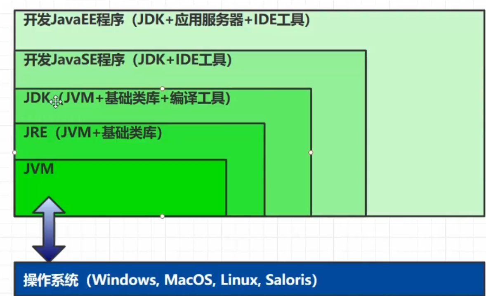
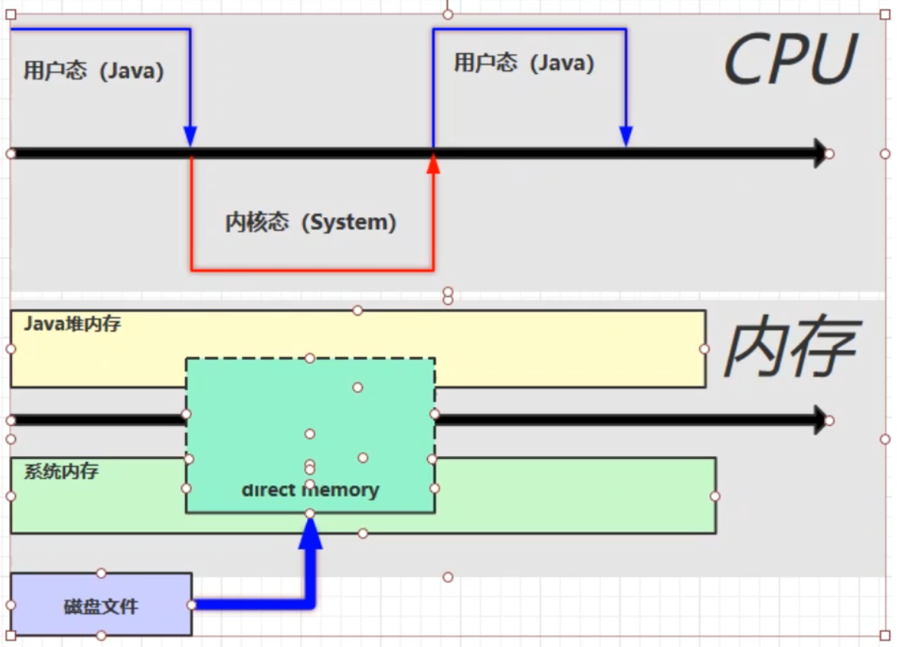

# JVM

## 一、 引言

**定义**

Java Virtual Machine - java 程序的运行环境（java 二进制字节码的运行环境）

**特性**

* 一处编写、到处运行
* 自动内存管理与垃圾回收功能
* 数组下标越界检查
* 多态

**JVM、JRE、JDK**



**体系路线**

https://www.javainterviewpoint.com/java-virtual-machine-architecture-in-java/


## 二、内存结构

参考资料：Chapter 2. The Structure of the Java Virtual Machine https://docs.oracle.com/javase/specs/jvms/se8/html/jvms-2.html#jvms-2.5.4


### 1、程序计数器

**作用**

保存JVM中下一条要执行的指令地址

**特点**

* 线程私有

* 不会有内存溢出

### 2、虚拟机栈

**定义**

- 每个**线程**运行需要的内存空间，称为**虚拟机栈**
- 每个栈由多个**栈帧**组成，对应着每次调用方法时所占用的内存
- 每个线程只能有**一个活动栈帧**，对应着**当前正在执行的方法**

**拓展问题**

（1）垃圾回收是否涉及栈内存？

* 不需要。因为虚拟机栈中是由一个个栈帧组成的，在方法执行完毕后，对应的栈帧就会被弹出栈。所以无需通过垃圾回收机制去回收内存。

（2）栈内存分配越大越好吗？

* 不是。因为**物理内存是一定的**，栈内存越大，可以支持更多的递归调用，但是可执行的线程数就会越少

（3）方法内的局部变量是否线程安全？

- 如果方法内**局部变量没有逃离方法的作用范围**，则是**线程安全**的
- 如果如果**局部变量引用了对象**，并**逃离了方法的作用范围**，则需要考虑线程安全问题

**栈内存溢出**

```
Java.lang.stackOverflowError
```

* 栈帧过多导致栈内存溢出
* 栈帧过大导致栈内存溢出

**线程运行诊断**

CPU占用过高：Linux环境下运行某些程序的时候，可能导致CPU的占用过高，这时需要定位占用CPU过高的线程

- **top**命令，查看是哪个**进程**占用CPU过高
- **ps H -eo pid, tid（线程id）, %cpu | grep 刚才通过top查到的进程号** 通过ps命令进一步查看是哪个线程占用CPU过高
- **jstack 进程id** 通过查看进程中的线程的tid，刚才通过ps命令看到的tid来**对比定位**，注意jstack查找出的线程id是**16进制的**，**需要转换**

### 3、本地方法栈

一些带有**native关键字**的方法就是需要JAVA去调用本地的C或者C++方法，因为JAVA有时候没法直接和操作系统底层交互，所以需要用到本地方法

### 4、堆

**Heap堆**

* 通过 new 关键字，创建对象都会使用堆内存

**特点**

- **所有线程共享**，堆内存中的对象都需要**考虑线程安全问题**
- 有垃圾回收机制

**堆内存溢出**

```
java.lang.OutofMemoryError ：java heap space. 堆内存溢出
```

**堆内存诊断**

* jps 
  查看当前系统中有哪些 java 进程

* jmap 
  查看堆内存占用情况 jmap - heap 进程id

* jconsole 
  图形界面的，多功能的监测工具，可以连续监测

* jvisualvm 

  可视化jvm工具

### 5、方法区

**内存溢出**

- 1.8以前会导致**永久代**内存溢出

```shell
* java.lang.OutOfMemoryError: PermGen Space
* -XX:MaxPermSize=8m
```

- 1.8以后会导致**元空间**内存溢出

```shell
* java.lang.OutOfMemoryError: Metaspace
* -XX:MaxMetaspaceSize=8m
```

**运行时常量池**

* 常量池，就是一张表，虚拟机指令根据这张常量表找到要执行的类名、方法名、参数类型、字面量
  等信息
* 运行时常量池，常量池是 *.class 文件中的，当该类被加载，它的常量池信息就会放入运行时常量
  池，并把里面的符号地址变为真实地址

**反编译查看类的信息**

* javac xx.java 生成 .class 文件
* javap -v xx.class 反编译

**串池 StringTable**

* 特征
  * 常量池中的字符串仅是符号，只有**在被用到时才会转化为对象**

  * 利用串池的机制，来避免重复创建字符串对象，里面的**元素不重复**

  * 字符串**变量**拼接的原理是**StringBuilder**

  * 字符串**常量**拼接的原理是**编译器优化，在编译期确定为值并放入串池**

  * 可以使用**intern方法**，主动将串池中还没有的字符串对象放入串池中

    * jdk 1.8 将这个字符串对象尝试放入串池，如果有则并不会放入；如果没有则放入串池成功，并且把串池中的对象返回（该字符串对象本身引用会变，堆内存与串池中的字符串对象不再是同一个对象）

      ```JAVA
      public class Main {
      	public static void main(String[] args) {
      		//"a" "b" 被放入串池中，str则存在于堆内存之中
      		String str = new String("a") + new String("b");
      		//调用str的intern方法，这时串池中没有"ab"，则会将该字符串对象放入到串池中，此时堆内存与串池中的"ab"是同一个对象
      		String st2 = str.intern();
      		//给str3赋值，因为此时串池中已有"ab"，则直接将串池中的内容返回
      		String str3 = "ab";
      		//因为堆内存与串池中的"ab"是同一个对象，所以以下两条语句打印的都为true
      		System.out.println(str == st2);
      		System.out.println(str == str3);
      	}
      }
      ```

    * jdk 1.6 将这个字符串对象尝试放入串池，如果有则并不会放入；如果没有会把此对象复制一份，放入串池，会把串池中的对象返回

      ```JAVA
      public class Main {
      	public static void main(String[] args) {
              //此处创建字符串对象"ab"，因为串池中还没有"ab"，所以将其放入串池中
      		String str3 = "ab";
              //"a" "b" 被放入串池中，str则存在于堆内存之中
      		String str = new String("a") + new String("b");
              //此时因为在创建str3时，"ab"已存在与串池中，所以放入失败，但是会返回串池中的"ab"
      		String str2 = str.intern();
              //false
      		System.out.println(str == str2);
              //false
      		System.out.println(str == str3);
              //true
      		System.out.println(str2 == str3);
      	}
      }
      ```

  * **注意**：无论是串池还是堆里面的字符串，都是对象

面试题：

```java
String s1 = "a";
String s2 = "b";
String s3 = "a" + "b";
String s4 = s1 + s2;
String s5 = "ab";
String s6 = s4.intern();
// 问
System.out.println(s3 == s4);
System.out.println(s3 == s5);
System.out.println(s3 == s6);
String x2 = new String("c") + new String("d");
String x1 = "cd";
x2.intern();
// 问，如果调换了【最后两行代码】的位置呢，如果是jdk1.6呢
System.out.println(x1 == x2);
```

**StringTable 垃圾回收**

StringTable在内存紧张时，会发生垃圾回收

**StringTable调优**

- 因为StringTable是由HashTable实现的，所以可以**适当增加HashTable桶的个数**，来减少字符串放入串池所需要的时间

  ```shell
  -XX:StringTableSize=xx
  ```

- 考虑是否需要将字符串对象入池

  可以通过**intern方法减少重复入池**

### 6、直接内存

**属性**

- 属于操作系统，常见于NIO操作时，**用于数据缓冲区**
- 分配回收成本较高，但读写性能高
- 不受JVM内存回收管理

普通读写流程：


使用Direct Memory 读写流程：



* 直接内存是操作系统和Java代码**都可以访问的一块区域**，无需将代码从系统内存复制到Java堆内存，从而提高了效率

#### 直接内存释放原理

直接内存的回收不是通过JVM的垃圾回收来释放的，而是通过**unsafe.freeMemory**来手动释放

- 使用Unsafe类来完成直接内存的分配回收，回收需要主动调用freeMemory方法
- ByteBuffer的实现内部使用了Cleaner（虚引用）来检测ByteBuffer。一旦ByteBuffer被垃圾回收，那么会由ReferenceHandler来调用Cleaner的clean方法调用freeMemory来释放内存


